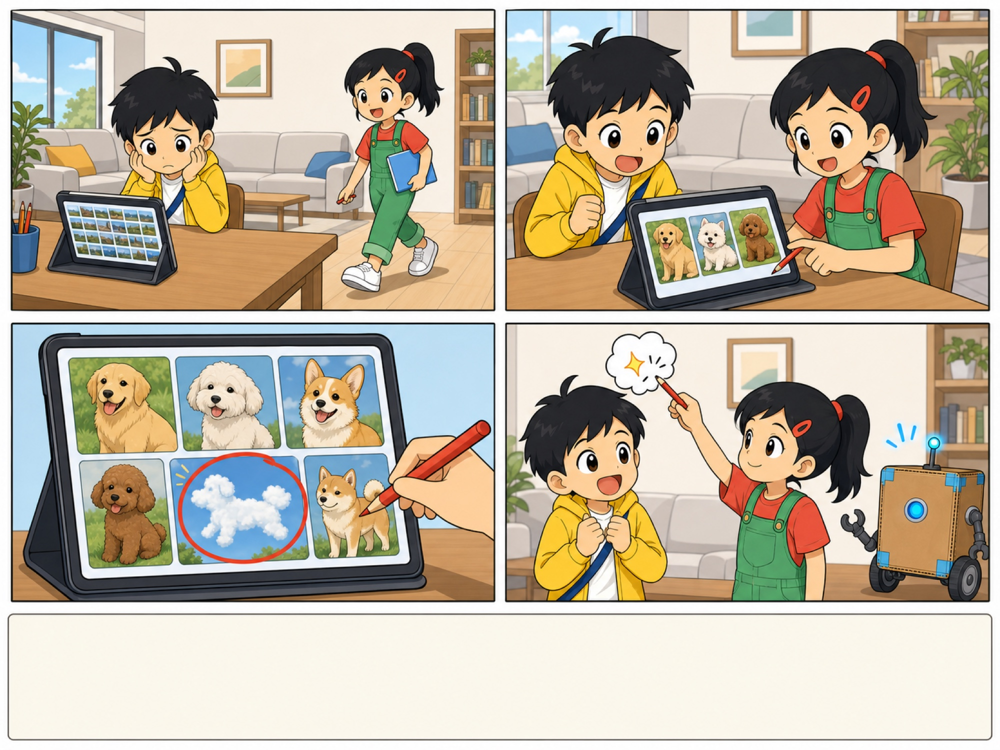
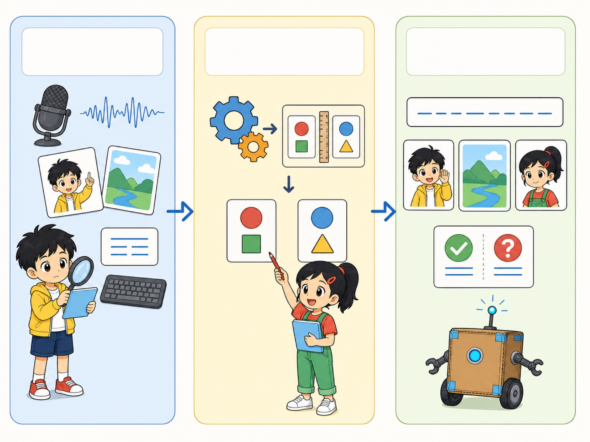
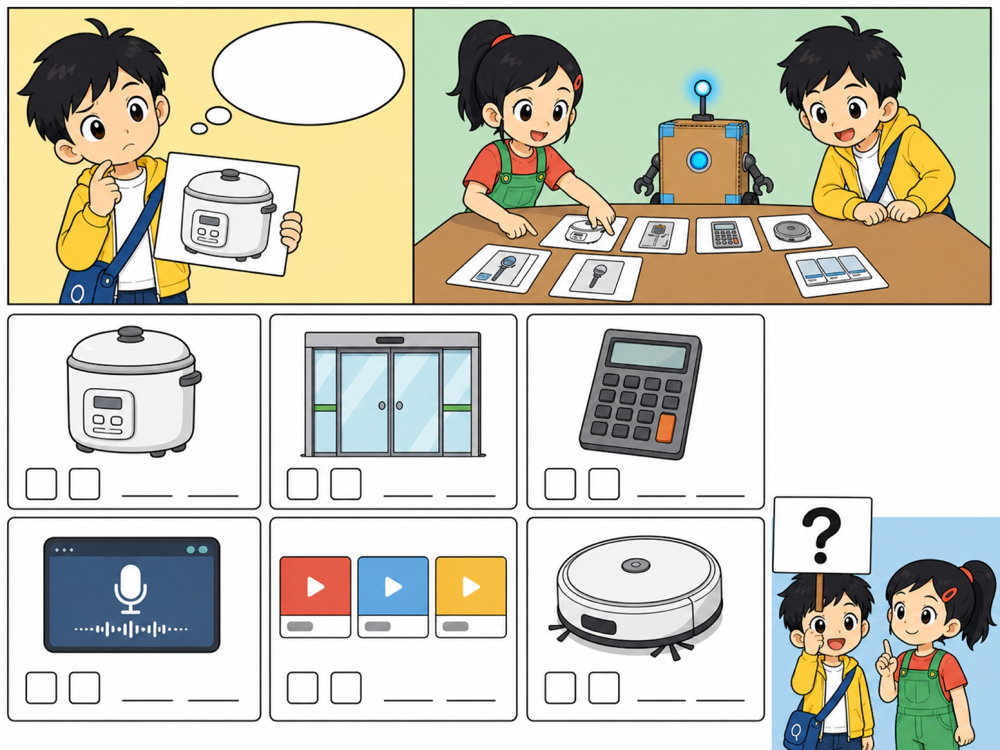

# 第 1 章 AI 藏在哪里？

## 漫画开场：会猜的相册

周六上午，小问想找去年春游的照片。

“几千张照片，一张张翻要翻到晚饭！”他抱着平板发愁。

朵朵在相册里输入“狗”。屏幕上很快出现了操场边的小白狗、宠物店里的金毛，还有一张长得像狗的云。

“相册认识狗！”小问惊叫。

“先别急着说它‘认识’。”朵朵指着那朵云，“它还把云猜成了狗呢。”

纸盒机器人方方亮起一盏小灯：“叮！侦探任务出现。”

*图 1-1 相册找到了小狗，也把一朵狗形云猜成了小狗。*

> **AI 侦探任务**：找出生活中可能用到 AI 的东西，并学会用“输入—处理—输出”观察它们。

## 1. 从三个盒子开始

朵朵画了三个盒子：

**输入 → 处理 → 输出**

*图 1-2 用三个盒子观察智能工具：输入、处理和输出。*

“输入”是机器收到的信息。“处理”是机器按照规则或学到的规律进行计算。“输出”是机器给出的结果。

刚才的相册搜索可以这样看：

| 步骤 | 发生了什么 |
| --- | --- |
| 输入 | 小问输入“狗”，相册读取照片 |
| 处理 | 程序寻找照片中像狗的图案 |
| 输出 | 相册列出它认为可能有狗的照片 |

输出里为什么会有一朵云？因为机器给出的是一次**判断**，不是永远正确的答案。

## 2. AI 到底是什么？

人工智能，英文叫 Artificial Intelligence，常写成 **AI**。

它不是某一台神奇机器，而是一组让机器完成某些“聪明任务”的方法。比如从照片中找物体、把说话声变成文字、根据路况推荐路线。

这些任务以前常常需要人来观察、比较和判断。现在，程序也能完成其中一部分。

> **记住**：AI 能完成某些任务，不等于它像人一样什么都懂。

小问问：“电饭锅会自己煮饭，它也是 AI 吗？”

“不一定。”朵朵说，“普通电饭锅可以按照提前写好的步骤加热和保温。它会自动工作，但不一定会从许多例子里找规律。”

## 3. 自动，不一定就是 AI

自动门看到有人靠近就打开。红绿灯按时间变换颜色。计算器会迅速算出 36 + 27。

它们都很有用，也都能自动工作。但“自动”这个词比“AI”大得多。很多自动设备只是在执行清楚、固定的规则。

有些 AI 系统也会执行规则。不同的是，许多现代 AI 还会从大量数据中找规律，再用规律判断新情况。这个过程叫**机器学习**，我们会在下一章调查它。

*图 1-3 自动工作的设备不一定使用 AI，要根据证据判断。*

可以先用这个问题帮助判断：

> 这个机器只是在照着固定步骤做，还是会根据许多例子找到规律，再处理新的情况？

这个问题不是万能尺子。有些产品同时使用普通程序和 AI。地图软件就是一个好例子：它既要按明确规则画路线，也可能根据很多路况数据估计哪条路更快。

## 4. 四个生活现场

### 现场一：语音输入

你说出“明天记得带水彩笔”，手机把声音变成文字。

- 输入：你的声音
- 处理：寻找声音和文字之间的规律
- 输出：屏幕上的句子

操场很吵时，输出可能出现错字。机器不是故意捣乱，而是输入里混进了很多噪声。

### 现场二：视频推荐

你看完几个恐龙视频，软件又推荐了更多恐龙内容。

- 输入：看过什么、停留多久等记录
- 处理：比较许多内容和观看规律
- 输出：下一批推荐内容

推荐只是“猜你可能喜欢”，不代表它知道什么最适合你。一直点同一种内容，看到的世界也可能越来越窄。

### 现场三：扫地机器人

扫地机器人碰到椅子腿，转向后继续前进。

- 输入：碰撞、距离或摄像头等传感器信息
- 处理：判断附近有没有障碍，决定下一步方向
- 输出：前进、转弯或停下

有的扫地机器人使用 AI，有的主要使用固定规则。只看外表，很难准确判断。

### 现场四：会聊天的程序

你输入一个问题，程序生成一段回答。

- 输入：你的文字和对话内容
- 处理：根据学到的语言规律计算接下来适合出现哪些文字
- 输出：一段新的文字

回答读起来很通顺，也可能含有错误。流畅和正确不是同一件事。

## 5. 动手试一试：AI 藏身地图

准备一张纸，画出家、学校或常去的商场。找到 5 个会自动工作的东西，把它们画在地图上。

给每个东西填一张小卡：

1. 它收到了什么输入？
2. 它做了什么处理？
3. 它给出了什么输出？
4. 它会不会答错或做错？
5. 你有证据说明它使用 AI 吗？如果没有，就写“还不知道”。

“还不知道”不是失败。侦探在证据不够时，不应该假装知道。

> **安全提醒**：不要为了完成活动拍摄陌生人，也不要上传家人的照片、声音、姓名或住址。

## 6. AI 放大镜：它会不会出错？

回到那张“狗形云”的照片。

相册也许学到了狗常见的轮廓、颜色和纹理。云的某些部分刚好很像狗，于是它给出了错误判断。

这告诉我们两件事：

- AI 常常是在根据规律做判断，不是在背诵唯一答案。
- 判断会受到输入、训练材料和使用环境的影响。

下一次看到 AI 的结果，你可以追问：“它根据什么做出这个判断？有没有可能看错？”

## 7. 小心这个坑：把 AI 当成魔法

广告可能会说某个产品“什么都懂”。视频里的机器人也可能表现得像真的有脾气。

但机器做出表情、说出句子，不代表它拥有和人一样的感受。我们可以用有趣的方式和它互动，同时记住它背后是数据、程序、芯片、电力和人的设计。

AI 很厉害，但不是魔法。

## 8. 侦探笔记

- 观察智能工具，可以先找它的输入、处理和输出。
- 自动工作的机器不一定使用 AI，许多设备只执行固定规则。
- AI 的输出可能正确，也可能错误；证据不够时可以说“还不知道”。

## 给大人的话

本章没有用一句话给所有 AI 系统划出绝对边界，因为现实产品常把规则系统、统计方法和机器学习组合在一起。共读时，重点不是让孩子给每个设备贴对标签，而是形成观察系统、寻找证据和允许不确定的习惯。

可以和孩子讨论：“如果自动门总把飘动的树叶当成人，会发生什么？我们还能增加什么输入帮助它判断？”这个问题会自然引向传感器、数据和测试。
