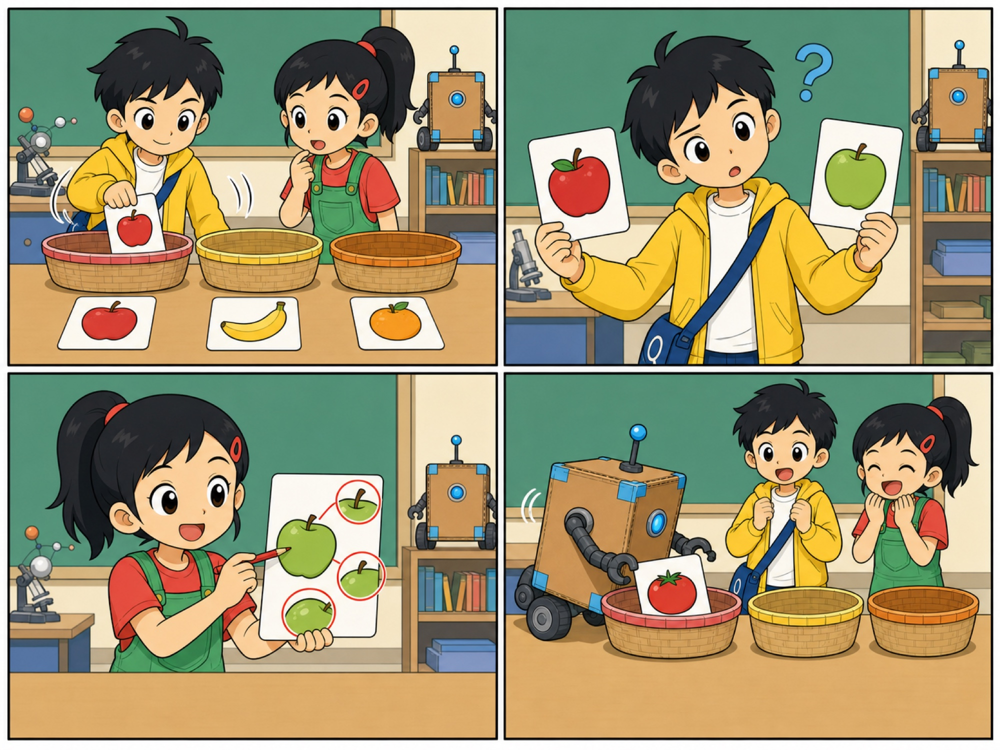
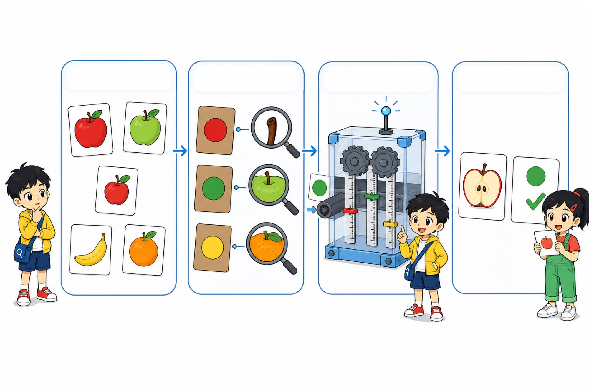
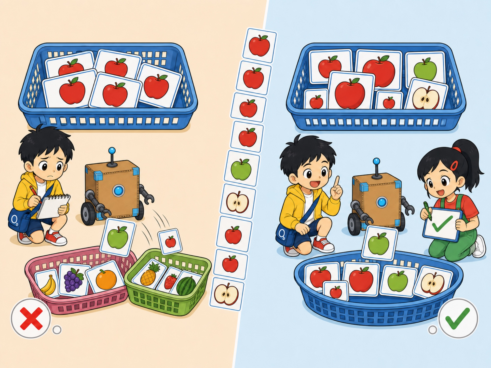

# 第 2 章 机器怎样学会分辨？

## 漫画开场：水果分拣员

校园科技节要开“水果小铺”。老师拿来一大箱水果卡片，请大家分成苹果、香蕉和橙子三堆。

小问拿起第一张：“红红的，圆圆的，是苹果！”

第二张是一根黄色香蕉，也很容易。

第三张却是青苹果。小问盯了半天：“它不是红色，为什么也是苹果？”

朵朵把红苹果和青苹果放在一起：“只记住颜色不够。我们还要观察形状、果梗和表皮。”

方方把一张番茄卡推进苹果堆，蓝灯开心地闪了一下。

“看来方方也需要学习。”小问笑了。

*图 2-1 只记住颜色不够，分类时还要寻找更多有用线索。*

> **AI 侦探任务**：用水果卡片认识数据、特征、标签和训练，看看机器怎样从许多例子中找规律。

## 1. 两种教机器的方法

如果只分三张卡片，我们可以先写规则：

- 细长、弯弯的，可能是香蕉。
- 圆圆的，顶上有果梗，可能是苹果。
- 圆圆的，表皮有很多小点，可能是橙子。

程序会照着规则一步一步判断。这和教方方“碰到墙就左转”很像。

可是，真实水果有大有小，有红有绿，还会被叶子挡住。规则越写越多，仍然可能漏掉特别的情况。

另一种方法是给机器看许多例子，让它从例子中寻找有用的规律。这类方法叫**机器学习（Machine Learning）**。

> 机器学习像做很多练习题，但机器不是坐在教室里的学生。它是在用计算方法调整内部的数字，让自己的答案更接近示例答案。

## 2. 数据是“练习材料”

一张水果照片、一段声音、一行天气记录，都可以成为**数据**。

朵朵准备了 30 张水果卡。每张卡都有一张图片，背面还写着正确名称。

这些卡片就是方方的练习材料。卡片越多，方方可以见到的情况通常越丰富。但“多”不一定就“好”。如果图片模糊、名称写错，再多也会带来麻烦。

小问把一张橙子卡背面写成“苹果”。方方照着错误答案练习，当然更容易学错。

所以，准备数据时要问：

1. 例子够不够丰富？
2. 图片或记录清不清楚？
3. 示例答案有没有写错？
4. 数据是经过允许得到的吗？

## 3. 标签像卡片背面的答案

水果卡背面的“苹果”“香蕉”“橙子”，叫作**标签**。

标签告诉机器：这个例子应该属于哪一类。

人先给许多例子写好标签，机器一边看例子，一边对照答案寻找规律。这叫**有监督学习**。这里的“监督”不是老师一直盯着屏幕，而是练习材料中带着示例答案。

并不是所有机器学习都需要这种标签。有的方法会自己寻找哪些东西常常靠得很近，有的方法会通过一次次尝试得到奖励。不过，本章先把“带答案的水果卡”调查清楚。

## 4. 特征是判断时用到的线索

小问观察青苹果时，发现颜色这条线索不够用。他又注意到形状、果梗和表皮。

这些帮助判断的线索，叫作**特征**。

*图 2-2 从练习材料中找规律，还要用没见过的新题检查。*

在简单程序里，人可以明确告诉机器看哪些特征。在一些现代机器学习方法中，机器会在训练中找到许多能帮助计算的图案。它找到的图案不一定像“果梗”这样容易用一句话讲出来。

朵朵提醒：“机器找到的规律，也可能不是我们希望它学的规律。”

比如，所有苹果照片都用蓝盘子装，所有橙子照片都用白盘子装。机器可能偷偷把“盘子颜色”当成线索。换一个盘子，它就糊涂了。

## 5. 训练不是把卡片背下来

方方看完 30 张卡后，能把这 30 张全答对，是不是就学会了？

还不能确定。

如果考试全是做过的原题，背答案也能拿满分。我们需要准备一些方方训练时没见过的新卡片，看看它能不能处理新情况。

用来调整机器的例子叫**训练数据**。用来检查学习结果的新例子叫**测试数据**。

小问拿出一张切开的苹果。方方犹豫了一会儿，把它分进橙子堆。

“发现新问题！”朵朵把错误记在本子上，“训练卡里没有切开的水果。”

真正的学习效果，不只看做过的题，还要看没见过的新题。

## 6. 只看红苹果会怎样？

小问重新整理训练卡，却只选了又大又红的苹果。

*图 2-3 训练例子太单一，学到的规律也可能太窄。*

训练后，方方能认出红苹果，却把青苹果和小苹果丢到别的篮子里。

这不是方方故意偏心。它的练习材料没有告诉它，苹果可以有很多样子。

如果数据只包含很窄的一部分情况，机器学到的规律也可能很窄。这种问题会让一些人或一些情况更容易被认错。

因此，设计 AI 的人需要检查数据是否覆盖真实世界中不同的样子、环境和使用者，还要持续测试哪些情况容易失败。

## 7. 动手试一试：纸上分类机

这个活动不需要电脑。

准备 12 张小纸片，画上不同的“外星水果”。每个水果可以有三种线索：

- 形状：圆形、三角形或长条形。
- 颜色：红色、蓝色或绿色。
- 花纹：圆点、条纹或没有花纹。

两人一组。一人秘密规定分类方法，比如“有圆点的是闪闪果”。先给同伴看 6 张带答案的训练卡，再拿出 3 张新卡让他猜。

完成后交换角色，并讨论：

1. 哪条线索最有用？
2. 有没有两张卡让人很难判断？
3. 增加什么训练卡会更好？
4. 如果训练答案写错，会发生什么？

你扮演的是“根据例子找规律的人”，不是真正的机器学习程序。但这个游戏能让你体会数据、标签、特征、训练和测试之间的关系。

## 8. 小心这个坑：为了训练，什么都收集

数据很重要，不代表可以随便收集。

照片里可能有人脸，录音里可能有声音和姓名，位置记录可能暴露一个人住在哪里。这些都可能涉及隐私。

本章活动只使用自己画的卡片。不要为了“训练 AI”偷偷录音、拍同学，或者把别人的资料上传到网络。

需要真实数据时，必须由负责任的成年人说明用途、取得同意，并做好保护。

## 9. 侦探笔记

- 机器学习让机器从许多例子中寻找规律，数据是它的练习材料。
- 标签像示例答案，特征是帮助判断的线索。
- 训练答得好还不够，要用没见过的新数据测试；数据不丰富，结果也可能不可靠。

## 给大人的话

本章用分类任务介绍监督学习，没有把“学习”拟人成理解与思考。共读时，可以不断追问“机器可能学到了哪条意外线索”，帮助孩子建立数据并非中立、准确率也不是全部的初步意识。

纸上分类活动中的规则是人为设计的，和真实模型的优化过程并不相同。它的作用是让孩子体验样本、标签、特征和泛化，不应被解释成机器学习算法的完整模拟。
