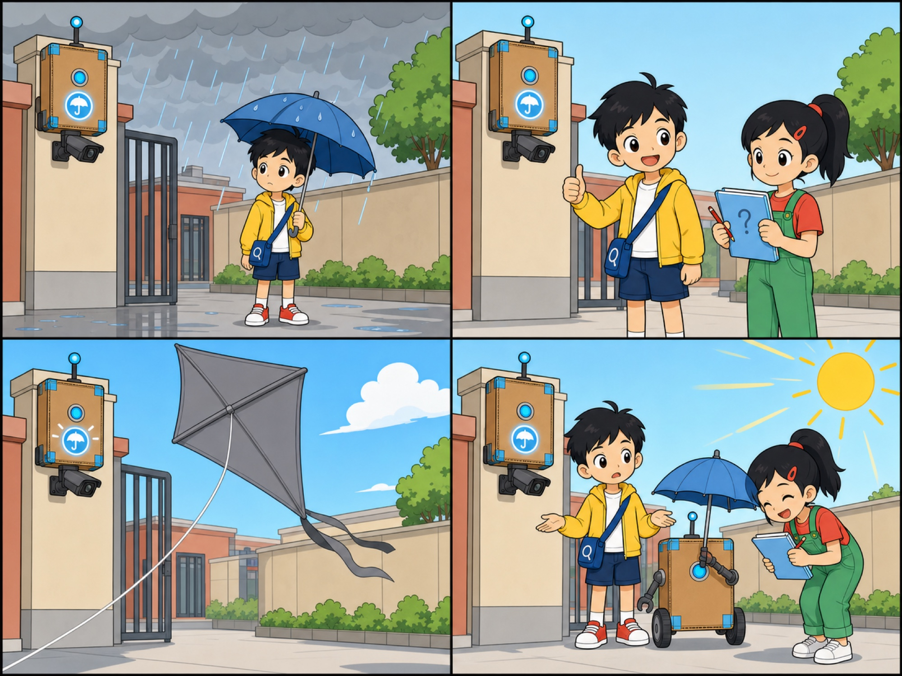
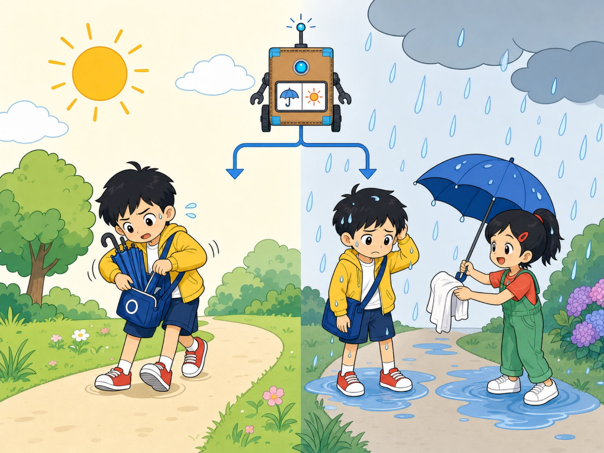
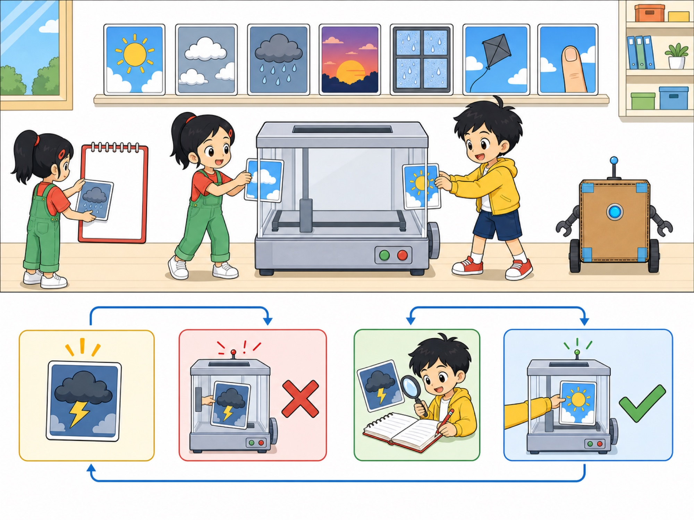

# 第 3 章 AI 也会答错

## 漫画开场：雨伞守门员

校园科技节那天，门口摆着一个“天气小助手”。它会看天空照片，再亮起“带伞”或“不带伞”的提示灯。

上午，天空灰蒙蒙的。助手亮起“带伞”。几分钟后，真的下雨了。

小问竖起大拇指：“全对！”

下午，一大片灰色风筝飘过摄像头。助手又亮起“带伞”。这一次，太阳一直照到放学。

方方顶着一把小伞站在阳光里。朵朵笑得弯下了腰。

“答对一次不能说明次次都对。”她翻开侦探本，“我们来收集错误。”

*图 3-1 同一个助手可能有时答对、有时答错，一次成功不能代表每次成功。*

> **AI 侦探任务**：认识测试、错误和信心分数，学会在使用 AI 时检查重要答案。

## 1. 错误不是偶然的小麻烦

第 2 章里，方方把切开的苹果认成了橙子。现在，天气助手又把风筝当成乌云。

AI 会出错，原因可能有很多：

- 输入和训练时见过的情况很不一样。
- 图片模糊、声音太吵，重要线索看不清。
- 训练数据太少、太窄，或者标签有错误。
- 机器学到了不合适的线索。
- 任务本来就很难，连人也可能意见不同。

找到错误不是为了嘲笑机器，而是为了知道它在哪些地方需要改进，也为了决定哪些事情不能只听它的。

## 2. 测试像给新同学出新题

如果我们只拿训练时见过的天空照片测试，助手可能只是“认得原题”。

朵朵准备了一个测试盒：晴天、阴天、雨天、黄昏、窗户上的水珠、灰色风筝，还有一张被手指挡住一半的天空。

这些例子故意包含不同时间、角度和干扰。

好的测试不只问“总共答对多少”，还会问：

1. 哪一类最容易错？
2. 在什么环境里容易错？
3. 错了以后会有什么后果？
4. 谁更容易受到错误影响？

把 100 道简单题全答对，不代表遇到一张奇怪的新图也能答对。

## 3. 两种方向不同的错误

天气助手会犯两种不同的错误。

第一种：**本来不用带伞，它却说要带。**

小问多背了一把伞，有点麻烦，但通常不会太危险。

第二种：**本来会下雨，它却说不用带。**

小问可能被雨淋湿，书包里的作业也可能进水。

两种错误的数量和后果不同。设计系统时，不能只看一个总分，还要想哪种错误更需要避免。

*图 3-2 两种错误的方向不同，带来的麻烦也不同。*

如果 AI 用在找垃圾邮件，错放一封广告和错拦一封老师通知，影响不同。如果用在医院、交通或安全设备中，错误可能更严重，必须由专业人员负责并设置更多保护。

## 4. “我有八成把握”也可能错

一些 AI 不只给出答案，还会给出一个**信心分数**。它像是在说：“按照我算到的规律，这个答案有多像正确答案。”

假设天气助手显示：

- 下雨：80 分
- 不下雨：20 分

这不代表未来一定有 80% 的机会下雨，也不代表机器真的感到自信。它只是输出了一个计算结果。

更重要的是，分数很高也可能答错。如果训练图片都有蓝色日期角标，模型也许把角标当成了天气线索。它会很有“信心”地使用一条错误规律。

所以，信心分数可以帮助判断，但不能代替测试和证据。

## 5. 给错误建一本“错题集”

朵朵没有删掉风筝照片。她把照片、机器答案、正确情况和当时环境记进错题集。

*图 3-3 专门寻找失败、记录原因、修好后重测，才能让系统更可靠。*

| 观察项 | 记录示例 |
| --- | --- |
| 输入 | 灰色风筝挡住部分天空 |
| AI 输出 | 建议带伞 |
| 实际情况 | 晴天，没有下雨 |
| 可能原因 | 风筝形状和颜色像乌云 |
| 下一步 | 增加风筝、建筑物和遮挡照片测试 |

错题集能帮助设计者发现重复出现的问题。修好以后，还要把旧错题再测一遍，防止问题重新回来。

这和我们订正数学错题很像。但模型不会自己承担责任，收集、分析和修复错误仍然是人的工作。

## 6. 机器和人一起检查

不是所有答案都需要同样严格的检查。

AI 把相册里的云猜成狗，通常只是有趣的小错误。AI 如果把过敏食物说成“可以吃”，后果可能很严重。

可以把任务分成三类：

- **低风险**：猜谜、生成故事灵感。可以试一试，错了容易发现和改正。
- **需要核对**：作业资料、旅行信息、新闻内容。要查看可靠来源。
- **高风险**：健康、财务、安全和重要个人决定。不能只依靠 AI，要找家长、老师或专业人员。

“有人检查”也不是随便看一眼。检查的人需要有足够知识、时间和权力去拒绝错误答案。

## 7. 动手试一试：专门寻找失败

和同伴设计一台纸上“形状识别机”。先写下三条规则，例如：

- 有三个角的是三角形。
- 四条边一样长的是正方形。
- 没有角的是圆形。

然后不要只画最标准的图形。试着画：

- 歪着放的正方形。
- 被橡皮挡住一个角的三角形。
- 手绘得不太圆的圆形。
- 四条边差一点点长的图形。

一人按照规则判断，另一人专门寻找能让规则失败的例子。每找到一个失败例子，就把它加入错题集。

最后讨论：是增加新规则，还是承认有些图形需要人来判断？

> 这个活动教的是测试思维，不是真正的图像识别算法。真实系统会使用更多数据和计算，但一样需要认真寻找失败情况。

## 8. 小心这个坑：只展示最好的一次

如果一个程序测试了 100 次，只把最成功的 1 次录成视频，我们会误以为它非常可靠。

评价 AI 时，要看看测试用了多少例子、有没有困难情况、失败时会怎样，以及结果是不是在新的环境中仍然成立。

遇到“从不出错”“百分之百准确”这样的说法，AI 小侦探应该多问一句：“证据在哪里？”

## 9. 侦探笔记

- AI 会因为输入、数据、环境和任务难度等原因答错。
- 测试要使用没见过的新例子，还要专门寻找不同类型的失败。
- 重要答案不能只看 AI 是否流畅或信心分数高，要根据风险查证并请合适的人负责。

## 给大人的话

本章把误报与漏报转化为“多带伞”和“被雨淋”的差异，没有要求孩子记忆专业名称。共读时可以换成垃圾邮件、门禁或内容过滤等例子，讨论不同错误的代价，但避免使用会让孩子焦虑的极端情境。

“低风险、需要核对、高风险”的划分是儿童安全决策框架，不是正式行业分级。实际系统还需要结合具体场景、法规、影响范围和可逆性评估风险。
