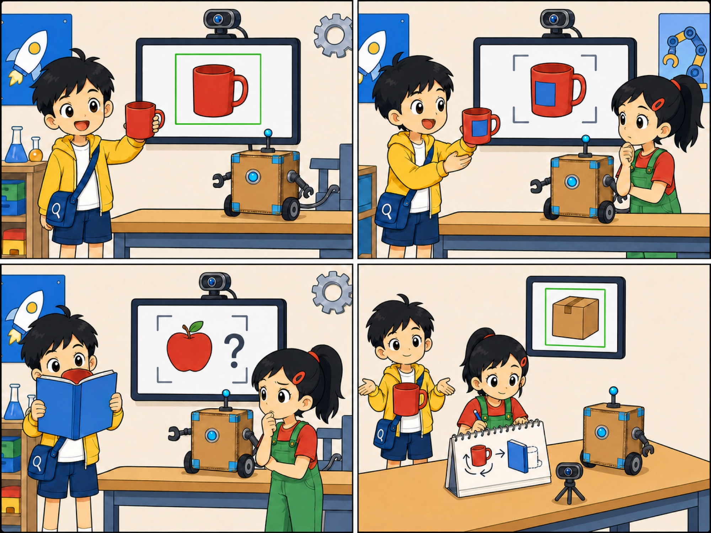
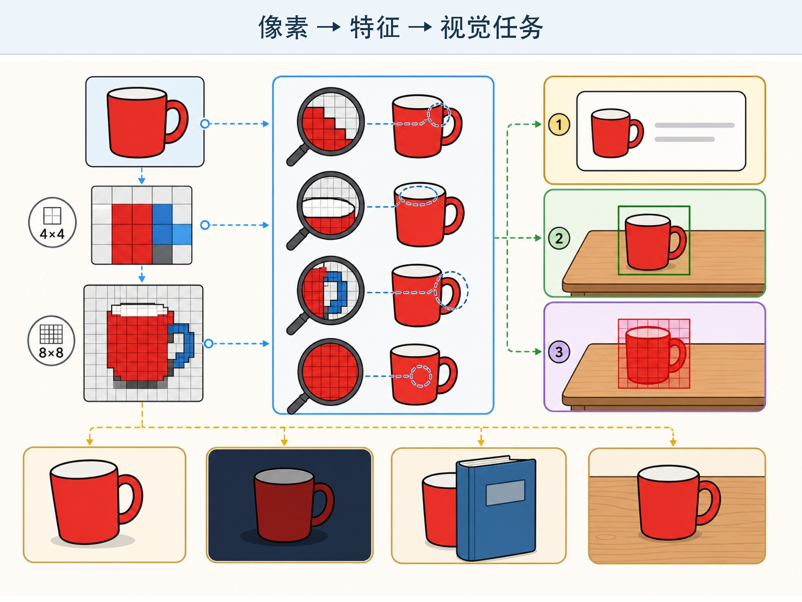

# 第 4 章 让机器看见：图像识别

## 漫画开场：消失的水杯

科技节教室里，老师准备了一个“寻找红色物品”的挑战。

小问举起红水杯，识图程序立刻画出一个方框。屏幕上的提示灯变成绿色。

他把水杯转过来，露出背面的蓝色贴纸。程序愣住了，方框一会儿出现，一会儿消失。

朵朵又把水杯藏到书后，只露出一小块红色。程序把它猜成了苹果。

“水杯没有消失。”小问说，“是机器从这个角度没找到它。”

方方把摄像头转向自己，屏幕却框住了旁边的纸箱。

*图 4-1 水杯一直存在，角度和遮挡却会改变机器收到的图像。*

> **AI 侦探任务**：认识像素、图像分类和物体检测，调查角度、光线与遮挡为什么会影响识别结果。

## 1. 机器收到的不是“一个水杯”

我们看照片时，会说：“这是红水杯。”

电脑先收到的却是一格一格的颜色数字。每一个小格叫作**像素**。把许多像素排在一起，才组成屏幕上的图片。

把照片不断放大，你会看到边缘变成小方块。每个方块可以用数字记录亮不亮、红不红、绿不绿、蓝不蓝。

所以，机器处理图像时，起点不是“水杯”这个名字，而是大量像素数字。

> 像素像马赛克小方块，但真实图像处理不是把纸方块拼起来。电脑会对许多数字进行计算。

## 2. 从像素中寻找图案

只有颜色还不够。番茄、红气球和红水杯都可能是红色。

识图系统还会利用边缘、形状、纹理以及不同部分之间的关系。现代图像模型会在许多训练图片中，逐步找到有助于完成任务的图案。

有些图案很简单，比如一条边。有些图案由很多小图案组合起来，很难用一句话说清。

机器找到图案，不代表它拥有人的眼睛和生活经验。它可能在训练中见过许多水杯照片，却没有真正喝过水，也不知道杯子摔碎后会割伤手。

## 3. “这是什么”和“它在哪里”

图像 AI 可以完成不同任务。

**图像分类**像给整张图贴标签。输入一张照片，输出可能是“猫”“狗”或“兔子”。

**物体检测**不仅猜物体是什么，还要用方框指出它在哪里。一张图里有三辆自行车，它可能画出三个框。

**图像分割**更细。它会尝试指出哪些像素属于水杯，哪些属于桌子，好像沿着物体边缘剪出一张贴纸。

还有一种常见任务是**文字识别**。它把照片里的印刷文字变成电脑可以编辑和搜索的文字。

不同任务的输入都可能是图片，但输出不一样。选择任务前，要先想清楚真正需要的结果。

*图 4-2 从像素中寻找图案，可以完成不同的视觉任务。*

## 4. 角度、光线和遮挡

小问从正面拍水杯，杯身很完整。换到杯底，只能看到一个圆。关掉一盏灯，红色又变暗了。

这三种变化会带来不同困难：

- **角度**改变了物体在照片里的形状。
- **光线**改变了颜色、亮度和阴影。
- **遮挡**让一部分重要线索看不见。

如果训练图片大多是在明亮房间正面拍摄，系统到了昏暗走廊或奇怪角度下就更容易失败。

测试识图系统时，不能只用“最好看”的照片。还要加入远近、旋转、阴影、模糊、遮挡和不同背景。

## 5. 一张图片里可能藏着意外线索

朵朵发现，训练用的水杯照片全在白桌子上拍。红苹果照片却全在木桌上拍。

模型也许没有认真区分杯口和果梗，而是学会了看桌子颜色。

她把红水杯放到木桌上，程序果然更容易猜错。

这叫作**背景线索干扰**。模型利用的线索虽然能在旧图片中拿到高分，却不一定适合新环境。

要发现这种问题，可以更换背景、遮住物体的一部分，或者保留物体不变只改变周围环境。每次只改变一个条件，更容易判断错误从哪里来。

## 6. 动手试一试：像素密信

准备一张方格纸和彩笔。

在 12×12 的方格中画一个简单物体，比如小树、雨伞或笑脸。每个格子只能涂一种颜色，不画曲线。

把图交给同伴，先让他在远处猜，再逐步遮住几行或改变几个格子的颜色。

记录三个问题：

1. 保留哪些格子时仍然容易认出？
2. 遮住哪里最容易猜错？
3. 两个不同物体能不能画得很像？

这个活动说明少量小格也能组合出形状，部分线索消失后判断会变难。真实图像模型会处理更多像素，也会使用比这个游戏复杂得多的计算。

## 7. 再试一次：专门难倒识图程序

不用真的上传图片，也可以在纸上设计“困难测试卡”：

- 一只躲在窗帘后的玩具猫。
- 倒着放的水杯。
- 和桌布颜色很接近的积木。
- 被强光照得只剩轮廓的书包。

在每张卡下面写：改变了角度、光线、遮挡还是背景？你希望系统输出什么？如果出错，会有多大影响？

这就是测试设计。好的测试者不是故意捣乱，而是在系统真正使用前找到薄弱地方。

## 8. 小心这个坑：照片不只是像素

照片对电脑来说是像素，对人来说还可能包含身份和生活信息。

人脸、校服、门牌、作业姓名、车牌和房间布局，都可能暴露隐私。删除照片上的姓名，不一定能删掉所有线索。

不要为了测试识图程序偷拍同学，也不要把家庭照片随便上传。需要拍摄别人时，要先说明用途并得到同意；儿童使用联网识图服务时，应由家长或老师陪同。

## 9. 侦探笔记

- 数字图片由许多像素组成，图像模型会从像素数字中寻找有用图案。
- 分类回答“整张图像什么”，检测回答“物体是什么、在哪里”，不同任务输出不同。
- 角度、光线、遮挡和背景都可能让识别出错；照片还可能包含隐私。

## 给大人的话

本章有意避免使用“机器看懂了”这样的表述。计算机视觉覆盖范围很广。书中只用分类、检测、分割和 OCR 建立任务意识，不展开卷积、视觉 Transformer 等模型结构。

共读时可以拿同一个物体在不同背景下观察，但不必把儿童照片上传到在线服务。重点是设计变量和记录结果，而不是比较哪款识图产品更聪明。
