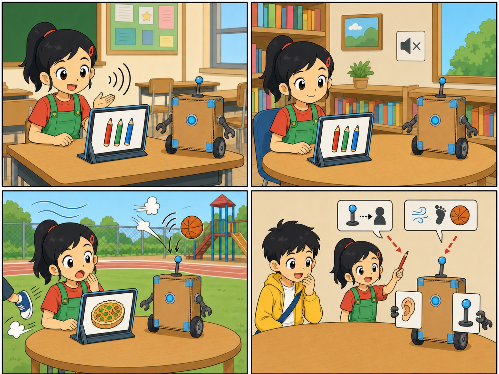
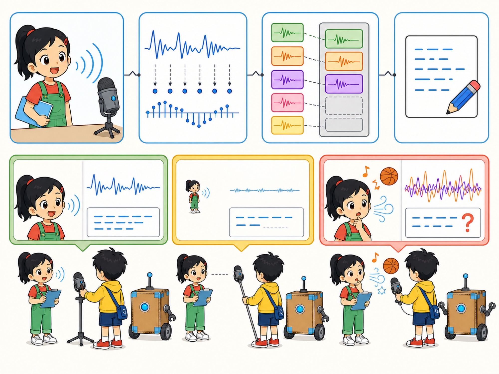

# 第 5 章 让机器听见：语音识别

## 漫画开场：“彩笔”变成“菜饼”

朵朵对平板说：“明天记得带彩笔。”

屏幕却写成：“明天记得带菜饼。”

小问笑得趴在桌上：“科技节要改成美食节啦！”

朵朵走到安静的图书角，又说了一遍。这次，屏幕正确写出了“彩笔”。

回到操场边，风声、脚步声和篮球声一起钻进麦克风，“彩笔”又变成了奇怪的词。

方方举起两张卡：一张画着耳朵，一张画着麦克风。

“机器没有耳朵。”朵朵说，“它先要用麦克风把声音变成数字。”

*图 5-1 同一句话换了距离和环境，识别结果可能不同。*

> **AI 侦探任务**：认识声音波形、语音识别和噪声，弄清“听见声音”与“理解意思”为什么不是同一件事。

## 1. 声音从振动开始

说话时，喉咙里的声带振动，推动周围空气。空气的变化传到耳朵，我们就听到了声音。

把手轻轻放在喉咙上，拉长声音说“啊——”，可以感觉到振动。不要大声喊，也不要用力按压。

麦克风会感受空气变化，把它变成电信号。电脑再隔一小段时间记录一次信号强弱，得到一串数字。

这些数字画在纸上，会形成高高低低的**声音波形**。

> 波形像一条起伏的山路，但声音不是沿着纸上的山路跑。图线只是帮助我们观察数字怎样变化。

## 2. 一句话里没有整齐的空格

书面句子里，词与词之间有空格或标点。真实说话却常常连在一起。

我们还会说快、说慢、停顿、重复，或者把一个字拖得很长。同一句“今天去公园”，不同人的声音高低、口音和速度都不一样。

语音识别系统需要从连续的声音数字中寻找语音图案，再推测可能说了哪些字词。

它可能结合前后文选择结果。比如“我要喝一杯水”比“我要喝一背水”更符合常见语言规律。

这仍然是计算出来的判断，不代表机器真的口渴，也不保证每次都选对。

## 3. 从声音到文字的接力赛

可以把语音识别想成一场四棒接力：

1. **收音**：麦克风接收说话声和周围声音。
2. **数字化**：设备把声音变化记录成数字。
3. **寻找语音图案**：模型比较声音片段与学到的规律。
4. **组合文字**：系统根据声音和前后文给出文字结果。

每一棒都可能遇到困难。麦克风太远，第一棒就不清楚；操场噪声太大，声音图案会混在一起；遇到生僻姓名，最后一棒可能选错字。

*图 5-2 声音到文字是一场接力，每一步都可能影响结果。*

## 4. 噪声为什么会捣乱？

我们想听的人声叫作目标声音。风声、电视声、汽车声和其他人说话，都可能成为**噪声**。

噪声不一定难听。好听的音乐如果盖住了要记录的讲话，对这次任务来说也会成为噪声。

小问做了三次实验：

- 麦克风离嘴一臂远，房间安静。
- 麦克风放到教室另一头，房间安静。
- 麦克风离嘴很近，旁边却在播放音乐。

结果说明，距离和环境都会影响输入。改进识别，不一定只靠换一个更大的模型，也可以靠靠近麦克风、减少噪声、说清楚或让用户确认文字。

## 5. 口音和说话方式不同

不同地区有不同口音。小朋友和成年人声音不同，有人说得快，有人说得慢。

如果训练数据里很少出现某种口音、年龄或说话方式，系统可能更容易听错这些人的话。

这不是使用者“说得不标准”就应该承担的问题。设计语音产品的人要让数据更丰富，测试不同使用者，并提供修改、重说或改用键盘的办法。

一个公平好用的工具，不该只对少数声音表现好。

## 6. 语音识别、语音合成和唤醒词

这三个功能常常一起出现，却不是一回事。

- **语音识别**：把声音变成文字。
- **语音合成**：把文字变成机器播放的声音。
- **唤醒词检测**：判断有没有说出约定的短语，让设备开始响应。

当你对语音助手说话时，设备可能先检测唤醒词，再识别后面的内容，最后用合成声音读出回答。

知道每一步在做什么，才能判断错误出在哪里。它没反应，可能是没检测到唤醒词；它答非所问，可能是文字识别错了，也可能是后面的回答系统出错。

## 7. 动手试一试：纸杯波形实验

这个活动只做观察，不录下任何人的声音。

准备一个干净纸杯、一张保鲜膜、橡皮筋和少量碎纸屑。请大人帮助，把保鲜膜绷紧在杯口，用橡皮筋固定，再放几粒很轻的纸屑。

在杯口附近正常说话或轻轻拍手，观察纸屑是否跳动。改变距离，再观察一次。

讨论：

1. 声音大一些和小一些，纸屑变化有什么不同？
2. 距离变远后呢？
3. 如果几个人同时说话，会不会更难分清是谁造成的振动？

纸屑只能展示振动的影响，不能像麦克风一样记录和识别语音。实验结束后收好碎纸，不要把保鲜膜套在头上。

## 8. 再试一次：空耳调查表

请同伴读五个容易听错的短句。你只用耳朵记录，不使用手机：

- 带彩笔 / 带菜饼
- 十只狮子 / 四只狮子
- 蓝色书包 / 男生书包

第一次保持安静，第二次由另一位同伴轻轻翻书制造背景声。比较两次记录，但不要故意大喊。

你会发现，人也会听错。语音识别的挑战并不是机器独有的；不同之处是，人能利用现场、常识和追问来补充线索。

## 9. 小心这个坑：声音也是个人信息

录音可能包含姓名、家庭对话、上课内容和周围地点。声音本身也可能暴露说话者特点。

不要偷偷录下别人，不要把同学声音上传到陌生网站。使用需要录音权限的应用前，要和家长或老师一起查看它为什么需要麦克风、什么时候开始录、录音会发到哪里。

看到麦克风正在使用的提示时，要知道是哪一个应用打开了它。任务结束后，可以关闭不需要的麦克风权限。

## 10. 侦探笔记

- 麦克风把空气振动变成信号，电脑记录为数字；语音识别再从数字中推测文字。
- 距离、噪声、口音、语速和生僻词都会影响识别，输入质量很重要。
- 语音识别、语音合成和唤醒词检测是不同任务；录音和声音需要得到允许并保护隐私。

## 给大人的话

本章使用“收音—数字化—寻找图案—组合文字”的简化管线，没有展开采样率、频谱、声学模型或端到端模型。孩子只需理解声音需要先变成数据，识别结果受到输入与训练覆盖影响。

纸杯实验应由成人检查材料安全。课堂活动不要求录音，既降低设备门槛，也避免为了教学收集儿童声音数据。
