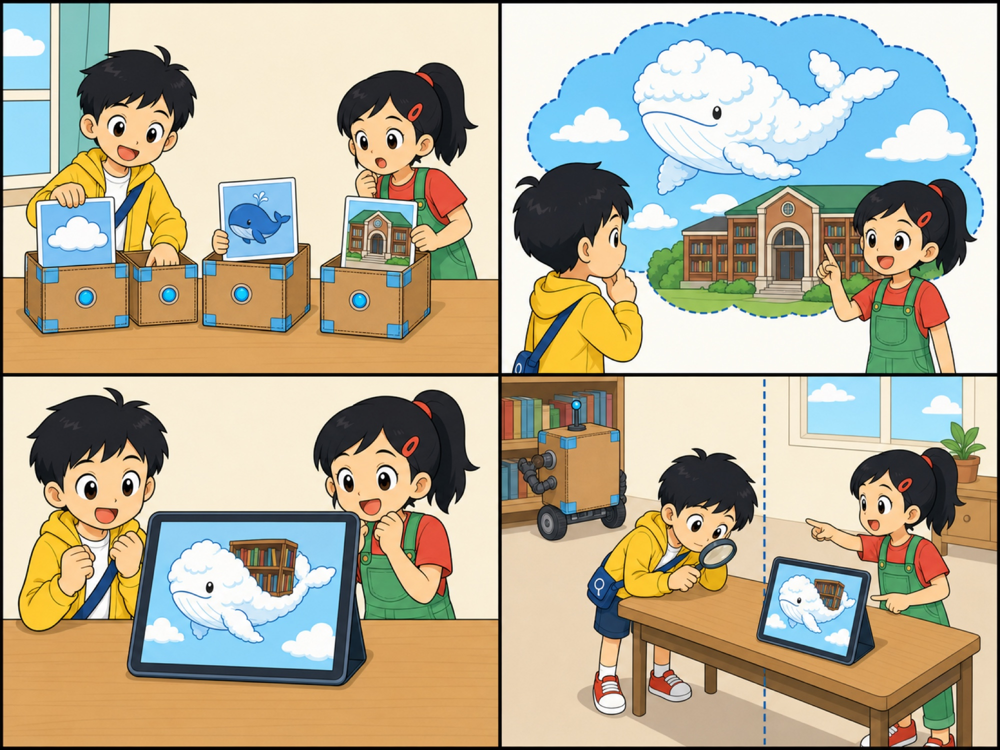
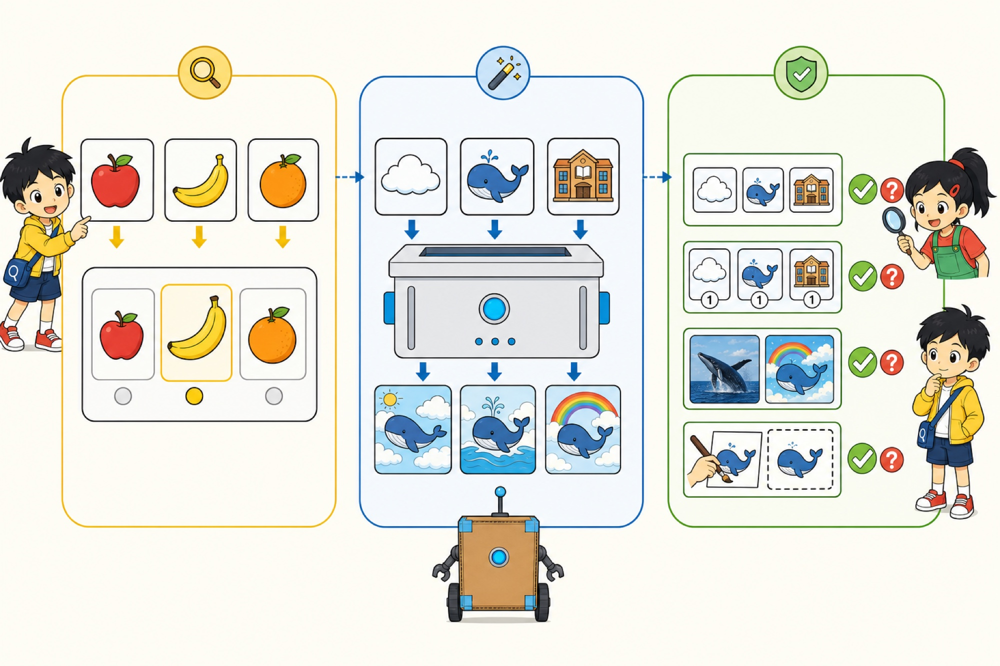

# 第 6 章 会说话、会画画的生成式 AI

## 漫画开场：不存在的“云朵鲸鱼”

小问抽出三张故事卡：“云朵、鲸鱼、图书馆。”

朵朵闭上眼睛想了一会儿：“一只住在云里的鲸鱼，每晚游进图书馆，帮书本吹掉灰尘。”

“这些事情以前发生过吗？”小问问。

“没有，这是我把三个点子组合成的新故事。”

他们把同样的要求交给一个生成工具。屏幕上出现另一段故事，还画出一只背着书架的云朵鲸鱼。

方方绕着屏幕转了一圈，想从桌子后面找到那只鲸鱼。

“图是新的，”朵朵说，“但不代表世界上真的有它。”

*图 6-1 工具可以生成不存在的云朵鲸鱼，但新图不是现实证据。*

> **AI 侦探任务**：区分识别式 AI 与生成式 AI，认识文字、图片和声音生成，并学会检查事实、版权与伪造风险。

## 1. 从“选答案”到“做出新内容”

前几章的分类系统常常从几个类别里选择答案：这是苹果还是香蕉？照片里有没有水杯？

**生成式人工智能（Generative AI）**会根据要求生成新的内容，例如一段文字、一幅图片、一段声音或一小段视频。

“新的”是说这次输出不是从一个固定答案按钮中直接选出来，不等于它完全没有受到训练材料影响，也不等于内容一定原创、真实或合适。

识别和生成还可以合作。图片工具可能先识别画面里的物体，再根据文字要求修改；聊天工具也可能先判断问题类型，再生成回答。

*图 6-2 识别是在已有类别中判断，生成是在条件下产生内容；生成后还要检查。*

## 2. 它从哪里学会这些样子？

生成模型会从大量材料中学习文字、图像或声音里的规律。

文字中，哪些词常常一起出现？故事通常怎样开头和结尾？图片中，轮子常出现在车身下面，眼睛常出现在脸的上半部。

当小问要求“戴着宇航帽的橙色小猫”时，模型会根据学到的图案，组合出符合要求的像素。

这像用许多见过的拼法做一次新组合，但模型不是拿着剪刀从旧图上剪下一只猫。它通过计算一步步生成新的数字结果。

不同生成方法的计算过程不同。我们不需要在这一章记住算法名字，只要知道：输出来自训练规律和当前要求，不是机器亲眼经历的事情。

## 3. 文字、图片和声音都能生成

### 文字生成

输入“写一个关于勇气的三句故事”，工具可能生成一个短故事。它也能改写句子、列清单或继续对话。

### 图片生成

输入对场景、人物、颜色和构图的描述，工具会生成一幅图。人物的手、物体数量和图片里的文字可能出错，需要检查。

### 声音生成

工具可以把文字读成声音，也可能生成音乐或模仿某种说话方式。声音听起来像真人，不代表那个人真的说过这些话。

### 多种信息一起使用

有些系统能同时处理文字、图片和声音。这叫**多模态**。例如，输入一张植物照片和一个问题，系统生成文字说明。

模态变多，能完成的任务更多，也会带来更多隐私和核验问题。

## 4. 好要求像一张清楚的任务卡

小问第一次只说：“画一只动物。”结果和他想象得完全不同。

朵朵帮他补全任务卡：

- **要做什么**：画一只小猫。
- **场景是什么**：它在月球整理石头标本。
- **重要细节**：橙色短毛，戴透明宇航帽，身边有三个标本盒。
- **怎样呈现**：儿童科普插画，画面明亮，不要文字。

要求越清楚，工具越容易接近目标。但提示写得很长也不保证完美。模型可能漏掉细节，或者把“三个盒子”画成四个。

我们需要查看输出，指出具体问题，再修改任务卡。这叫**迭代**，也就是根据结果一轮一轮改进。

## 5. 漂亮内容也可能是假的

生成工具擅长做出“看起来很像”的内容。

它可以画出一本从不存在的古书，也可以写出一段像百科全书的错误介绍。图片越逼真、句子越流畅，人越容易放松警惕。

遇到事实问题，要寻找可靠来源。可以问：

1. 这段内容是在讲想象，还是在声称真实发生？
2. 有来源吗？来源真的存在吗？
3. 其他可靠资料是否也这样说？
4. 时间、地点、人物和数字能否核对？

“生成了一张图”只能证明工具输出了这张图，不能证明图里的事情发生过。

## 6. 谁的作品？能不能随便用？

生成模型需要训练材料。材料中可能包含许多人创作的文章、图片和音乐。不同工具获得和使用材料的方式并不相同，相关规则也在变化。

使用生成内容时，不要冒充自己从头完成了全部创作。学校有作业要求时，要按老师规定说明工具帮助了什么。

也不要要求工具故意模仿某位在世画家的独特个人风格，或者生成用来欺骗别人的签名、证件和作品。

更好的做法是描述需要的通用特点，例如“清楚轮廓、平涂色彩、幽默知识漫画”，再加入自己的角色、故事和修改。

## 7. 动手试一试：人类故事生成器

准备三组纸卡：

- 角色卡：小猫、邮递员、机器人、会跳舞的树。
- 地点卡：月球、图书馆、海底、操场。
- 任务卡：寻找钥匙、帮助朋友、修好桥、完成比赛。

每组抽一张，用五句话讲一个故事。必须包括开头、困难、尝试、变化和结尾。

再抽一次，比较两个故事：

1. 哪些内容来自卡片？
2. 哪些细节是你自己补充的？
3. 故事里有没有不合理的地方？
4. 如果交给同伴修改，他会改变什么？

这个活动能体验“根据条件生成新组合”，但人的创作包含生活经验、目标、情感和责任，不能把纸卡游戏当成人类创作的全部。

## 8. 动手试一试：真假海报检查员

在纸上画两张“校园活动海报”。一张写真实活动，一张写一个想象活动，例如“周五操场举行云朵鲸鱼展”。

不要真的贴出去。请同伴只根据海报判断真假，再告诉他哪些信息可以核对：老师通知、日期、地点和负责人。

讨论：画得漂亮会不会让假活动更像真的？增加一个看似正式的标志，是否就变成证据？

这个活动提醒我们：外表像真的，不等于内容是真的。

## 9. 小心这个坑：用生成内容冒充别人

生成技术可以制造像真人说话的声音，也可以合成看似真实的照片和视频。这类内容可能被用来开玩笑，也可能被用来诈骗和伤害别人。

不要制作同学或老师的假声音、假照片，更不要拿它吓人或索要东西。

如果收到熟人发来的奇怪语音或视频，特别是要求转账、提供密码或保守秘密时，要通过另一个可靠方式联系本人，并立即告诉家长或老师。

## 10. 侦探笔记

- 生成式 AI 根据训练中学到的规律和当前要求，生成文字、图片、声音等新内容。
- 输出可以很漂亮、很流畅，也可能漏掉要求、违反常识或制造假信息。
- 使用生成内容要核对事实、尊重作品和他人身份，并诚实说明工具提供的帮助。

## 给大人的话

本章没有把生成式 AI 简化成“复制粘贴”，也没有声称每次输出都完全独创。关于训练数据、版权和平台规则，应以具体工具、地区法律和学校政策为准。

儿童活动默认离线完成。若使用在线生成服务，应由成人确认年龄要求、账户规则、数据用途和内容过滤设置，不上传儿童人脸、声音、姓名或学校信息。
