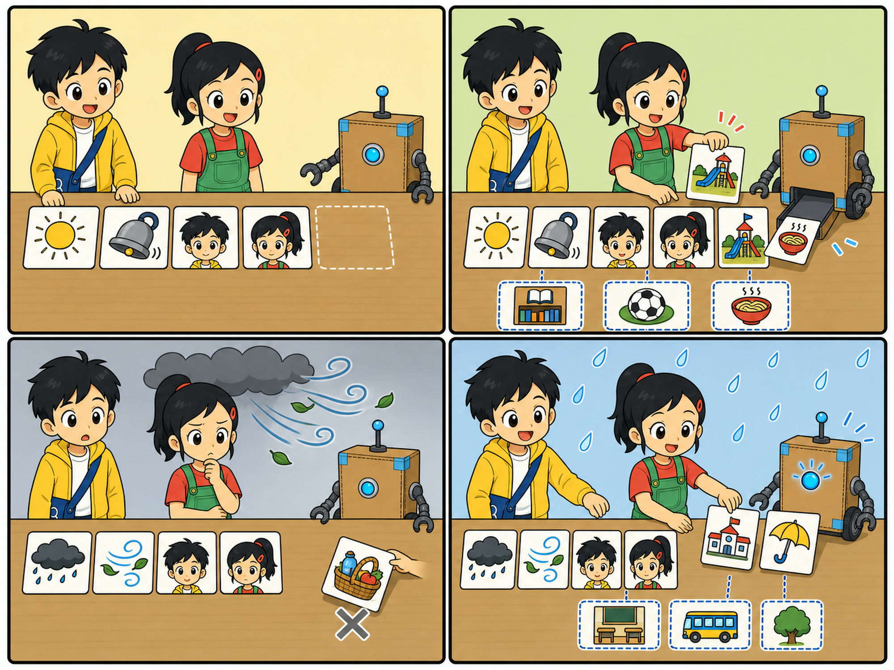
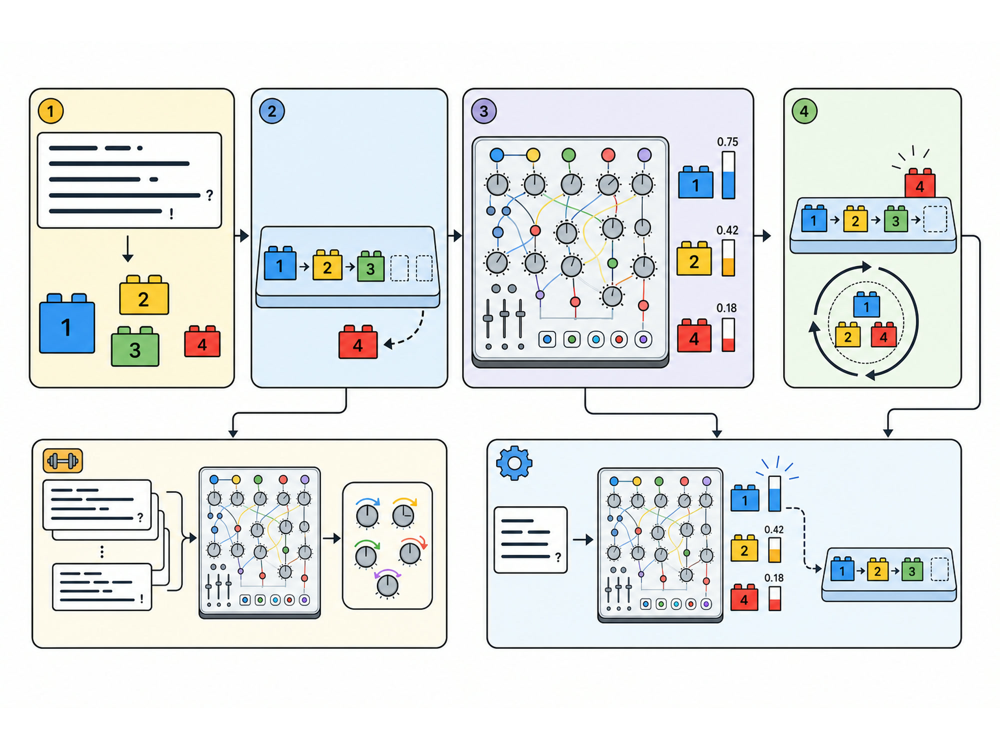

# 第 7 章 大语言模型的文字积木

## 漫画开场：下一张卡是什么？

朵朵在桌上摆了四张卡：“今天、放学、以后、我们……”

小问抢着接：“去操场！”

朵朵又接：“去图书馆！”

方方从纸盒里推出一张卡，上面画着一碗面。

“去吃面也说得通。”小问摸摸肚子，“下一张卡不只有一个答案。”

朵朵把前面的卡换成：“乌云越来越厚，我们赶紧……”

这一次，小问选了“回教室”，而不是“去野餐”。前面的内容变了，合适的接法也变了。

> **AI 侦探任务**：用文字积木认识大语言模型、Token、上下文和下一个 Token 预测，理解会接话不等于知道所有事实。

*图 7-1 前文不同，下一步更合适的接法也会不同。*

## 1. 语言里有许多规律

我们听过很多句子，所以能感觉出哪些说法更常见。

“早上太阳从东方……”后面接“升起”很自然。接“冰箱”虽然不是绝对不可能，却很奇怪。

语言模型会从大量文字中学习这种搭配和结构：什么内容常常一起出现，问题后面常出现怎样的回答，故事怎样发展，代码和表格有什么格式。

它把这些规律记录在大量可以调整的数字中。训练时，这些数字会一次次变化，让模型更擅长完成文字预测任务。

模型不是把每本书完整塞进一个抽屉，也不是在脑海里播放作者写作的场景。它通过计算形成了复杂的语言规律。

## 2. Token 是模型使用的文字积木

我们写句子时会想到字和词。模型处理文字时，常常先把内容切成更小的单位，叫作 **Token**。

一个 Token 可能是一个字、一个词的一部分、标点或其他符号。不同模型的切分方法不一样。

比如“人工智能很有趣”可能被切成几块文字积木，但不一定正好是“人工 / 智能 / 很 / 有趣”。英文单词也可能被拆开。

为什么要切？因为模型需要把文字转换成可以计算的编号，再处理这些编号之间的关系。

> Token 像文字积木，但它不是印着完整汉字的真实积木。它是模型处理文字时使用的数字单位。

## 3. 一次预测一小步

大语言模型生成回答时，常见做法是根据已经出现的 Token，计算下一步哪些 Token 更合适。

它选出一个 Token，加到后面，再用新的整段内容预测下一步。这样一小步一小步，句子就变长了。

开头是“从前有一只”，后面可能接“小猫”“狐狸”或“机器人”。模型会给许多候选接法不同的分数，再按照生成设置选择其中一个。

因此，同一个问题问两次，答案可能不同。不同不一定是错误，但事实问题不能因为换了一种说法就改变事实。

*图 7-2 模型不是一次吐出整段答案，而是根据已有内容逐步生成。*

## 4. 为什么叫“大”语言模型？

“大”不是说电脑外壳很大。

它通常表示模型里有非常多可以调整的数字，这些数字常叫作**参数**；训练还使用了大量计算和文字材料。

参数像一张巨大控制板上的许多旋钮。训练会调整旋钮，让预测结果逐步改善。

但旋钮多不等于每个问题都答得好。材料质量、训练方法、任务类型和使用方式都会影响结果。小模型在合适任务上也可能更快、更省资源。

## 5. 训练和回答是两个阶段

训练阶段，模型阅读大量示例并调整参数。这个过程需要许多计算设备、时间和电力。

使用阶段，我们输入问题，模型用已经调整好的参数进行计算并生成回答。这个阶段常叫作**推理**。

“推理”在这里是工程术语，不表示模型一定像人一样想明白了原因。

使用时提供的新问题通常不会让整个模型立刻重新训练。对话内容会影响本次回答，但这和大规模训练不是同一件事。

## 6. 上下文像一块有限的工作台

模型生成下一步时，会参考当前能够看到的内容。这些内容叫作**上下文**。

上下文可以包含问题、之前的对话、任务说明和提供的资料。前文从“放学以后”换成“乌云越来越厚”，后面的接法就会改变。

模型一次能处理的上下文有长度限制，叫作**上下文窗口**。它像一块有限大小的工作台。东西太多，有些旧内容可能放不下，重要要求也可能被淹没。

因此，写任务时要把关键信息说清楚，长对话中还要适时总结。但即使信息放进上下文，模型也可能理解错误或没有照做。

## 7. 为什么它看起来懂很多？

训练材料可能包含科学、历史、故事、程序和日常对话。模型又能根据问题组织语言，所以回答看起来覆盖很广。

可是，语言范围广不等于拥有人的生活经历。

它没有参加过你的运动会，不知道你家桌子真正放在哪里，也不会为错误承担责任。除非系统另外连接了可靠资料或工具，它也不一定知道刚刚发生的事情。

我们可以把它当作强大的语言工具，而不是无所不知的人。

## 8. 动手试一试：下一个词接龙

准备 20 张词语卡，包含人物、动作、地点和连接词。

第一轮，一人摆出开头：“今天放学以后，我们……”其他人各选一张最合适的接续卡。比较大家选择是否相同。

第二轮，把开头改成：“暴雨马上来了，我们……”再选择一次。

第三轮，故意加入一张不常见但仍能说通的卡，试着补充前文让它变得合理。

讨论：

1. 为什么同一个开头可以有多个接法？
2. 前文怎样改变了选择？
3. 句子通顺，能不能证明里面的事情真的发生过？

这个游戏只模拟“根据前文选择接续”的想法。真实大语言模型会处理 Token、参数和复杂计算，不是从纸盒里抽一张词卡。

## 9. 小心这个坑：把流畅当成理解

大语言模型会生成完整句子，还能使用“我认为”“我很高兴”等日常表达。

这些表达让对话更自然，不足以证明模型拥有人的感受、意识和责任。

判断一个回答是否可靠，要看证据、来源和任务结果，而不是看它说话像不像人。

## 10. 侦探笔记

- 大语言模型从大量文字中学习语言规律，把文字切成 Token 进行计算。
- 它常通过一次预测一个 Token，逐步生成回答；上下文会影响接下来的内容。
- 模型很大、回答很流畅，都不代表它知道一切或拥有人的理解与经历。

## 给大人的话

本章使用自回归语言模型作为主要解释对象，没有声称所有生成模型都采用完全相同的结构。Token 切分、采样和上下文实现会因模型而异。

“文字积木”“工作台”和“旋钮”都是带边界的比喻。共读时应回到三个准确点：文字被编码为数字单位，参数在训练中调整，生成时根据上下文计算后续 Token。
