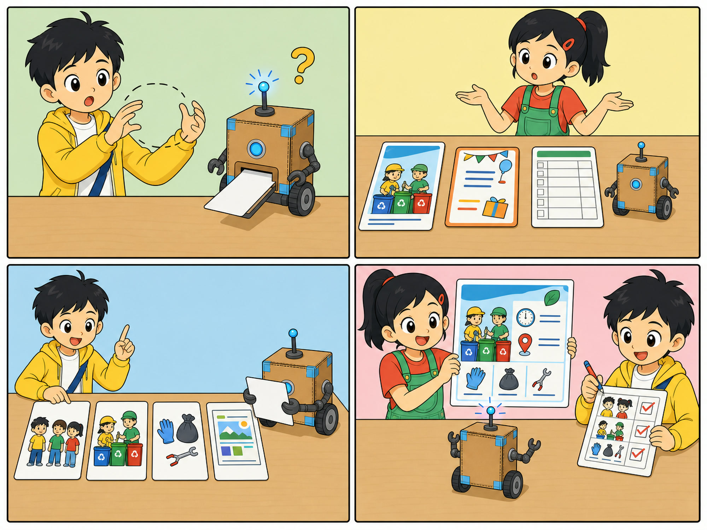
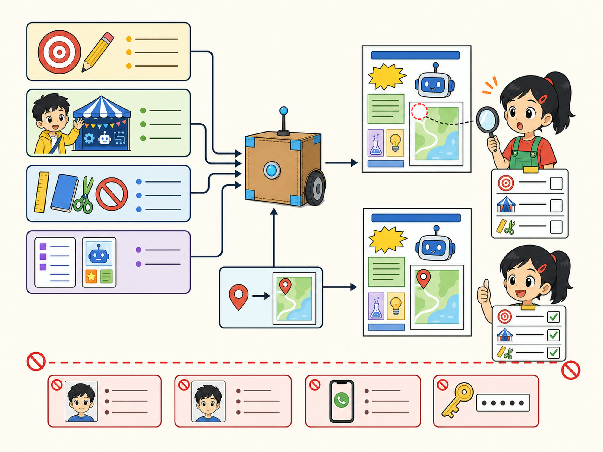

# 第 8 章 怎样向 AI 问清楚？

## 漫画开场：“帮我做一个！”

小问对方方说：“帮我做一个！”

方方蓝灯闪了三次，推出一张空白卡片。

“做一个什么？”朵朵问。

“就是科技节要用的那个呀。”

“海报、邀请卡、实验记录，还是纸盒模型？”

小问想了想：“做一张三年级同学能看懂的垃圾分类活动海报。要有时间、地点和三条准备事项，文字不要太多。”

这一次，朵朵很快画出了草稿。

> **AI 侦探任务**：学习用任务、背景、要求和输出形式组成清楚提示，并通过检查和修改逐步接近目标。

*图 8-1 AI 不能看见你脑中的“那个”，任务越具体，猜测就越少。*

## 1. 提示不是魔法口令

我们给 AI 的问题、说明和材料，常叫作**提示（Prompt）**。

提示不是念对就一定成功的魔法咒语。它更像一张任务卡：告诉工具要做什么，提供哪些信息，有什么边界，结果怎样呈现。

“写点东西”太模糊。模型只能猜测写什么、给谁看、写多长。

“给三年级同学写三句科技节提醒，每句不超过 20 个字”就清楚得多。

## 2. 一张清楚任务卡的四部分

### 任务

先说要完成什么动作，例如比较、解释、整理、改写或设计。

### 背景

说明读者是谁、事情发生在哪里，以及模型必须知道的材料。

### 要求和边界

写清长度、语气、必须包含什么、不能包含什么。要求之间不能互相打架。

### 输出形式

告诉它使用三条清单、一张表、五句话还是其他形式。

把四部分放在一起，可以写成：

> 请把下面的科学观察记录整理成给三年级同学看的三条结论。每条一句话，使用常见词，不添加记录里没有的数据。最后列出一个还不能确定的问题。

任务卡不一定越长越好。和目标无关的说明太多，反而可能盖住重点。写完后可以用手指逐项检查：真正要做的事是哪一句？材料在哪里？哪些规则不能违反？最后要交出什么样的结果？

如果自己也说不清目标，可以先请对方追问。例如：“在开始前，请先问我两个必须确认的问题。”回答完这些问题，再整理正式任务卡。会追问不是失败，而是在减少猜测。

*图 8-2 清楚提示提供方向，检查与迭代负责把结果一步步修正。*

## 3. 把材料和要求分开

朵朵递给小问一页观察记录。小问直接把要求夹在记录中间，很难看出哪一句是材料，哪一句是命令。

更清楚的方法是分区：

- **任务**：整理观察结果。
- **材料**：三次实验记录。
- **要求**：只使用材料中的事实。
- **输出**：三条结论和一个待确认问题。

使用标题、编号或明显分隔线，可以减少混淆。

如果材料来自别人，还要确认有权使用，并删除不必要的姓名、联系方式和私人内容。

## 4. 给一个小例子

有些要求用一句话难以说清，可以给一个简单例子。

任务是把长句改成短句时，可以提供：

- 输入示例：因为今天下雨，所以运动会改到体育馆举行。
- 输出示例：今天下雨。运动会改在体育馆举行。

例子能展示希望的格式，却也可能把模型带向例子中的内容。例子要短、准确，并和真正任务相似。

不要提供含有真实个人隐私的示例。

## 5. 大任务拆成小步骤

“帮我完成科技节”太大了。

可以拆成：

1. 列出活动必须说明的信息。
2. 根据真实通知整理草稿。
3. 检查时间、地点和负责人。
4. 改成适合三年级阅读的短句。
5. 最后检查有没有添加不存在的内容。

拆步骤不代表每一步都交给 AI。重要事实要由人核对，最终作品也要由人负责。

## 6. 第一版不是终点

模型第一次回答后，小问发现三条提醒中少了活动地点。

他没有只说“重写”，而是指出具体问题：“保留前两条，把地点补进第三条。地点只能使用通知里的内容。”

根据结果继续提出修改，叫作**迭代**。

有效迭代包含三步：

1. 对照任务卡检查结果。
2. 指出一个具体差距。
3. 修改要求，再检查一次。

如果结果越来越乱，可以停止长对话，重新整理一张简洁任务卡。

每次修改最好只抓住一两个最重要的差距。一次塞入十条互相影响的修改，模型可能修好了格式，却又漏掉事实。保留原始材料和检查清单，才能知道新版本究竟变好了，还是只是看起来更漂亮。

## 7. 清楚提示也不能保证正确

一张好任务卡能减少误解，不能消除模型的全部错误。

模型可能没有所需资料，可能漏掉要求，也可能生成听起来合理的错误内容。

提示技巧不能代替可靠来源、测试和人工判断。尤其是作业事实、健康、安全和个人决定，不能只靠“把提示写得更厉害”。

## 8. 动手试一试：给纸盒机器人指路

在方格纸上画一个 6×6 地图，放置起点、终点和三个障碍。

一人扮演方方，只执行明确指令。另一人先说：“走到终点。”扮演方方的人保持不动，因为方向和步数都不清楚。

再把任务改成：

1. 从左下角出发，面向上方。
2. 向前走两格。
3. 右转，向前走三格。
4. 遇到障碍就停止并报告位置，不要自己绕路。

完成后换一张地图，检查同样指令是否仍然有效。

这个游戏练习明确任务和边界。真实 AI 不只是执行固定路线，它仍可能误解自然语言，所以输出还要检查。

## 9. 动手试一试：模糊任务修理站

把下面三句话改成清楚任务卡：

- 给我讲讲恐龙。
- 帮我写好一点。
- 做一张表。

每张任务卡都补齐：给谁看、要做什么、使用什么材料、有什么限制、怎样输出。

和同伴交换，看看对方是否还需要追问。如果两个人读完后想到的结果完全不同，说明任务卡还能继续改进。

## 10. 小心这个坑：为了得到好答案上传秘密

模型需要背景，不代表背景越多越好。

真实姓名、地址、电话号码、账号密码、家庭照片、同学成绩和未公开文件，都不应该随便放进提示。

可以把“王小明”改成“同学 A”，把真实地址改成“学校附近”，只保留完成任务必须的信息。儿童使用在线 AI 时，应由家长或老师陪同。

## 11. 侦探笔记

- 提示像任务卡，可以包含任务、背景、要求与边界、输出形式。
- 大任务可以拆成小步骤，第一版结果要对照任务检查，再进行具体修改。
- 提示写得清楚能减少误解，但不能保证事实正确，也不能用隐私交换更好的回答。

## 给大人的话

本章把 Prompt Engineering 转化为任务表达能力，避免给孩子灌输“万能提示词公式”。四部分结构是实用脚手架，不是每次都必须完整套用的固定模板。

课堂练习建议使用虚构材料或公开通知，不要求学生登录生成式 AI 服务。教师可以扮演“会误解任务的机器人”，同样能完成主要学习目标。
