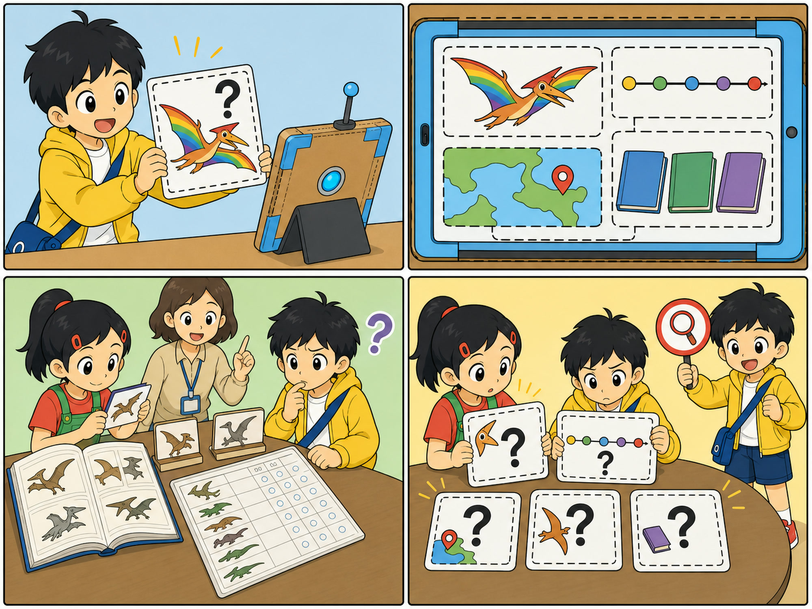
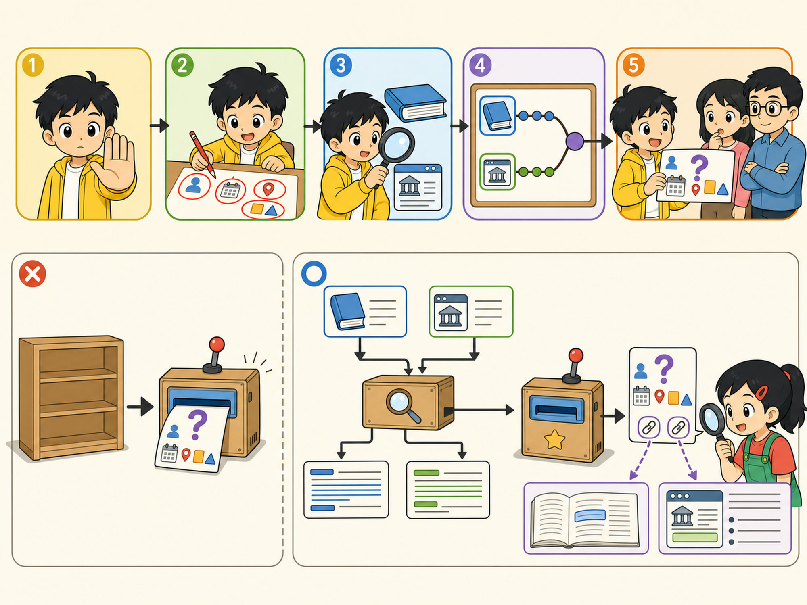

# 第 9 章 AI 为什么会一本正经地说错？

## 漫画开场：彩虹翼龙的生日

小问问聊天工具：“彩虹翼龙生活在什么时候？”

屏幕很快回答：“彩虹翼龙生活在一亿年前，每年春天会用彩色翅膀求偶。科学家在云海县发现了它的化石。”

句子完整，时间、地点和习性都有。小问差点把它写进恐龙小报。

朵朵搜索老师提供的恐龙资料，却怎么也找不到“彩虹翼龙”。

“因为它是我刚才编的名字。”小问瞪大眼睛，“AI 怎么把它说得像真的一样？”

方方举起红色问号牌，把“云海县”也圈了出来。

> **AI 侦探任务**：认识大模型幻觉，学习把流畅回答拆成可核对的事实，并使用可靠来源交叉验证。

*图 9-1 细节多、语气肯定，只能让一句话显得像真的，不能把它变成事实。*

## 1. 流畅的接话可能拼出假事实

第 7 章讲过，大语言模型会根据上下文预测接下来的 Token。

“某种恐龙生活在……年前”“科学家在……发现化石”都是常见的介绍句式。即使“彩虹翼龙”不存在，模型也可能沿着这些句式继续生成具体内容。

这种看起来合理、实际上缺少依据或与事实不符的输出，常被称作**幻觉（Hallucination）**。

模型不是故意撒谎。撒谎通常表示知道真相却故意欺骗。模型是在生成过程中给出了错误内容，但使用者仍可能被误导。

## 2. 为什么会出现幻觉？

原因可能包括：

- 问题里包含不存在或错误的前提。
- 模型缺少可靠资料，却仍继续生成。
- 训练材料中信息冲突、过时或错误。
- 任务要求模型给出非常具体的名字、日期或来源。
- 生成设置更鼓励多样接法，而不是谨慎回答。

即使把问题写得很清楚，也不能保证没有幻觉。

## 3. 把回答拆成“可检查的小块”

朵朵把回答拆成四张事实卡：

1. 有一种恐龙叫彩虹翼龙。
2. 它生活在一亿年前。
3. 它用彩色翅膀求偶。
4. 云海县发现过它的化石。

现在，每张卡都可以单独查证。

一大段话容易让人被流畅语气带着走。拆成姓名、时间、地点、数字和因果关系后，更容易发现哪一块缺少证据。

## 4. 让它给来源，来源也要查

小问追问：“请给出参考书名。”工具列出了三本听起来很正式的书。

朵朵一本也找不到。

模型不仅可能编事实，也可能编书名、作者、网页和研究报告。看到来源名称，不能自动当成已经验证。

要检查：

- 来源真的存在吗？
- 作者或机构是谁？
- 来源里真的写了这句话吗？
- 发布时间是否适合当前问题？
- 这是一手记录、专业解释，还是别人转述？

## 5. 可靠资料怎样找？

不同问题需要不同来源。

学校活动时间，应查看老师或学校的正式通知。天气预警，应查看权威气象信息。动物知识，可以查博物馆、科学机构和经过编辑审核的百科资料。

只看一个网页仍可能出错。重要事实可以找两个彼此独立、可信的来源进行**交叉验证**。

“很多网页都复制了同一句话”不一定是多个独立证据。它们可能都来自同一个错误帖子。

## 6. 让模型先看资料再回答

有些 AI 系统会先从指定资料中寻找相关内容，再根据找到的片段回答。

这像开卷考试：先翻到材料，再组织答案。工程师常把这类方法叫作**检索增强生成**。

它能减少一部分无依据回答，还可以让结果附上引用。但它仍会出错：可能没找到正确段落，可能读错，也可能引用的资料本身不可靠。

因此，引用是检查线索，不是自动正确印章。

还要分清“没有找到”和“证明不存在”。朵朵没有在一本书里找到彩虹翼龙，只能说这本书没有相关记录。她继续查博物馆资料和可信百科，仍找不到证据，再结合“小问刚刚编了名字”这一信息，才有充分理由判断这次回答不可靠。

AI 如果只根据指定资料回答，比较好的表达应当是：“在提供的资料中没有找到答案。”这比猜出一个完整故事更有用。承认不知道，是可靠工具应该具备的重要能力。

## 7. 哪些任务更要小心？

生成故事点子时，虚构内容可能正是目标。只要不冒充真实事件，想象中的彩虹翼龙可以成为有趣角色。

但下面这些内容必须认真核对：

- 人名、地名、日期和数字。
- 作业中的科学与历史事实。
- 新闻、比赛规则和活动通知。
- 健康、安全、金钱与账号信息。
- 声称某个人说过或做过什么。

先判断任务需要“有创意”还是“讲事实”，核验方法才不会用错。

## 8. 动手试一试：不存在的动物百科

每人编一个不存在的动物名字，例如“月光毛毛龟”。再写四句话，其中两句明显是想象，两句故意写得像百科事实。

和同伴交换，只靠文字判断哪些是真的。然后公开答案：这个动物根本不存在，四句话都不能当作真实动物资料。

讨论：

1. 加入具体年份和地点，会不会显得更可信？
2. 使用“科学家发现”这样的开头，会不会让人放松检查？
3. 怎样明确标出这是一段虚构创作？

活动最后要在纸上醒目标记“虚构练习”，不要把内容贴到网上误导别人。

## 9. 一张五步核验卡

遇到 AI 给出的事实，可以按照五步检查：

1. **停一下**：不要因为回答很快、很流畅就立刻相信。
2. **圈事实**：找出姓名、日期、地点、数字和重要结论。
3. **查来源**：寻找真正存在、适合这个问题的可靠资料。
4. **做对照**：比较两个独立来源，看看是否一致。
5. **问大人**：高风险或拿不准时，请家长、老师或专业人员帮助。

如果暂时查不到，可以诚实地写“还不能确认”。

*图 9-2 五步核验卡不会替你决定真假，但能把“我觉得”变成可检查的过程。*

核验后还要记录结论。可以在事实卡旁写“已确认”“与来源冲突”或“暂未找到证据”，并记下查过的资料。这样别人能够复查，你也不会过几天忘记当时为什么相信或怀疑它。

## 10. 小心这个坑：用“AI 说的”代替证据

“AI 说的”只说明某个工具生成过这段内容，不是事实来源。

同样，“网上看到的”“很多人转发”也不自动等于可靠。

做作业和小报时，要写真正查过的资料来源；使用 AI 帮助整理时，还要遵守老师关于工具使用的规定。

## 11. 侦探笔记

- 大模型可能生成流畅却缺少依据的内容，这类错误常叫作幻觉。
- 要把长回答拆成可检查的事实卡，来源名称和引用也必须确认真实存在并支持结论。
- 创意任务可以虚构，事实任务要停一下、圈事实、查来源、做对照，重要问题还要问合适的大人。

## 给大人的话

本章没有把幻觉归结为单一原因，也没有暗示 RAG 可以彻底解决问题。检索质量、来源质量、上下文组织和生成过程都会影响最终答案。

“彩虹翼龙”“云海县”和示例书名均为虚构教学元素。正式排版时应继续保持明显的虚构标记，避免片段脱离上下文传播后造成误解。
