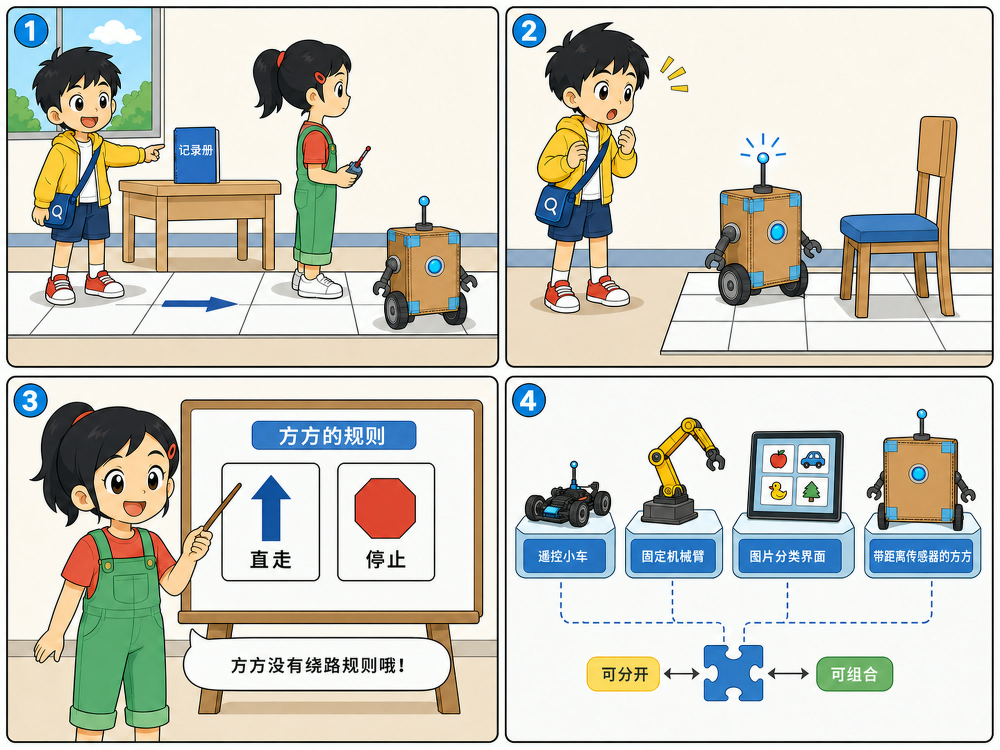
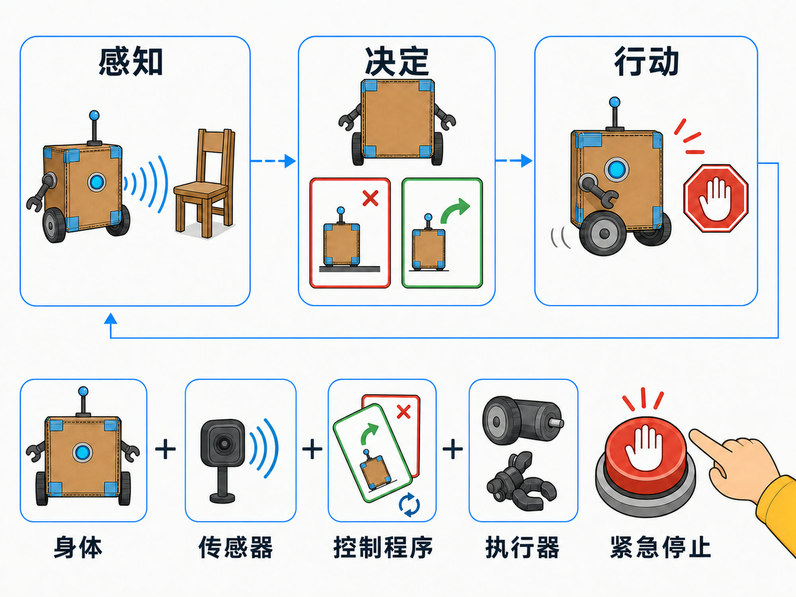

# 第 10 章 机器人就是 AI 吗？

## 漫画开场：方方为什么不绕路？

科技节准备室里，小问把一本记录册放在桌子上。

“方方，去把记录册拿来！”

纸盒机器人方方向前滚了两米，在一把椅子前停住。蓝灯一闪一闪，却没有绕过去。

“它不是机器人吗？怎么连绕路都不会？”小问问。

朵朵蹲下来检查：“我们只给它写了直走和停止的规则。它能动，不表示它会自己想出新路线。”

小问把椅子移开。方方继续直走，又在桌边停下。原来机器人有了身体，还需要合适的传感器、程序和行动规则。

> **AI 侦探任务**：区分机器人与人工智能，认识传感器、控制程序和执行器，并用“感知—决定—行动”解释机器人怎样完成任务。

*图 10-1 能移动的是机器人身体，会不会绕路取决于传感器和控制方法。*

## 1. 机器人是一种有身体的机器

机器人通常能在真实世界中感受环境、执行动作，或者两者都能做到。

工厂机械臂可以搬运零件。扫地机器人可以移动和吸尘。水下机器人能在深海拍摄。

它们的身体可能像小车、手臂、飞行器，也可能完全不像人。

机器人不一定使用 AI。按照固定时间浇水的小机器，可以只用普通程序。玩具遥控车由人控制，也不需要自己识别道路。

反过来，AI 也不一定有机器人身体。相册里的图片分类、语音转文字和聊天模型，都可以只运行在电脑或服务器中。

所以，“机器人”和“AI”是两个不同概念。它们可以合作，却不能画等号。

## 2. 方方身上有四类重要部件

第一类是**身体**。轮子、外壳和机械结构承受重量，也决定机器人能去哪里。

第二类是**传感器**。它们收集输入，例如摄像头接收光，麦克风接收声音，距离传感器测量前方物体有多远。

第三类是**控制程序**。它根据输入执行规则或模型，决定下一步做什么。

第四类是**执行器**。电机让轮子转动，机械臂抓取物品，扬声器发出声音。

传感器像测量工具，不是人的眼睛和耳朵。控制程序也不是藏在盒子里的小人。所有结果都来自部件、数据和程序共同工作。

## 3. 感知—决定—行动的循环

朵朵给方方装上距离传感器，并写下新规则：

1. 测量前方距离。
2. 如果障碍很近，就停止。
3. 如果前方安全，就让轮子前进一点。
4. 重新测量，再做下一次决定。

这形成了一个循环：**感知—决定—行动**。

机器人行动后，周围情况会改变，所以它要再次感知。它不是看一次就一路冲到底。

真实机器人可能每秒循环许多次，也可能同时读取多个传感器。这里的三步图是理解方法，不代表所有机器人都只有三条程序。

*图 10-2 “感知—决定—行动”不断循环，紧急停止为真实动作保留安全出口。*

## 4. 规则和 AI 可以怎样分工？

固定规则适合边界清楚的任务。例如：“距离小于 20 厘米就停止。”它容易检查，也容易说明。

有些输入很复杂，很难把每种情况都写成规则。例如，从摄像头画面中分辨地面、纸箱和行人。工程师可能使用图像识别模型帮助判断。

模型给出“前方像纸箱”的结果后，安全程序还要决定是否停车。AI 模型只是系统中的一个部件，不应该独自承担全部责任。

能用简单传感器和规则可靠完成的任务，不必为了听起来厉害而强行加 AI。系统越复杂，需要测试和维护的地方也越多。

## 5. AI 放大镜：从输入到真实动作

假设机器人要把彩色积木送进盒子。

摄像头提供图片输入，识别模型判断积木位置，控制程序计算移动方向，电机带动轮子和机械臂。动作完成后，摄像头再检查积木是否真的进了盒子。

任何一环都可能出错：镜头被遮住，识别错了，轮子打滑，盒子被移动，机械臂也可能没有抓稳。

因此，检查机器人不能只问“模型准确吗”，还要检查整个系统从感知到行动是否可靠。

## 6. 动手试一试：蒙眼机器人

在空地上用纸杯摆一条路线。活动必须由老师或家长看护，不在楼梯、马路或有尖角的地方进行。

一人扮演机器人，闭眼后站在起点；一人扮演传感器，只能报告“前方安全”“前方有障碍”；另一人扮演控制程序，只能发出“前进一步”“左转”“右转”“停止”。

走完后交换角色，再讨论：

1. 传感器报告慢了会怎样？
2. “前进一步”到底多远？
3. 规则没有写到的新情况由谁处理？
4. 哪些地方应该立即停止并请人帮助？

这个游戏模拟信息传递，不需要真的蒙住眼睛走动。也可以让“机器人”睁眼但承诺只按口令行动。

## 7. 怎样测试一个机器人？

先在安全、简单的环境里测试，再逐步加入变化。

可以测试光线变暗、障碍换颜色、地面变滑、指令中断和电量不足。还要故意准备失败情况，观察机器人能否停下来，而不是继续危险动作。

好的安全设计常包含“停止按钮”“速度限制”和“人工接管”。当输入不确定或关键部件失灵时，停下来通常比猜一个动作更可靠。

## 8. 小心这个坑：把机器人的动作当成心情

方方抬起机械臂，是因为程序发出了动作命令，不表示它真的高兴。

机器人说“我很累”也可能只是电量提醒的对话设计。自然的动作和语言能帮助人使用机器，却不能证明机器拥有人的感受。

我们可以喜欢一个机器人角色，同时仍然准确地理解它怎样工作。

## 9. 侦探笔记

- 机器人是能感受环境或执行动作的机器，不是所有机器人都使用 AI，AI 也不一定有身体。
- 传感器提供输入，控制程序作出决定，执行器完成动作；机器人常在“感知—决定—行动”中循环。
- AI 模型只是系统的一部分，真实动作还需要安全规则、整机测试和人工接管。

## 给大人的话

本章采用宽泛的教育定义介绍机器人，没有把自主程度作为唯一标准。行业和研究领域对“机器人”的边界可能不同，共读时不必纠缠遥控玩具是否算机器人，重点是识别感知、控制和执行的关系。

涉及儿童活动时，应优先使用纸面路线或角色扮演。真实电机、飞行器、机械臂和联网设备需要成人负责设备安全、场地安全和数据权限。
