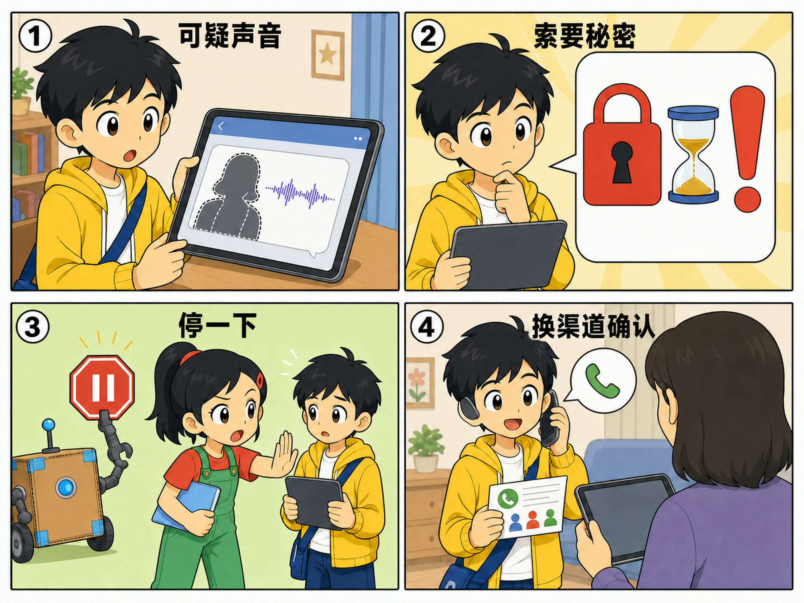
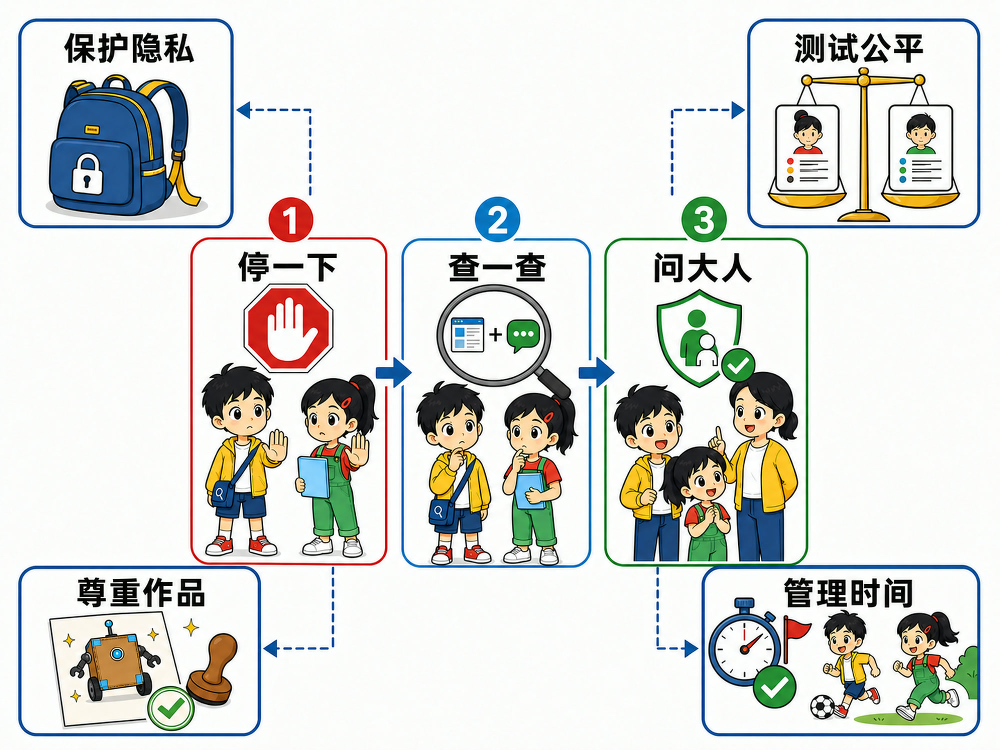

# 第 11 章 AI 世界的安全守则

## 漫画开场：声音像妈妈，就一定是妈妈吗？

小问收到一段语音。声音很像妈妈：“把家里的开门密码发给我，我马上要用。”

他刚准备回复，方方弹出一张红色暂停牌。

朵朵提醒：“声音和图片都可以被 AI 模仿。先别发秘密，用原来保存的号码联系妈妈。”

小问打了电话。妈妈说自己根本没有发过那段语音。

“差一点就被骗了！”小问把消息交给大人处理，“原来熟悉的声音也要核验。”

> **AI 侦探任务**：学习保护隐私、识别 AI 伪造与诈骗、观察不公平结果、尊重他人作品，并记住“停一下—查一查—问大人”。

*图 11-1 熟悉的声音也可能被模仿；不在原消息里继续周旋，换渠道确认更可靠。*

## 1. 数据像随身小背包

照片、声音、位置、姓名、账号和浏览记录，都可能成为数据。

有些数据能帮助 AI 完成任务。例如，语音输入需要接收一段声音。可是完成任务不需要的秘密，不应该顺手一起交出去。

使用工具前先问三件事：它需要什么数据？为什么需要？数据会被送到哪里、保存多久？

孩子不必独自判断复杂的服务条款。需要注册、上传照片或录音时，应先请家长或老师确认。能使用虚构名字、物品卡片和公开材料完成的练习，就不使用真实隐私。

密码、验证码、家庭住址和私密照片不能因为对方“说得很急”就发送。正规的家人、老师和工作人员也不应该索要你的账号密码。

## 2. 看起来像真的，也可能是合成的

生成式 AI 可以制作很像真实人物的图片、声音和视频。经过 AI 制作或修改、用来模仿真实人物的内容，常被称为**深度伪造（Deepfake）**。

有些伪造内容会留下不自然的嘴形、光影或声音停顿，但技术会变化，不能只靠找小破绽。

更可靠的办法是核对来源：谁发来的？原账号可靠吗？其他可信渠道有没有同样消息？能不能用以前保存的电话直接确认？

不要点击可疑消息里提供的新号码或链接。骗子可能把假联系方式也准备好了。

## 3. 遇到催促，先让速度慢下来

“马上转发”“十分钟内交钱”“不许告诉别人”“把验证码给我”，这些话会让人来不及思考。

安全口诀的第一步是**停一下**。不回复，不转账，不点陌生链接，也不继续提供信息。

第二步是**查一查**。离开原消息，用独立方式联系本人或查看正式通知。

第三步是**问大人**。把完整情况告诉家长、老师或其他可信任的大人。被骗不是孩子的错，越早求助越容易减少损失。

*图 11-2 三步口诀处理眼前风险，四个安全区提醒我们长期负责任地使用 AI。*

## 4. AI 的错误可能对一些人更多

第 2 章讲过，训练数据不丰富会造成偏差。如果语音系统主要听过安静环境中的成人声音，它可能更难听懂儿童、方言使用者或嘈杂场景中的人。

这会带来**公平性**问题：不同人使用同一系统，得到的错误率和机会可能不同。

公平不只是“每个人都按同一条规则”。还要测试不同群体和场景，看看规则是否让某些人总是吃亏。

发现系统对自己识别不好，不代表自己的声音、外貌或表达有问题。问题可能来自数据和设计。应保留人工选择，并把问题告诉负责的人。

## 5. 尊重别人的作品和身份

AI 能帮助改写、画图和配音，不表示任何内容都能随便拿来用。

不要冒充同学发言，不用他人的照片制作取笑视频，也不要把未经同意的作品当成自己的。

完成作业时，要遵守老师对 AI 工具的规定。哪些部分由自己完成，哪些部分得到工具帮助，应如实说明。引用资料和作品时，要记录来源，并遵守使用许可。

“技术上做得到”不等于“这样做是合适的”。尊重、同意和责任也是作品的一部分。

## 6. AI 放大镜：安全不是一个按钮

一个安全的 AI 产品，需要很多人一起工作。

设计者要减少不必要的数据，工程师要设置权限和停止机制。测试人员要寻找不同人群中的错误，运营人员要处理举报，使用者也要遵守规则。

没有哪个“安全按钮”能让风险全部消失。软件更新、使用场景变化和新的诈骗方法，都需要继续观察和改进。

## 7. 别让推荐替你安排全部时间

推荐系统会挑选你可能继续观看的内容。连续播放和提醒能让人停留更久，却不一定符合你的睡眠、运动和学习计划。

可以在使用前决定结束时间，关闭不必要的提醒，把设备放到够不到的地方，并请家人一起遵守约定。

休息不是输给机器。能主动停下来，说明你在管理工具。

## 8. 动手试一试：安全信号灯

准备红、黄、绿三张卡。由大人读出情境，孩子举卡并说明原因。

- 绿灯：使用不含个人信息的水果卡训练分类游戏。
- 黄灯：应用请求开启麦克风，但任务只是看一张静态图片。
- 红灯：陌生人用熟悉声音索要验证码，并要求保密。
- 黄灯：AI 给出一条新闻，却没有可打开的来源。
- 红灯：未经同意，把同学照片做成搞笑视频。

同一情境可能需要补充信息才能判断。举黄灯不是胆小，而是表示“先暂停并确认”。

## 9. 小心这个坑：把责任全推给使用者

孩子需要学习安全习惯，但不能把所有责任都压在孩子身上。

产品应有合适的年龄保护、清楚提示和投诉渠道。学校与家庭应提供陪伴。制作和传播欺骗内容的人，也必须承担责任。

遇到问题时，先保护人、保存必要证据并求助，不责怪受骗者“为什么没看出来”。

## 10. 侦探笔记

- 使用 AI 时只提供完成任务必需的数据，秘密、身份和他人资料要特别保护。
- 熟悉的声音、图片和视频也可能被合成；遇到催促要停一下、换渠道查一查、及时问大人。
- 公平、作品许可、使用时间和产品设计都属于 AI 安全，安全需要许多人共同负责。

## 给大人的话

本章不建议用真假视频竞猜训练儿童，因为这容易制造“看一眼就能识破”的错误信心。更稳妥的训练重点是来源、情境、独立联系渠道和及时求助。

涉及诈骗或隐私事件时，不要求孩子自行取证、与对方争辩或继续周旋。成人应根据实际情况联系平台、学校或有关机构，并避免在处理过程中再次扩散儿童个人信息。
