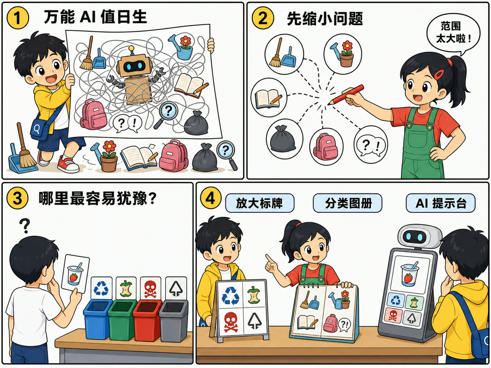
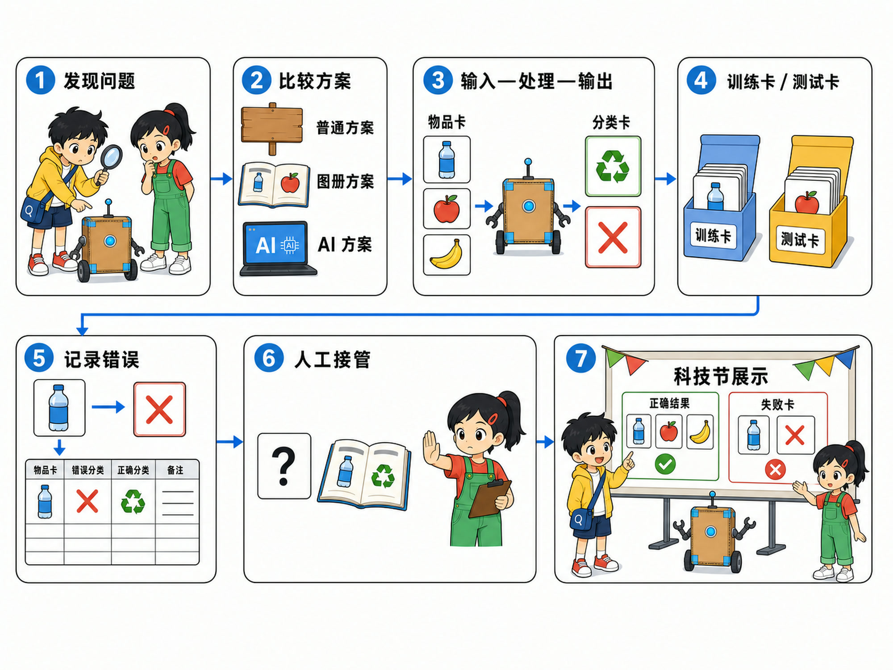

# 第 12 章 我们的校园 AI 小发明

## 漫画开场：“万能 AI 值日生”太大了

科技节报名只剩三天。小问在海报纸上写下：“万能 AI 值日生。”

“它要做什么？”朵朵问。

“扫地、浇花、批作业、找失物，还能回答所有问题！”

朵朵拿出红笔，把纸圈得像一团毛线：“问题太多，谁也说不清怎样才算成功。”

这时，一位同学拿着酸奶杯，站在四个垃圾桶前犹豫。

小问有了新主意：“我们先做一个垃圾分类提示台。它只识别练习用的物品卡，给出分类建议；拿不准时，请值日生帮助。”

> **AI 侦探任务**：完成一次负责任的 AI 设计，从发现问题、判断是否需要 AI，到制作原型、测试错误、设计人工接管并清楚展示。

*图 12-1 先缩小问题，再比较多种方案；AI 只是候选工具之一。*

## 1. 从真实问题开始

好发明不是先喊“我要用 AI”，而是先观察人们遇到了什么困难。

小问和朵朵在午休后观察十分钟。他们不拍人脸、不记姓名，只在纸上画正字：哪些物品最容易分错？大家为什么犹豫？现有垃圾桶标志是否清楚？

他们发现，干净纸盒和饮料瓶比较容易判断，沾有食物的餐盒最让人困惑。有些同学不是不会分类，而是没有看见桶上的说明。

问题可以写成一句话：“怎样帮助同学在不确定时找到正确分类信息？”

这比“做一个厉害 AI”更容易设计和检查。

## 2. 先问：真的需要 AI 吗？

朵朵提出三个方案：放大垃圾桶标签、制作可翻阅的物品图册、设计图片分类提示台。

前两个方案不需要 AI，成本低，也更容易维护。图片分类适合物品种类多、外观变化大的情况，但会识别错误。

他们决定在科技节制作纸面版 AI 原型，比较三个方案，而不是预先宣布 AI 一定最好。

工程师把这种选择叫作方案比较。最合适的工具不一定最复杂。能用清楚标牌解决的问题，就不必收集大量照片训练模型。

## 3. 写清输入、处理和输出

提示台的输入是练习物品卡的图片，不拍真人，也不记录谁扔了什么。

处理部分是假想的图片分类模型。它从纸盒、瓶子和餐盒等样本中学习外观规律。

输出不是命令，而是建议：“更像可回收物”“更像其他垃圾”或“不能确定，请查看规则”。

团队还写下成功标准：在 20 张测试卡中，大多数常见物品能给出正确建议；模糊、遮挡或脏污卡片应允许回答“不确定”；最终分类规则以学校正式说明为准。

成功标准必须在测试前写。看过结果以后再改标准，很容易只挑对自己有利的部分。

## 4. 准备数据卡，也要留下测试卡

小问画了不同角度、不同颜色的纸盒和瓶子。朵朵提醒他加入压扁的纸盒、带标签的瓶子和部分遮挡的物品。

如果训练卡全是漂亮正面图，系统到了真实场景就可能出错。

他们把卡片分成两组：训练卡用来找规律，测试卡先收起来，最后才使用。测试卡不能只是训练卡的复制品。

所有图片都由团队自己绘制，或者使用得到许可的公开素材。不拍同学，不保留教室里的姓名牌，也不从网上随便搬图。

## 5. 用纸面原型演一遍

方方扮演提示台。使用者递上一张物品卡，藏在纸盒后的同学按照事先写好的分类规则，推出一张结果卡。

如果图片不清楚，就推出问号卡；如果使用者不同意，可以打开分类图册，或者请值日生处理。

纸面原型没有真正训练模型，却能提前发现流程问题：相机放哪里？结果怎样说才不会像命令？找不到类别时怎么办？谁来修改错误规则？

先用纸测试流程，能减少做出软件后才发现方向不对的浪费。

## 6. AI 放大镜：给错误留一条出口

测试开始后，系统把蓝色玻璃瓶卡认成了塑料瓶。另一张被手遮住一半的纸盒卡，系统却给出很肯定的答案。

团队没有把错卡藏起来，而是记录：输入是什么，系统输出什么，正确规则是什么，可能为什么出错，准备怎样改。

他们增加了三个出口：低把握时显示问号，始终提供正式分类图册，重要争议交给值日生。这个过程叫作**人工接管**。

人工接管不是给失败找借口。它要明确在什么情况下发生、由谁处理，以及怎样把新问题带回下一轮改进。

*图 12-2 一块完整项目板既记录成功，也保留错误、接管方法和已知限制。*

## 7. 动手试一试：画出你的 AI 发明卡

选择一个校园里的小问题，不使用真实姓名、成绩、人脸、声音或位置记录。

在一张纸上完成七格发明卡：

1. 谁遇到了什么问题？
2. 不用 AI 有哪些办法？
3. 输入、处理和输出分别是什么？
4. 需要哪些不含隐私的样本？
5. 怎样测试平常情况和意外情况？
6. 系统答错时怎样停止或请人帮助？
7. 谁对最终决定负责？

和同伴交换发明卡。对方不负责夸“真酷”，而要找出一个不清楚的地方、一个可能出错的地方和一个更简单的办法。

## 8. 展示时要说出限制

科技节上，小问先演示三张识别正确的卡，又主动拿出识别失败的蓝色瓶子。

朵朵展示测试表：哪些卡参加过训练，哪些只用于测试，错误集中在哪里。他们还比较了放大标签和纸面图册。

一个负责任的展示应包含：解决的问题、工作流程、数据来源、测试方法、已知错误、安全边界和下一步计划。

只展示成功画面，会让观众误以为系统从不出错。说出限制不会让作品变差，反而说明团队真正理解了自己的发明。

## 9. 小心这个坑：为了证明有用而收集更多数据

“照片越多越好”并不总是正确。

重复、模糊、标错类别的图片可能让模型学坏。包含人脸、姓名和位置的照片还会增加隐私风险。

应该先确定任务需要什么，再收集最少而合适的数据。项目结束后，也要按照约定删除不再需要的资料。

## 10. 侦探笔记

- AI 项目先从真实问题开始，并比较不用 AI 的简单方案；技术复杂不等于更合适。
- 写清输入、处理、输出和成功标准，分开训练卡与测试卡，用多样情况寻找错误。
- 负责任的发明要保护隐私、允许不确定、安排人工接管，并在展示中主动说明限制。

## 给大人的话

本章的垃圾分类提示台是纸面原型，不要求儿童注册模型训练平台。实际分类规则随地区和时间变化，应以所在地官方规定为准，不把书中的类别示例当作现实处置标准。

课堂评价建议把问题定义、方案比较、测试记录、隐私保护和限制说明列为主要指标，而不是只奖励“使用了 AI”或演示成功率。成人应负责真实设备、在线账户、素材许可和数据删除。
