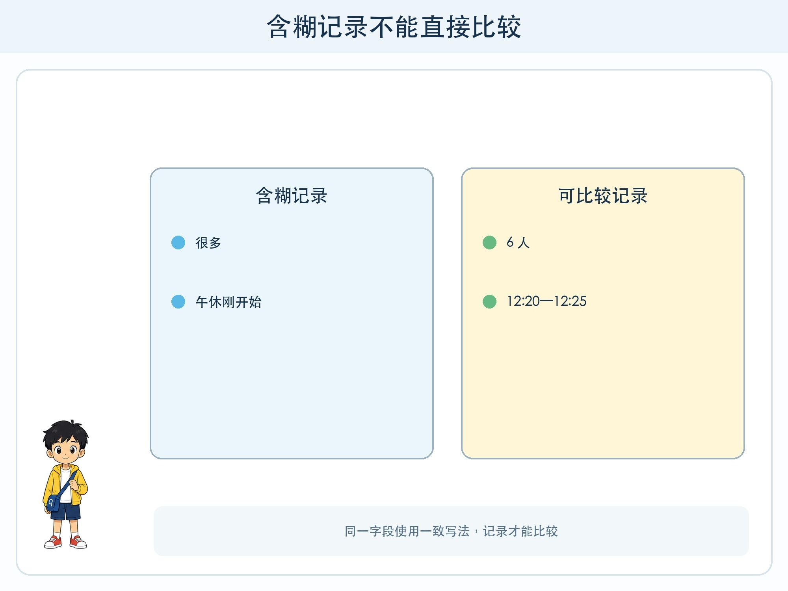
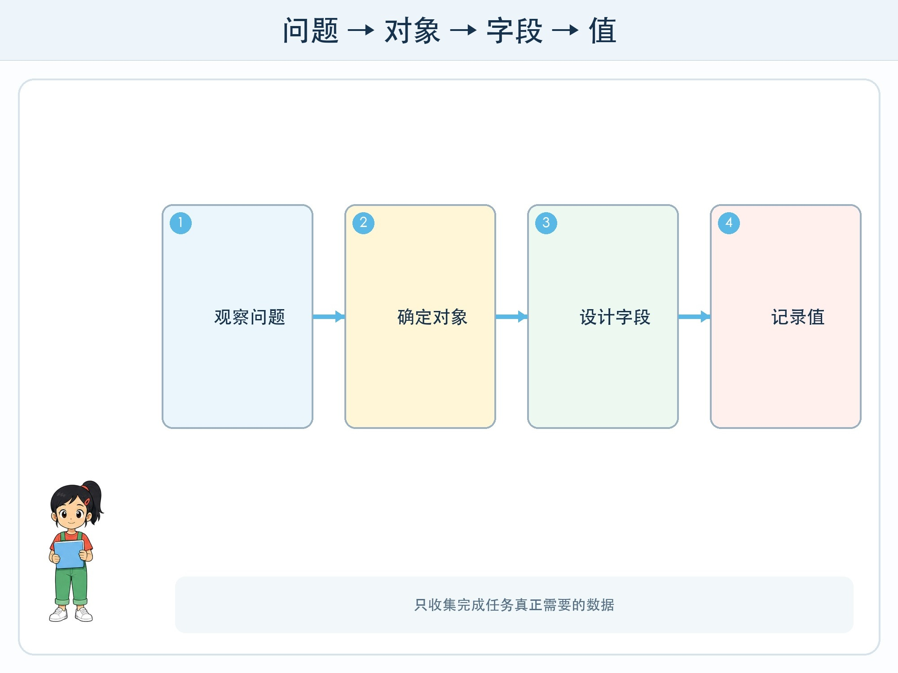

# 第 1 章 校园里的数据脚印

## 漫画开场

午休后，老师发现图书角常常排队，却不知道哪一类书最需要多准备几本。小问马上说：“让方方每天数一数，不就知道了吗？”

方方真的开始数。第一天，它写下“很多”；第二天写“有一点挤”；第三天写“排了长队”。朵朵看完记录直摇头：“这些词都没有错，可是没法放在一起比较。”

“那就每分钟数一次人数！”小问改口。朵朵又问：“从几点开始？同一个人离开又回来算几次？要不要记录借了什么书？”方方的蓝灯闪了三下。原来在收集数据以前，先要说清楚问题。

## 工程挑战

本章要完成三件事：

1. 分清记录中的**对象、字段和值**。
2. 为一个真实问题设计够用但不过量的数据表。
3. 知道数据不是自动出现的，它来自一次次有规则的观察。

## 一行记录里有什么

数据可以是数字，也可以是文字、图片、声音或位置。它们共同的特点是：被记录下来，能够用于观察、比较或计算。

朵朵把图书角问题拆成一张表。每一行代表一次观察，也就是一个**对象**。每一列代表要记录的项目，叫作**字段**。格子里的具体内容叫作**值**。

| 日期 | 时间段 | 等待人数 | 借阅类别 |
| --- | --- | ---: | --- |
| 周一 | 12:20—12:25 | 6 | 科普 |
| 周一 | 12:25—12:30 | 3 | 文学 |
| 周二 | 12:20—12:25 | 8 | 科普 |

“等待人数”字段里的 6、3、8 是值。“科普”和“文学”也是值。字段名称要稳定，值的写法也要一致。今天写“科普”，明天写“科学书”，电脑可能把它们当成两类。

## 收得越多越好吗

小问提议顺便记录每名同学的姓名、班级、借书历史和照片。老师却说，这些信息对“哪类书需要增加”没有必要，还会带来隐私风险。

工程师常问两个问题：这个字段能帮助回答目标问题吗？如果不用它，任务还能完成吗？只收集必要数据叫作**数据最小化**。它既能减少整理工作，也能保护人。

图书角只需要统计人数和类别，不需要知道具体是谁。即使某个字段“以后也许有用”，也不能成为随便收集的理由。

## 数据会留下选择

数据表看起来很客观，其实每一列都包含人的选择。只在午休观察，就不知道放学后的情况；只记录排队者，就看不到因为队伍太长而离开的人；只统计借出数量，也不一定知道孩子真正想借却没找到的书。

所以数据不是现实本身，而是从现实中选出来的一部分。读表时，不只看格子里有什么，还要问：谁记录的，什么时候记录的，哪些情况没被记录？

## 动手试一试：设计一张不收姓名的观察表

选择一个校园问题：饮水机什么时候排队、哪种失物最多，或者班级绿植什么时候需要浇水。

1. 用一句话写目标，例如“找出饮水机最拥挤的时间段”。
2. 规定一次观察代表什么。
3. 设计不超过四个字段。
4. 连续模拟记录六行，其中故意留一个特殊情况。
5. 请同伴只看表格，说出他能回答什么、不能回答什么。

不要记录同学姓名、学号、人脸、声音或联系方式。活动的重点是设计字段，不是真实追踪个人。

## 小心这个坑

一个常见错误是“先把所有东西收起来，以后再想用途”。数据一旦包含个人信息，就会产生保存、访问、删除和泄露风险。另一个错误是把“没有记录”理解成“没有发生”。空白可能代表没有人，也可能代表观察员忘了写，两种情况完全不同。

## 工程师笔记

- 数据表的一行代表一个对象或一次观察，一列代表一个字段。
- 数据只记录现实的一部分，采集规则决定我们能看到什么。
- 只收集完成任务真正需要的信息，不用姓名也能解决的问题就不要收姓名。

## 给大人的话

本章的重点不是电子表格操作，而是数据定义。共读时可让孩子比较两张字段不同的表，追问“它们能回答同一个问题吗”。不要让孩子为练习而真实记录同学行为；使用虚构数据即可达到学习目标。
