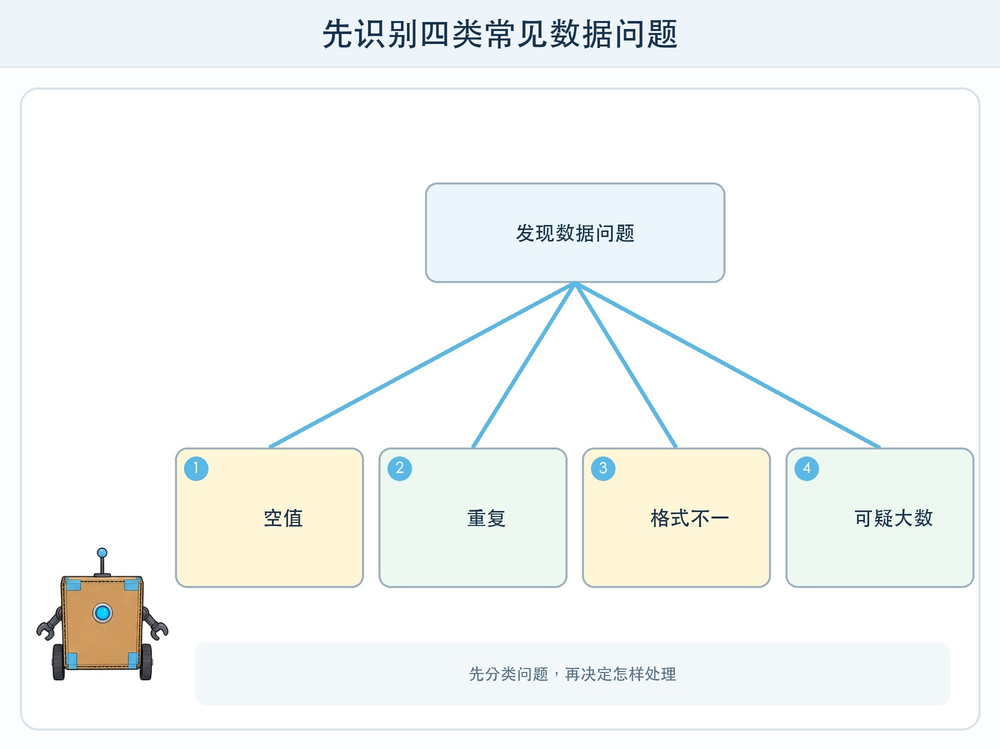
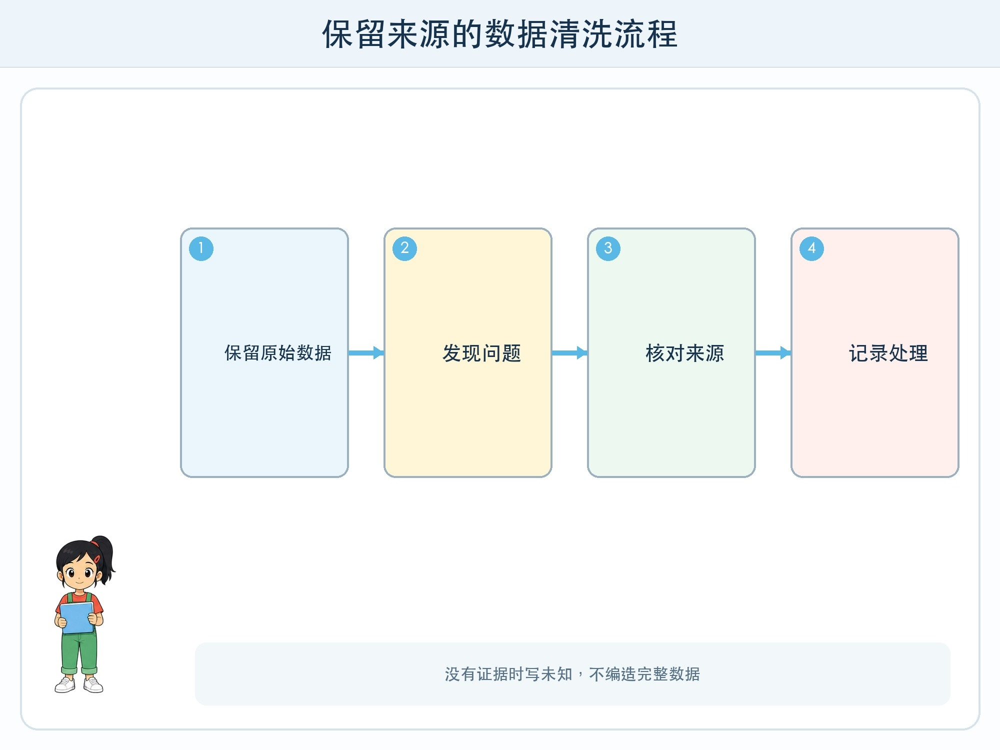

# 第 2 章 数据要先整理

## 漫画开场

图书角观察结束后，小问兴奋地把记录交给方方。方方刚读到第三行就停了：一行写“12 点 20”，一行写“12:20”，还有一行写“午休刚开始”。人数栏里出现了“六”“6 人”和一个空格。

更奇怪的是，周三的同一条记录出现两次，周五等待人数竟然是 68。小问挠头：“难道那天全校都挤进来了？”朵朵查回纸卡，发现原来是把 8 写成了 68。

方方没有办法猜哪一种写法才对。它会严格执行处理步骤，却不会自动知道记录者的原意。把数据交给模型之前，工程师必须先做**数据清洗**。

## 工程挑战

本章要学会识别四类常见问题：

- 缺失：应该填写的格子为空。
- 重复：同一次观察被记了不止一次。
- 不一致：相同意思使用不同格式或名称。
- 异常：数值或内容明显超出合理范围。

更重要的是：清洗不是把“不好看”的数据删掉，而是依据规则查明原因、记录处理决定。

## 先找到问题类型

空格不一定都能填成 0。等待人数为空，可能表示没有排队，也可能表示忘记观察。如果没有证据，就应标记“未知”，不能为了表格整齐编一个数字。

重复记录也要看依据。日期、时间段、观察位置都相同，才可能是同一条。两位观察员在同一时间分别计数，数值不同不代表一定有一条错了，也可能是观察起止时刻不同。

格式问题通常可以按统一规则修改。例如把时间都写成“时:分”，把“科学”“科普书”统一到事先约定的类别。不过修改前最好保留原始记录，方便以后追查。

异常值最需要谨慎。68 可能是笔误，也可能是科技节真的来了很多人。工程师不能看到大数就删除，而要回到来源、询问记录者或标为“待确认”。

## 为什么清洗会影响 AI

假设要训练一个模型预测图书角是否拥挤。如果大量空格被错误填成 0，模型会以为那些时段没有人；如果重复了最拥挤的一天，模型会高估拥挤情况；如果类别名称混乱，同一种书会被分散到好几组。

模型不会拿着放大镜追问每个格子。它只会从提供的数据中寻找规律。错误、重复和混乱的格式也会一起进入规律。因此有一句工程提醒：输入质量不好，输出通常也不会可靠。

这不表示清洗以后数据就“绝对正确”。清洗只能按照已知规则减少问题。记录范围太窄、观察方式不公平等问题，还需要后面的测试发现。

## 动手试一试：数据修理站

请大人或同伴准备一张含 12 行虚构记录的表，故意放入：两个空值、一个重复、两种时间格式和一个可疑大数。

1. 不直接修改，先给每个问题画圈并编号。
2. 在旁边写问题类型和需要的证据。
3. 能确认的按统一规则修改；不能确认的写“未知”或“待核对”。
4. 新增“处理说明”一列，写清改了什么。
5. 比较原表和清洗表，数一数每类问题有多少。

这张“处理说明”就是小型的数据日志。别人可以据此理解你的决定，而不是只看到一张突然变整齐的表。

## 清洗规则也会出错

如果规则写“等待人数超过 20 一律删除”，科技节当天的真实高峰也会消失。如果规则写“空白一律填 0”，忘记记录会变成没有人。自动清洗可以加快重复工作，但规则必须先用样例测试，并保留人工复核。

另一个风险是“为了让结果好看而清洗”。如果只删除模型答错的样本，分数可能提高，却掩盖了系统真正的边界。清洗的目标是让数据含义更清楚，不是替模型藏错题。

## 小心这个坑

原始数据和清洗后的数据应该分开保存。不要在唯一一份记录上反复覆盖，也不要把含个人信息的真实数据复制到个人设备。课堂练习使用虚构表格；真实学校数据由有权限的成人按规定处理。

## 工程师笔记

- 缺失、重复、不一致和异常需要不同的处理办法。
- 没有证据时写“未知”，比猜一个看似完整的值更诚实。
- 每次修改都保留来源和说明，清洗不能用来隐藏失败样本。

## 给大人的话

可以让孩子扮演“记录员、清洗员、复核员”，体验同一人既改又审容易漏错。评价重点是能否说明处理依据，而不是是否把每个空格填满。若使用电子表格，只操作虚构数据，不导入班级真实名单或行为记录。
