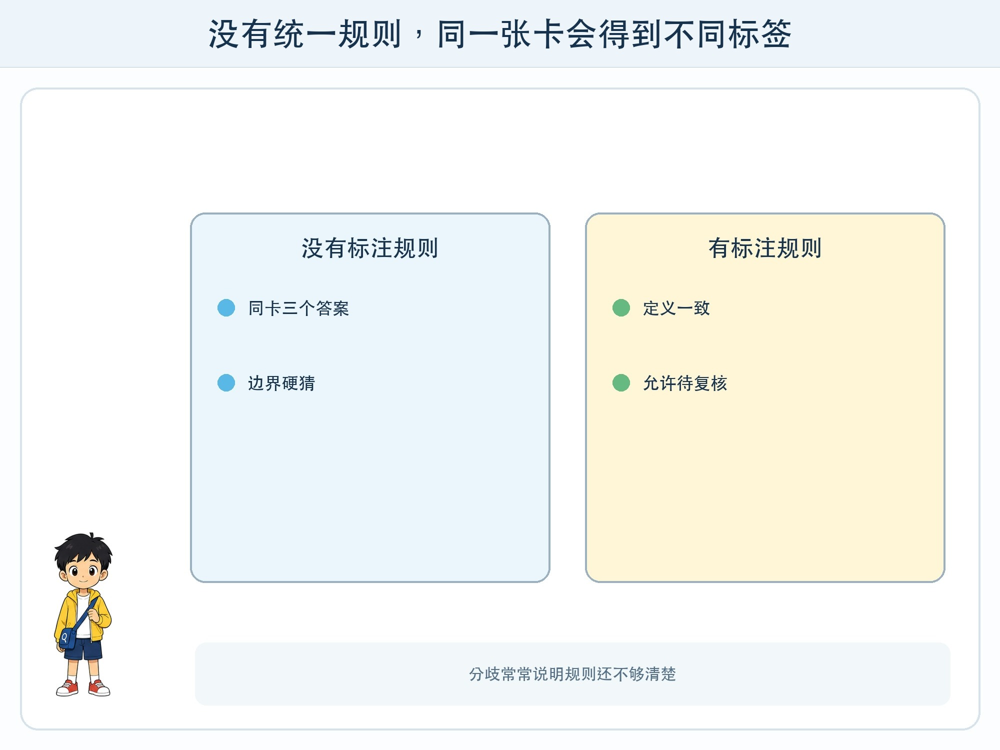
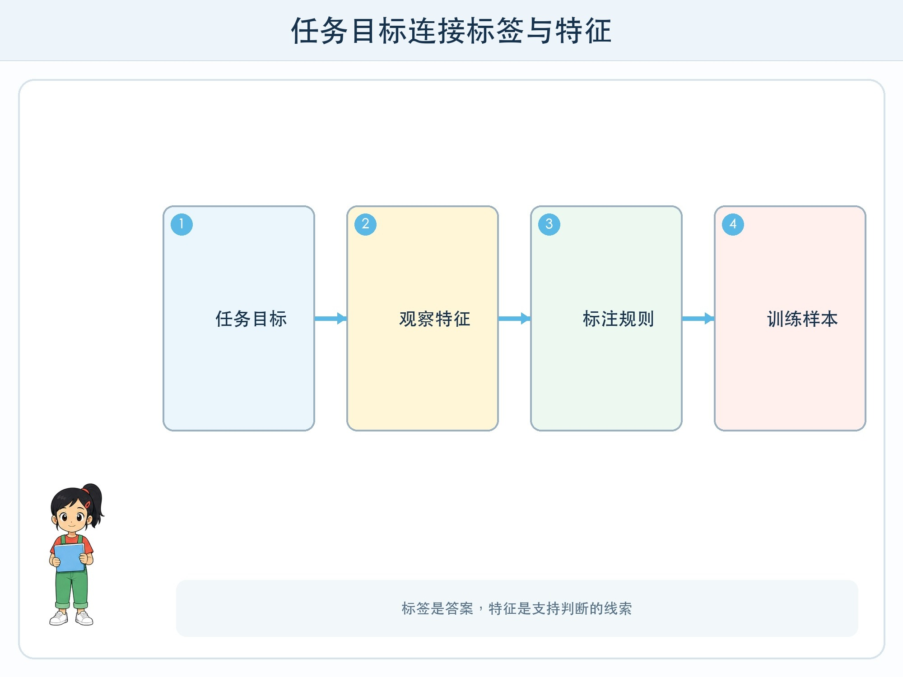

# 第 3 章 给机器准备答案

## 漫画开场

为了制作物品分类站，小问画了许多卡片：水瓶、纸盒、旧电池和香蕉皮。他在卡片背面写答案，却很快遇到争议。喝完的纸杯算“纸类”，还是算“其他垃圾”？装过油的纸盒还能不能回收？

朵朵请三位同学分别标注。结果同一张卡得到了三个答案。方方拿着卡片左右摇晃，蓝灯不停闪。训练数据明明很多，答案却互相冲突。

“问题不在方方，”朵朵说，“是我们还没有写清楚标注规则。”

## 工程挑战

本章要区分两个容易混淆的词：

- **标签**是希望系统学会预测的答案，例如“可回收物”。
- **特征**是帮助判断的可观察线索，例如材质、是否被污染、形状。

你还要学会写一份标注说明，让不同标注者面对同一张卡时尽量采用同样标准。

## 标签不是随手起的名字

一个任务可以有不同标签方案。按材质分，可以有纸、塑料、金属；按使用状态分，可以有可继续使用、需要维修、应当丢弃；按垃圾投放规则分，又会得到另一组答案。

没有哪套标签天然适合所有问题。首先要写清目标：“帮助校园分类投放”与“统计物品材质”是两个任务，不能把答案混在一起。

标签还要尽量互相清楚。如果一张卡既能放进“纸类”，又能放进“包装”，而规则没有说明优先级，模型和人都会困惑。有些任务允许多个标签，有些任务要求只能选一个，必须提前约定。

## 特征是判断线索

看到透明瓶身、旋拧瓶盖和塑料材质，人可能判断它是塑料水瓶。这些可以观察的线索就是特征。

特征不一定由人手工写出。简单判断树可能使用明确字段；图像模型会从大量像素中形成复杂的内部表示。但对四年级工程项目来说，先列出人能解释的特征，有助于发现规则遗漏。

“颜色”看起来是特征，却未必可靠。绿色瓶子和透明瓶子可能属于同一类，绿色纸盒却是另一类。好特征要与任务有关，并在不同样本中比较稳定。

## 怎样写标注说明

朵朵写出四部分：

1. 每个标签的一句话定义。
2. 每类至少两个正例和一个容易混淆的反例。
3. 特殊情况的处理办法。
4. 拿不准时标“待复核”，不要硬猜。

例如，“可回收纸类”可以写：干净、没有大量食物残留的纸制品；被油污严重污染的纸盒先标“待复核”，由成人依据本地投放规则确认。这样比只写“纸做的”更明确。

标注完成后，可以抽取同一批卡让两人独立判断，再比较一致数量。如果 20 张卡只有 12 张一致，说明规则或图片还不够清楚。争议不是坏事，它指出了需要补充的边界。

## 动手试一试：建立十张卡的标注手册

选择安全、虚构的主题，例如“适合雨天/晴天的物品”或“图书角书籍类别”。

1. 写一句任务目标。
2. 设计 3 个互相清楚的标签。
3. 为每个标签列出 2 个特征和 1 个不能作为决定依据的线索。
4. 画 10 张卡，其中至少 2 张是边界样本。
5. 两人背对背标注，再计算一致了多少张。
6. 只修改说明，不讨论时暗示具体答案，然后重新标注。

记录“第一次一致数”和“第二次一致数”。一致率提高说明说明书更清楚，但仍不代表标签一定符合真实世界的所有情况。

## 谁来决定标签

标签可能影响人时，决定权不能只交给不了解场景的人。给植物照片标物种，需要相关知识；给辅助设备判断需求，更应听取实际使用者意见。标注者的经验、语言和规则都会进入数据。

有时真实情况本来就不只有一个答案。工程师应允许“其他”“不确定”或多标签，而不是为了方便模型强迫每个样本进入单一盒子。

## 小心这个坑

不要用同学的外貌、成绩、口音、性格或家庭情况做分类练习。这些标签可能伤害人，也常常把复杂的人压成一个不公平的词。课堂活动选择物品、天气、自绘图形等低风险对象。

## 工程师笔记

- 标签是任务希望预测的答案，特征是支持判断的线索。
- 标签方案取决于目标；标注规则要包含定义、例子、边界和待复核方式。
- 标注分歧能暴露规则不清，不能靠催大家“统一答案”掩盖。

## 给大人的话

本章适合连接科学分类与语文定义练习。请强调标签是为任务服务的人为设计，不是对象永远不变的“身份”。若讨论垃圾分类，应以所在地当前公开规则为准，不把书中例子当作通用投放指令。
