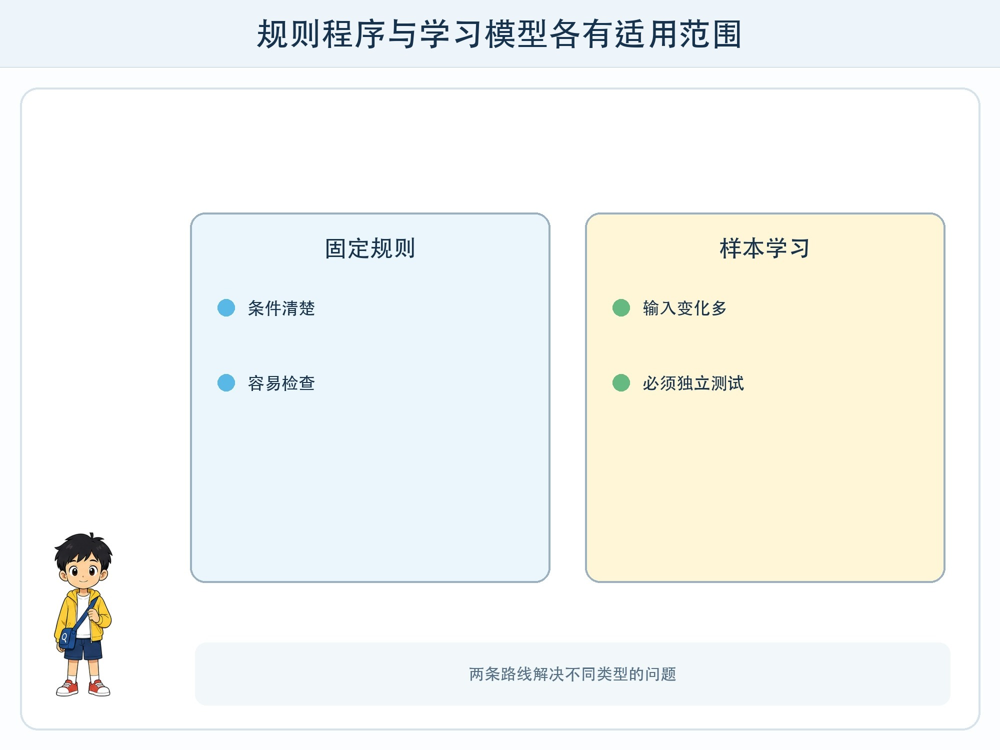
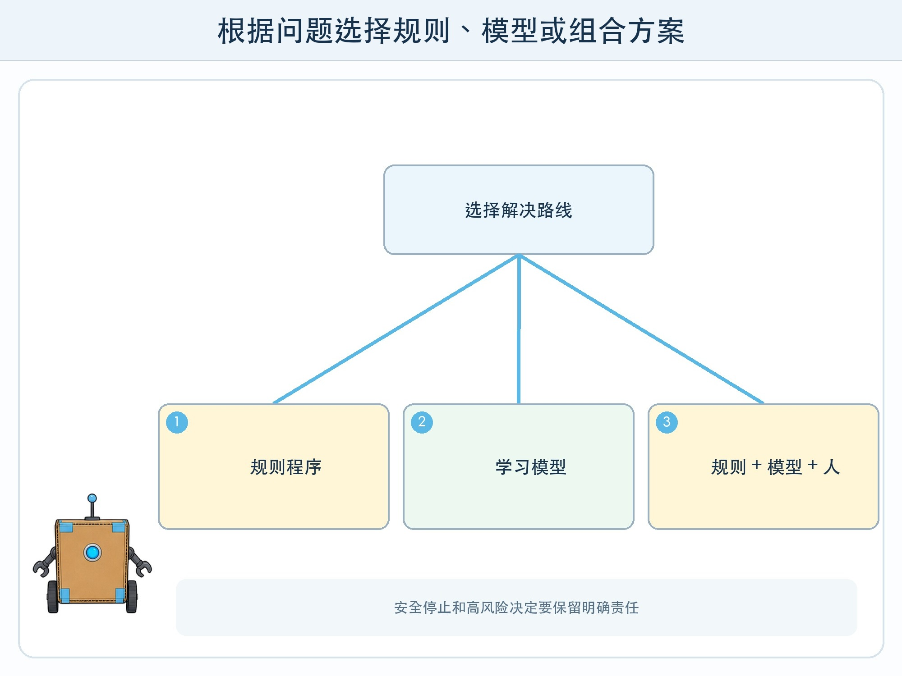

# 第 4 章 规则程序和学习模型

## 漫画开场

小问想让方方判断操场是否适合体育课。他写了两条规则：“下雨就去室内；没下雨就去操场。”方方看着阴沉的天空，检测到没有雨滴，立刻亮起“去操场”。几分钟后，大风卷起沙尘，同学们只好返回。

朵朵拿出过去二十天的天气卡，卡上有降雨、风力、地面积水和体育课安排。她提议让系统从这些例子里找规律。小问问：“有了机器学习，是不是再也不用写规则？”

答案不是二选一。真实系统常把规则、模型和人的判断组合起来。

## 工程挑战

本章要比较两条解决问题的路线：

- **规则程序**：人事先写清“如果……那么……”。
- **学习模型**：系统从带答案的样本中调整判断方法。

你要能根据任务的变化范围、错误后果和解释要求，说明为什么选择其中一种或把两种组合。

## 规则程序擅长什么

当条件明确、变化不大，而且必须严格执行时，规则很合适。例如计算借书到期日、检测输入是否为空、遇到紧急停止按钮立即断开动作。这些要求不需要从数据中“猜”。

规则的优点是容易检查。看到“温度高于 35 摄氏度就提醒”，人能直接理解触发条件。它的缺点是要提前想到各种情况。规则越多，互相冲突和遗漏的机会也越多。

规则也不是天然正确。阈值为什么是 35？传感器坏了怎么办？两个条件同时发生听谁的？仍然需要测试和负责人。

## 学习模型擅长什么

有些任务很难列出全部规则。怎样用几千个像素判断一张照片里是猫还是狗？怎样从声音波形识别不同说话速度？人很难把每种形状写成完整条件，却可以准备很多带标签的例子，让模型调整内部参数。

模型的优点是能处理复杂、变化多的输入。缺点是结果受训练数据影响，内部判断可能不容易解释，新情况仍会失败。模型不是自动发现“真正原因”，它找到的是在训练样本中有用的统计规律。

## 为什么常常需要组合

分类站可以用模型识别卡片图案，再用规则检查结果：模型信心不足时不自动放入箱子；识别到电池等特殊物品时必须请成人确认；停止按钮永远优先于模型输出。

这里模型负责变化多的识别，规则负责清楚的安全边界，人负责处理高风险和意外情况。组合不是“越多越先进”，而是让每部分做它擅长的工作。

决定方案时可以问：

| 问题 | 更可能的选择 |
| --- | --- |
| 条件能否清楚列完？ | 能，优先考虑规则 |
| 输入是否复杂多变？ | 是，可能需要模型 |
| 错一次后果是否严重？ | 是，增加规则、复核或不用自动化 |
| 是否有足够且合适的样本？ | 没有，不应急着训练模型 |

## 动手试一试：规则员与样本员比赛

画 20 张“适合户外活动/不适合户外活动”的虚构天气卡。每张包含降雨、风力、气温和地面状态。

1. 规则员只看前 8 张，写不超过三条判断规则。
2. 样本员也看前 8 张，用相似卡片归纳判断，但不能看到后 12 张答案。
3. 用后 12 张测试两种方法。
4. 记录每次错误发生在什么条件组合。
5. 共同设计“规则 + 待复核”的第三种方法。

这不是严格的机器学习训练，却能帮助你体验：规则依赖人写条件，学习方法依赖样本覆盖。两者都不能跳过独立测试。

## 小心这个坑

不要因为方法名字里有“学习”，就以为模型会像孩子一样理解体育课、天气和安全。它只处理被转换成数据的部分。也不要把普通规则包装成 AI 来显得高级。选择最简单、足够可靠的方法，往往是更好的工程决定。

## 工程师笔记

- 规则程序由人明确写条件，学习模型从样本中调整判断。
- 复杂输入适合探索模型，清楚边界和安全停止适合规则。
- 真实系统常组合规则、模型和人工复核，但每部分都要测试。

## 给大人的话

可把本章与信息科技中的条件语句衔接。请避免用“传统程序很笨、AI 程序很聪明”的对立叙事。两类方法解决的问题不同，许多可靠产品仍大量使用普通程序和规则。
