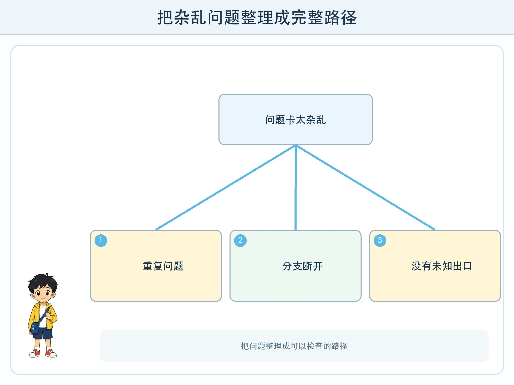
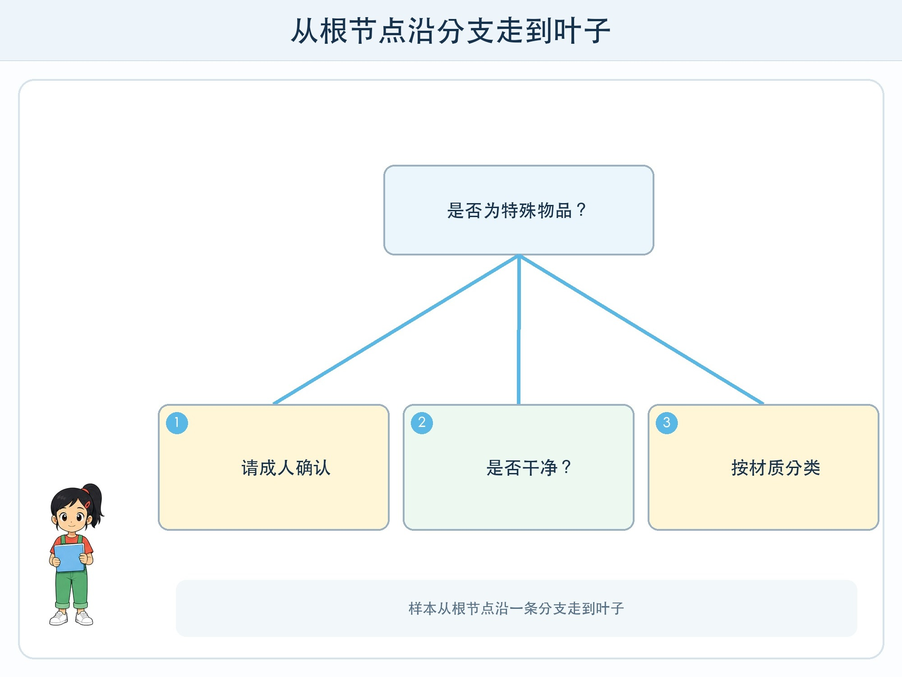

# 第 5 章 一棵会提问的树

## 漫画开场

分类站收到一张“喝完的酸奶杯”卡。小问说它是塑料，朵朵提醒杯里还有残留，方方则在“塑料”和“待处理”之间来回移动。

大家把争论写成问题：“主要材质是什么？”“是否干净？”“是否属于需要成人处理的特殊物品？”问题越写越乱，有的问题问了两遍，有的答案走到一半没有下一步。

朵朵把第一张问题卡放在树干位置，把“是”和“否”放成两条树枝。每个答案再连接下一个问题。杂乱的讨论变成了一棵**判断树**。

## 工程挑战

你要学会：

1. 用节点、分支和叶子表示一连串判断。
2. 选择先问哪个问题，让流程更清楚。
3. 用所有可能路径测试树，而不只试一条成功路线。

## 从根节点走到叶子

判断树最上面的第一个问题叫根节点。问题的每种回答形成一条分支。走到不再提问、直接给出结果的位置，叫叶子节点。

例如先问“是否为特殊物品”。回答“是”就直接到“请成人确认”；回答“否”再问“是否干净”；干净才继续按材质分类。树不是植物，也不会自己长大。这里的“树”是帮助人组织判断的一种图。

一个样本从根节点开始，每次只沿一条分支前进，最后到达一个叶子。路径上的问题共同构成这次判断的理由，因此简单判断树通常比较容易解释。

## 第一个问题很重要

如果先问颜色，红色塑料杯和红色电池会走到一起，后面还要用许多问题分开。若先问“是否属于特殊物品”，就能尽早把需要人工处理的情况分出去。

好的问题与目标有关，答案要能稳定观察。它还应尽量把当前样本分成有意义的组。并不是问题越多越准确。树太深时，流程难检查，还可能只适合训练卡中的细节。

从数据自动学习的决策树，会比较不同特征带来的分组效果，再选择分支。纸面活动由人来选问题，但可以体验同样的目标：每次提问都减少混乱。

## 树也会学偏

假如训练卡里所有金属物品都是灰色，判断树可能先问“是不是灰色”。遇到红色金属盒就会失败。这说明树使用了训练数据中方便但不可靠的线索。

树越复杂，越可能把训练样本记得很细，却对新样本表现不好。这种“练习题全会，新题不会”的现象，在机器学习中叫**过拟合**。四年级不需要记住公式，只要知道：测试卡必须与训练卡分开，而且要包含合理变化。

## 动手试一试：设计一棵借书建议树

准备 16 张虚构图书卡，字段包括是否有很多图片、篇幅长短、主题和适读年级。目标是分成“轻松浏览”“连续阅读”“需要成人帮助选择”三类。

1. 先用 10 张卡设计不超过四层的树。
2. 每个问题只能使用卡片上明确写出的信息。
3. 检查每个“是/否”分支是否都有去处。
4. 用剩余 6 张新卡测试，记录走过的完整路径。
5. 对失败卡只修改一个节点，再重新测试全部 6 张。

请注意，这只是图书形式建议，不评价同学的阅读能力，也不根据真实同学贴标签。

## 怎样测试一棵树

除了普通卡，还要准备边界卡：信息缺失怎么办？两个条件同时满足怎么办？没有任何分支适合怎么办？可靠的树需要“未知”或“人工确认”出口，而不是强迫每张卡得到肯定答案。

测试记录可以写成：样本、期望结果、实际路径、实际结果、修改建议。只写“答错了”无法知道在哪个节点开始走偏。

## 小心这个坑

判断树适合解释流程，但不能用来给真实同学按性格、能力或未来表现分类。树里的问题会把复杂情况简化，结果可能影响人时必须特别谨慎，并提供人工判断和申诉方式。

## 工程师笔记

- 判断树由根节点、分支和叶子组成，一次判断是一条完整路径。
- 第一个问题和特征选择会改变整棵树，方便线索不一定可靠。
- 测试要覆盖普通、边界、缺失和无合适答案的情况。

## 给大人的话

可让孩子用便签在地面摆树，再由同伴拿卡行走。重点是检查完整路径和“未知出口”，不是追求复杂。若引入自动学习决策树，只需说明算法会根据数据选择分支，不必展开信息增益公式。
