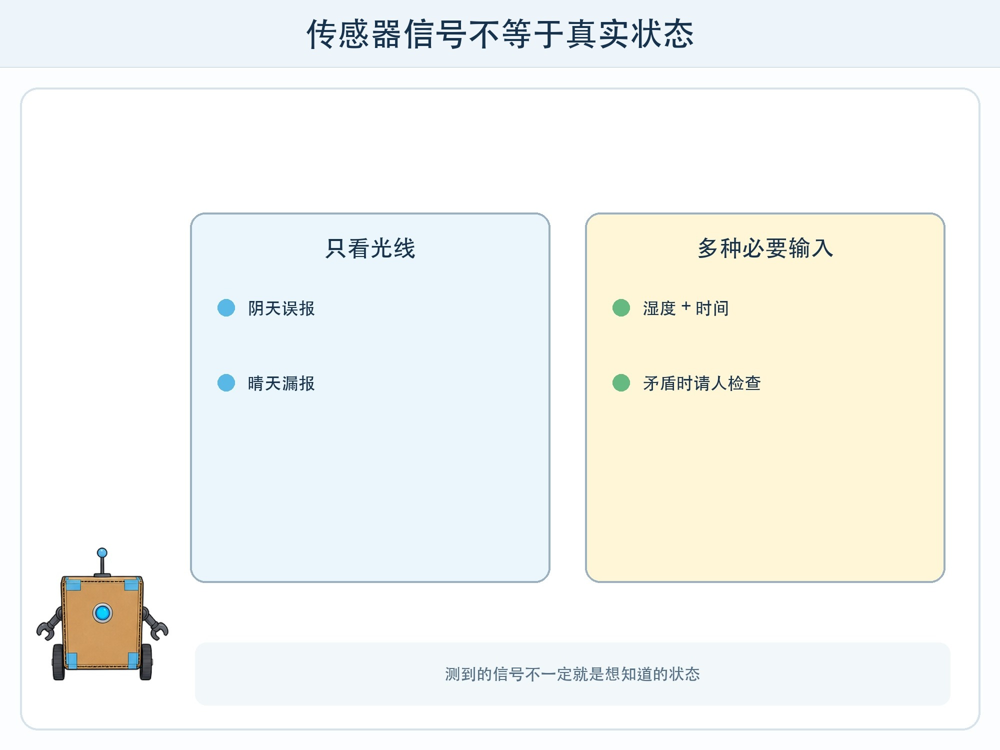
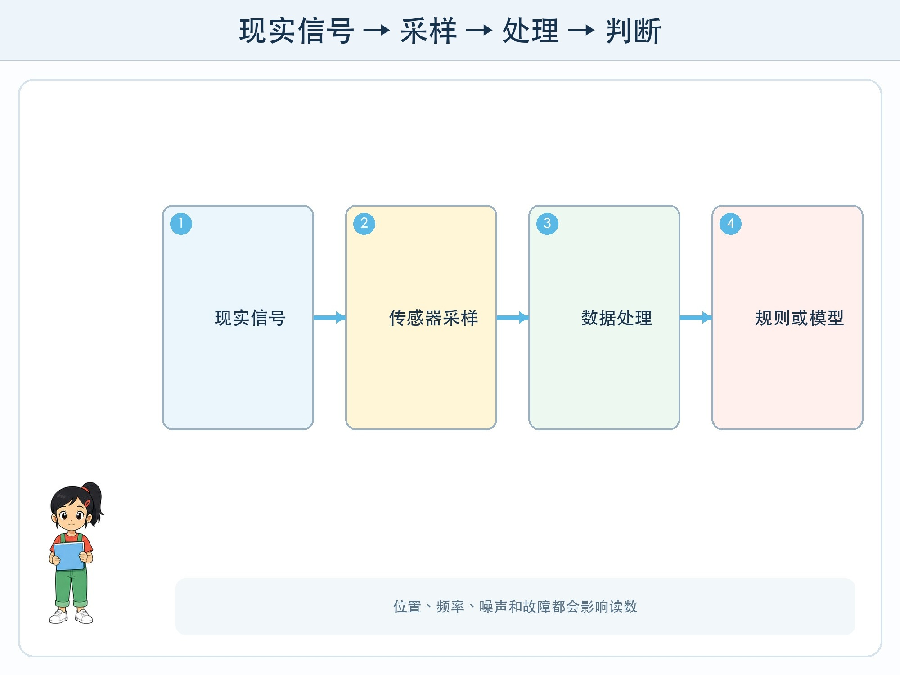

# 第 6 章 传感器小队

## 漫画开场

方方要负责提醒教室植物是否需要浇水。小问只装了一个光传感器：光线暗就提醒浇水。结果阴天时方方一直报警，盆土却很湿；晴天下午阳光很强，它反而不提醒，叶子已经有些打蔫。

朵朵问：“我们真正想知道的是光线，还是土壤是否缺水？”小问这才发现，传感器测到的信号和要解决的问题不是同一件事。

## 工程挑战

本章要理解：

- 传感器把现实世界中的某种变化转换成可处理的数据。
- 一个传感器只观察某一方面，读数可能受位置、范围和环境影响。
- 多种输入可以互相补充，但并不会自动变成正确结论。

## 机器怎样接到现实信号

光传感器对光强变化有反应，麦克风把空气振动转换成信号，距离传感器估计物体远近，温度传感器测量冷热。它们像系统通往现实的窗口，但窗口有方向和范围。

传感器输出通常是数字。数字本身没有告诉系统“该浇水了”。程序还要解释数值、比较阈值，或者把多项数据交给模型判断。

传感器不是人的眼睛、耳朵和皮肤。它不会拥有人的生活经验，也不一定测量与人体完全相同的范围。“像一种感官”只是帮助理解输入功能的比喻。

## 从采样到判断

传感器不可能记录每一个无限短的瞬间。系统会按一定时间间隔读取数据，这叫**采样**。每十分钟读一次和每天读一次，会看到不同细节。

读数还可能有噪声。移动传感器、碰到花盆、阳光直射或电量不足，都可能让数值波动。工程师常连续读取几次，看整体趋势，并记录测量条件。

## 多种输入怎样合作

植物提醒可以同时考虑土壤湿度、光照、温度和距离上次浇水的时间。土壤干而且长时间未浇水时，提醒更有依据；传感器读数矛盾时，请人检查。

这种把不同来源信息组合起来的方法常被称为**多传感器融合**。现代多模态 AI 也会处理文字、图片、声音等不同形式的信息。它们的共同点是要把不同输入对齐到同一任务，区别是模型处理方式更复杂。

输入越多不一定越好。每增加一种传感器，就增加成本、电量消耗、故障点和可能收集的隐私。教室植物不需要摄像头看人脸，也不需要麦克风听谈话。

## 动手试一试：纸面传感器值班表

画 12 张植物状态卡，每张写土壤湿度（干/适中/湿）、光照（弱/中/强）、温度（低/适中/高）和距上次浇水天数。

1. 第一轮只看光照，制定提醒规则。
2. 第二轮只看土壤湿度。
3. 第三轮同时看湿度和浇水时间，并加入“请人检查”。
4. 比较三轮对边界卡的结果。
5. 写下每种方案需要的传感器、可能故障和隐私影响。

活动只模拟数据，不要把电子部件插进真实土壤，也不要未经成人同意操作电源或联网设备。

## 传感器坏了怎么办

系统要能发现不合理读数。例如湿度数值一分钟内从最低跳到最高，又立刻返回，可能是接触不稳。若传感器持续没有数据，程序不应把缺失当成正常。

安全设计包括范围检查、连续读数对照、故障提示和人工接管。重要行动不能只依赖一个容易失效的信号。方方最终只负责“提醒检查”，不自动给植物大量浇水。

## 小心这个坑

摄像头和麦克风也是传感器，但会收集他人的图像与声音。课堂项目优先用虚构卡片或不涉及个人的光、距离等数据。即使设备能采集，也不代表有权采集；目的、同意、保存时间和访问者都要由成人按规则确认。

## 工程师笔记

- 传感器把现实变化变成数据，程序或模型再解释这些数据。
- 采样频率、位置、噪声和故障都会影响读数。
- 多种输入可以互补，但要控制必要性、隐私和故障成本。

## 给大人的话

本章可与科学课测量活动结合。让孩子比较“测到什么”和“真正想知道什么”，比记传感器名称更重要。若使用硬件，必须由成人检查电压、接线、联网和数据保存方式，植物浇水仍由人决定。
