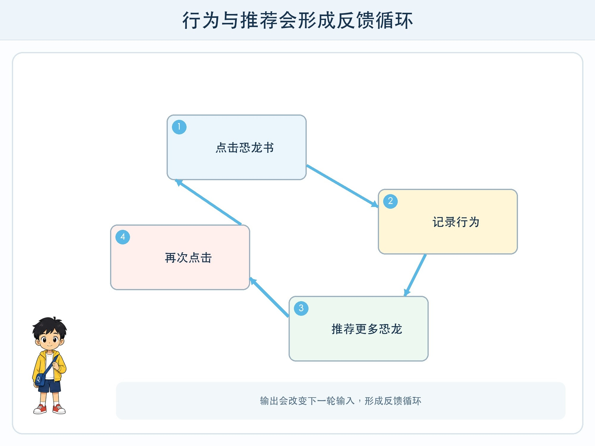
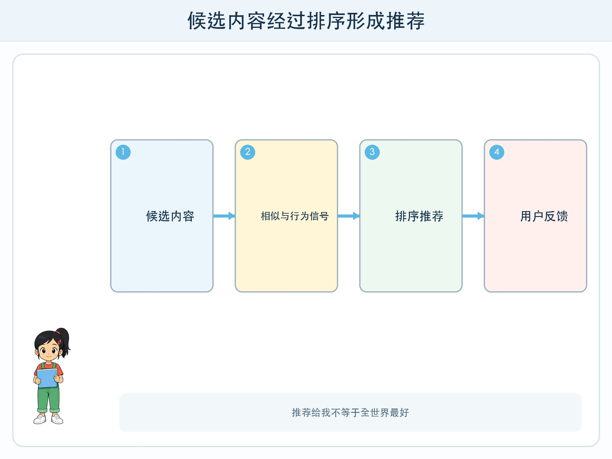

# 第 7 章 推荐从哪里来

## 漫画开场

校园阅读屏给小问推荐了十本恐龙书。他点开第一本，是因为喜欢恐龙；点开第二本，是想看看系统还会推什么；第三本只看了封面就退出。第二天，屏幕上几乎全是恐龙。

“它太懂我了！”小问说。朵朵却问：“你点开是喜欢，还是好奇？退出是不是不喜欢？系统能分清吗？”方方把每次点击都记成一个绿色对勾，完全没有记录原因。

推荐不是读心术。它根据可记录的行为和内容线索，估计什么可能与当前用户或场景相关。

## 工程挑战

本章要学会拆解推荐系统的三个部分：

1. 候选内容有哪些。
2. 系统根据哪些相似或行为信号排序。
3. 用户的新行为怎样再次影响后续推荐。

你还要发现：反馈能帮助系统调整，也可能让内容越来越单一。

## 两种常见线索

一种方法比较**内容相似**。如果一本书的主题、适读年级和篇幅与刚读完的书相近，它可能被排到前面。这里需要先把内容转成可比较的特征。

另一种方法观察**行为相似**。如果许多读过 A 的人也读 B，系统可能把 B 推荐给新的 A 读者。这不表示这些人“完全一样”，只表示某些记录行为有相似模式。

真实推荐系统可能把多种线索、时间、新内容、规则和人工运营组合起来。四年级不需要计算复杂公式，但要知道“推荐给我”是排序结果，不是“全世界最好”。

## 反馈循环

小问点击恐龙书，系统把点击当作兴趣信号，于是提供更多恐龙书；他看到更多恐龙书，自然又更可能点击。这形成了**反馈循环**：输出改变后续输入，后续输入又改变输出。

反馈循环不一定坏。它能减少无关内容，也能帮助发现相似作品。问题在于信号可能被误解，或者系统只追求“继续点击”，忽略多样性、准确性与时间管理。

如果推荐越来越窄，人接触到的观点和主题也可能变少。常见改进包括加入不同类别、给用户重置与关闭选项、说明推荐原因，以及允许主动搜索而不是只能接受推荐。

## 点击不等于喜欢

停留时间长可能是内容有趣，也可能是看不懂；快速退出可能是不喜欢，也可能是已经找到答案；反复播放可能是喜欢，也可能是音频卡住。行为数据是线索，不是人的完整想法。

这也说明推荐系统不能只用一个指标评价。点击率提高，不代表阅读质量、满意度或健康使用时间都提高。系统目标由设计者选择，选择什么目标会改变排序。

## 动手试一试：纸面图书推荐员

准备 18 张虚构图书卡，每张写主题、篇幅、图片多少和阅读目的。三人分别扮演候选库、排序员和读者。

1. 读者先选一本卡，并说明原因。
2. 排序员只根据卡片字段推荐三本，写下每本的理由。
3. 读者选择一本，但不能告诉排序员真实原因，只给“点开/跳过”信号。
4. 连续三轮后，检查推荐是否越来越单一。
5. 第四轮强制加入一本不同主题但适读的卡，比较体验。

记录“系统看到的行为”和“读者真实原因”之间的差别。不要使用同学真实阅读记录给人贴标签。

## 小心这个坑

推荐会影响注意力。儿童使用的内容服务应由成人检查年龄要求、广告、陌生人互动、自动播放和使用时长。不要为了“训练推荐”故意长时间点击。遇到不适宜内容，停止使用并告诉大人，不继续互动来测试系统。

## 工程师笔记

- 推荐系统从候选中排序，常使用内容相似和行为相似等线索。
- 用户行为会进入下一轮推荐，形成可能变窄的反馈循环。
- 点击只是线索，不等于真实兴趣；评价推荐不能只看点击率。

## 给大人的话

共读时可比较“搜索结果”和“个性化推荐”：前者也会排序，但触发方式和使用信号不同。讨论信息茧房时避免把责任全推给孩子，应同时看到系统目标、界面默认值和成人陪伴的作用。
