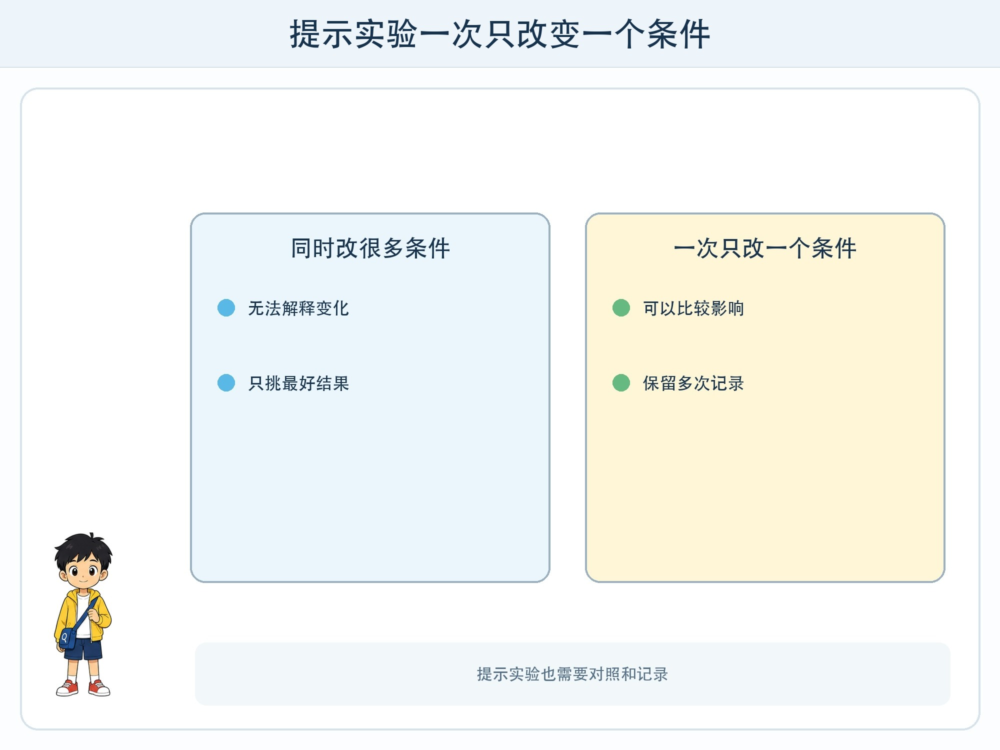
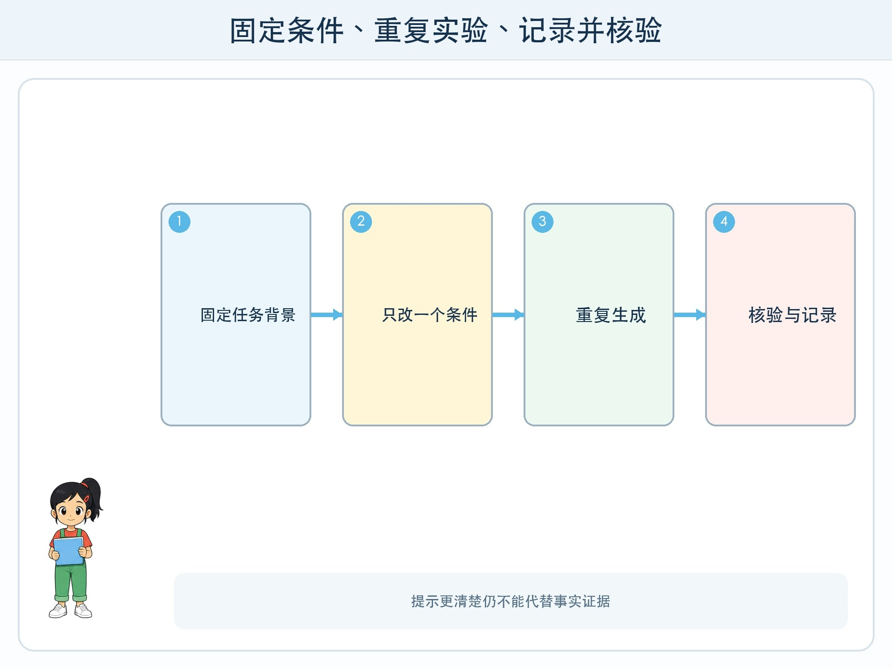

# 第 8 章 生成式 AI 实验室

## 漫画开场

科技节海报需要一句介绍。小问先写“帮我写一句”，得到一段很长的文字；又写“写得有趣、准确、很短、像诗、包括时间地点和全部活动”，结果又挤成一团。

他连续改了五次，每次同时换主题、长度、语气和格式。最后虽然得到一句喜欢的，却说不清是哪项修改起了作用。

朵朵把它当成科学实验：“一次只改变一个条件，其他条件保持不变，才能比较影响。”

## 工程挑战

你要把提示实验拆成四部分：任务、背景、要求和输出形式；再使用**单变量对照**，一次只改一个部分，记录多次输出的共同点与变化。

生成式 AI 的结果可能每次不同，因此实验不能只挑最好的一次。即使不使用在线工具，也能用同伴扮演“生成器”完成全部活动。

## 提示怎样影响结果

“介绍校园科技节”说明了任务，却没有读者、长度和用途。补充“写给三年级同学，40 字以内，用两句完整的话，不编造未提供的活动”，范围就更清楚。

提示不是魔法咒语。它向模型提供当前任务的上下文和约束。模型仍可能遗漏要求、生成不实信息或使用不合适的语气。提示越长也不一定越好，冲突要求会让结果更不稳定。

可以把提示检查成四格：

| 部分 | 要回答的问题 |
| --- | --- |
| 任务 | 具体要做什么？ |
| 背景 | 给谁用，已有资料是什么？ |
| 要求 | 长度、范围、安全边界是什么？ |
| 输出形式 | 用列表、表格还是短文？ |

## 像做实验一样比较

固定任务、资料和输出形式，只改变“读者是低年级同学/家长”，观察用词变化；或者固定其他条件，只改变“40 字/100 字”，观察信息取舍。

同一提示最好重复几次。若三次结果差别很大，说明不能把一次输出当成稳定功能。实验表应保留提示版本、变化项、输出摘要、事实错误和是否满足要求。

不要只给“好/不好”。可以分开检查：是否完成任务、是否符合格式、是否包含提供的事实、是否出现没根据的内容、是否适合读者。

## 生成和检索不是一回事

模型可以根据语言规律生成听起来合理的句子，但它不一定连接当前校园通知。即使回答里出现具体时间和活动，也要打开老师提供的原始资料确认。

若资料没有写机器人比赛，提示“不要编造”能降低风险，却不能保证绝不出现。重要事实的可靠性来自外部证据和人工核对，不是来自一句更强硬的提示。

## 动手试一试：人类生成器对照实验

三人一组，一人当委托人，一人当生成器，一人当记录员。准备同一份虚构科技节资料。

1. 版本 A 只写“介绍科技节”。
2. 版本 B 增加目标读者，其他不变。
3. 版本 C 在 B 基础上增加 50 字限制。
4. 版本 D 再要求用两项列表，并把资料中没有的内容写“未提供”。
5. 生成器每次只看当前版本，用一分钟作答。
6. 记录员比较输出，不评价书写漂亮程度，只核对目标和证据。

若由成人演示在线 AI，使用虚构资料和成人账号，不输入真实学校内部安排、学生姓名或未公开图片。

## 小心这个坑

反复调整提示可能让人只追求“看起来更像答案”，却忘记核对内容。也不要把完整作业交给 AI 后只改几个词冒充独立完成。应按老师要求说明工具帮助了哪一步，保留自己的判断和修改记录。

## 工程师笔记

- 清楚提示通常包含任务、背景、要求和输出形式。
- 一次只改变一个条件，并重复试验，才能比较提示变化的影响。
- 提示不能保证事实正确；校园时间、规则和数字必须回到原始资料核验。

## 给大人的话

本章可完全离线角色扮演。若在线演示，应提前测试输入、关闭历史内容展示，并使用不含个人信息的虚构素材。评价孩子是否能设计对照和记录失败，不评价谁“最会套提示词”。
