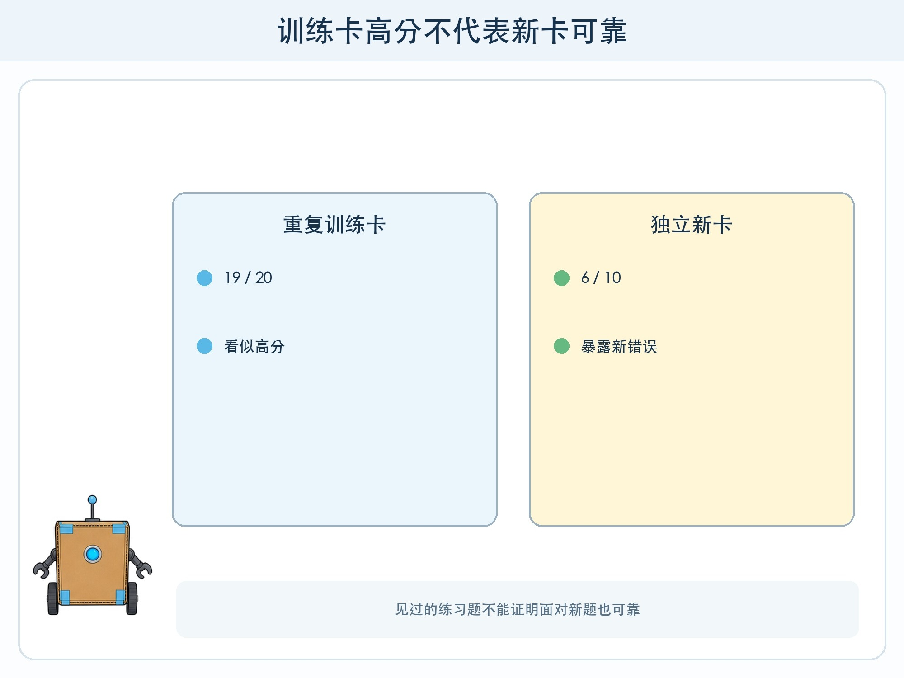
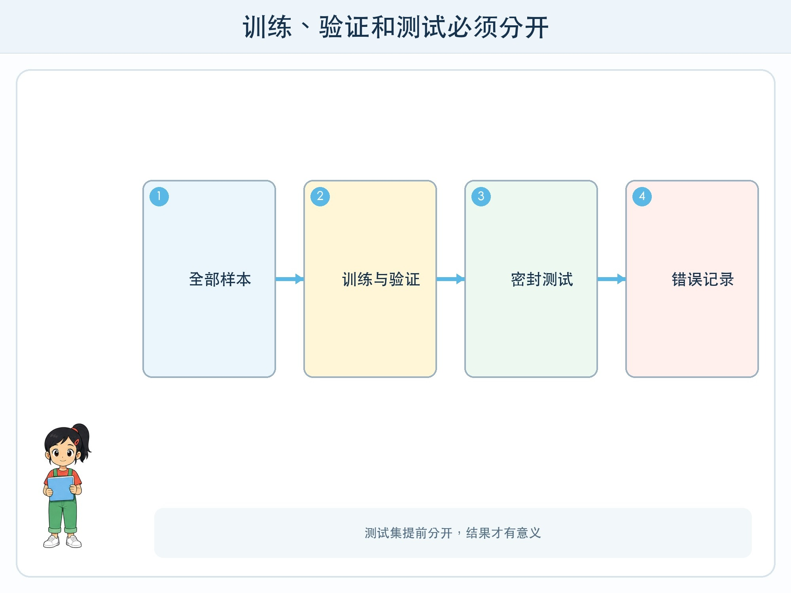

# 第 9 章 怎样知道模型好不好

## 漫画开场

方方用 20 张物品卡练习分类。小问把同样的 20 张再给它一次，方方答对 19 张。“95 分，太可靠了！”他在展示板上写道。

朵朵从信封里拿出 10 张从没见过的新卡。方方只答对 6 张，尤其容易把被压扁、遮住一角的卡分错。小问这才发现，他刚才测的是“见过的练习题”。

## 工程挑战

本章要理解：

- **训练集**用于让模型调整。
- **验证集**可帮助比较方案和选择设置。
- **测试集**留到最后，检查模型面对新样本的表现。

你还会计算最简单的正确率，并知道一个总分不能说明所有问题。

## 为什么测试题要分开

如果边训练边看测试答案，我们会不断针对测试题修改方法，测试集也会变成另一份练习题。最后得到的高分不能代表真实新情况。

所以数据要在训练前分组。训练集通常较多，验证集用于开发过程中比较，测试集应独立保留。小学纸面实验数据不大，可以简化为“训练卡”和“密封测试卡”，核心原则是不提前偷看。

训练、验证、测试还应来自相近任务范围。如果训练的是自绘物品卡，测试突然换成模糊监控照片，低分可能是任务范围变化，而不只是模型训练不好。工程报告要说明数据来自哪里、覆盖哪些变化。

## 正确率怎么算

正确率是“答对数量 ÷ 全部测试数量”。10 张卡答对 8 张，正确率就是 8/10，也就是 80%。它让不同轮次可以用同一把尺比较。

但 80% 不一定够好。若 2 个错误都发生在普通纸盒上，影响可能较小；若都把旧电池误判成普通物品，风险更大。相同正确率可以包含完全不同的错误分布。

测试报告至少要同时写：总数量、答对数量、错误样本、错误类别和可能后果。不要只写一个百分数。

## 准备普通卡和难例

普通卡检查日常情况，难例主动寻找边界：旋转、遮挡、颜色变化、信息缺失、训练中很少见的组合。难例不是故意“欺负模型”，而是提前发现真实使用中可能出现的失败。

每次修复后要重新测试全部测试卡。只测试刚才那张错卡，可能修好一个问题却破坏其他情况，这叫回归风险。保留固定测试集，才能看见修改前后整体变化。

## 动手试一试：密封测试信封

两组同学分别工作。A 组制作 18 张训练卡和规则说明；B 组制作 12 张测试卡，放入信封，不提前展示。

1. A 组只用训练卡设计判断方法。
2. 打开测试信封，每张只测一次并记录路径。
3. 计算正确率，再按错误类型分组。
4. 选一个最重要的错误提出修改。
5. 使用同一测试集重新测试全部 12 张，比较是否出现新错误。

测试卡应使用虚构图形或物品，不使用同学照片。两组要在开始前共同约定任务范围，避免测试变成猜谜。

## 分数也可能被“挑”出来

如果只展示表现最好的一组卡，或者连续换测试集直到分数高，就会得到过于乐观的结论。测试规则应在看到结果前写好，包括样本数量、通过标准和失败时怎么办。

模型在教室纸卡上表现好，也不能直接证明它适合真实垃圾分类。真实环境有光线、角度、污染、地区规则和设备故障。原型分数只支持有限结论。

## 小心这个坑

不要把模型分数变成对孩子的评分，也不要用同学个人数据测试“谁更像优秀学生”。模型评测应针对明确、低风险的任务。结果可能影响人时，还要检查不同群体错误、提供替代通道并由有责任的成人决定。

## 工程师笔记

- 训练卡用于调整，测试卡必须提前分开并保持独立。
- 正确率是答对数除以总数，但同样分数可能对应不同错误代价。
- 既测普通情况，也测边界难例；修改后重新跑完整测试集。

## 给大人的话

本章适合与数学分数、百分数结合。请让孩子保留错误样本，而不是为了高分不断替换测试卡。若出现“95% 准确率”等宣传，可追问测试对象、数量、范围和关键错误，培养证据意识。
