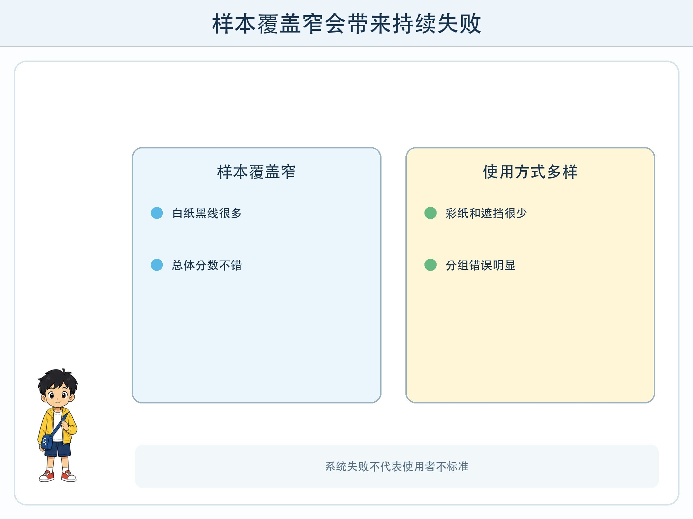
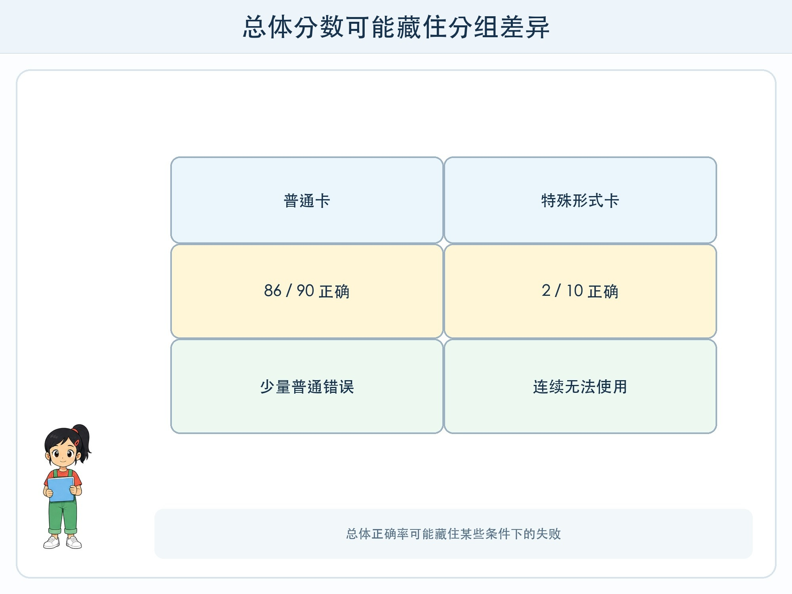

# 第 10 章 数据偏一点，结果会怎样

## 漫画开场

分类站在普通白纸上测试得很好。科技节当天，低年级同学带来用彩纸画的卡，另一位同学使用触摸凸点卡。方方连续说“无法识别”。

小问以为是这些卡“不标准”。朵朵把训练数据摊开：30 张卡里有 27 张是白纸黑线，只有 3 张是彩色，没有任何凸点卡。不是同学的卡奇怪，而是项目只准备了很窄的一种情况。

## 工程挑战

本章要理解**数据偏差**：样本对某些情况收集很多，对另一些相关情况很少或没有，模型可能把这种不平衡带进结果。

你还要学会按情况分组检查错误，并为模型不适用的人提供替代通道。公平不是要求每个人都以同一种方式使用系统。

## 数据怎样偏向一边

偏差可能来自采集时间、地点、设备和选择方式。只在晴天拍照，模型没见过雨天；只邀请最常使用产品的人测试，就听不到无法使用者的意见；只保留清晰成功样本，真实模糊输入就消失了。

数据“数量很多”不能自动解决偏差。一万张同一种角度的卡，仍然缺少其他角度。工程师要根据任务范围列出重要变化，再检查每种是否有足够样本。

这不表示每一格数量必须完全相同。有些情况本来少见，却可能后果严重，需要专门测试；有些变化与任务无关，不该为了凑齐而收集个人信息。

## 总分会藏住差异

假设 100 张测试卡中，普通白纸卡 90 张答对 86 张，彩纸与凸点卡 10 张只答对 2 张。总计答对 88 张，正确率 88%，看起来不错；但少数类型几乎无法使用。

所以除了总分，还要按与任务有关的条件分组：不同光线、材质、卡片形式、设备等。分组不是为了给人贴标签，而是检查系统是否在某些使用条件下持续失败。

当系统涉及真实人群，分组方式和数据收集必须由有责任的成人与相关使用者共同决定，遵守隐私与公平要求。儿童练习只使用虚构卡片。

## 公平不等于人人同一种入口

如果图像识别无法读取触摸卡，可以提供按键选择、人工说明或其他可访问方式。目标是让不同使用者都能完成任务，而不是强迫所有人迁就同一模型。

有时最公平的决定是不用 AI。例如一个简单选择表已经能完成分类，却为了“智能”增加摄像头和误判，就没有必要。技术方案要服务人，不能反过来要求人变得“像训练数据”。

## 动手试一试：覆盖检查棋盘

画一个 3×3 棋盘。横轴写光线：亮、中、暗；纵轴写卡片形式：黑白、彩色、部分遮挡。为每格准备两张虚构卡。

1. 用原方法测试全部 18 张。
2. 在棋盘格里写“答对数/2”。
3. 找出最弱的一格，不先看总正确率。
4. 选择增加样本、修改规则或提供人工入口中的一种改进。
5. 重新测试全部格，检查改进是否伤害其他情况。

讨论：如果某种形式无法可靠识别，怎样让使用者仍能完成任务？

## 小心这个坑

不要用肤色、口音、身体情况、成绩或家庭背景做儿童分类实验。讨论现实偏差时，应把问题放在数据、设计、部署和责任上，不能说某群体“不标准”。出现不公平结果时，先保护受影响者，再修复系统。

## 工程师笔记

- 数据偏差来自覆盖不均、采集选择和遗漏，不会因样本总数大而自动消失。
- 总正确率可能藏住某些条件下的连续失败，要按任务相关情况分组检查。
- 公平设计包括替代方式、人工入口和“不使用 AI”的选择。

## 给大人的话

本章可连接数学统计和无障碍教育。不要要求真实学生透露个人特征来“验证公平”。使用虚构条件和物品卡即可理解分组评测；现实高风险系统应由专业团队、相关群体和监管要求共同审查。
