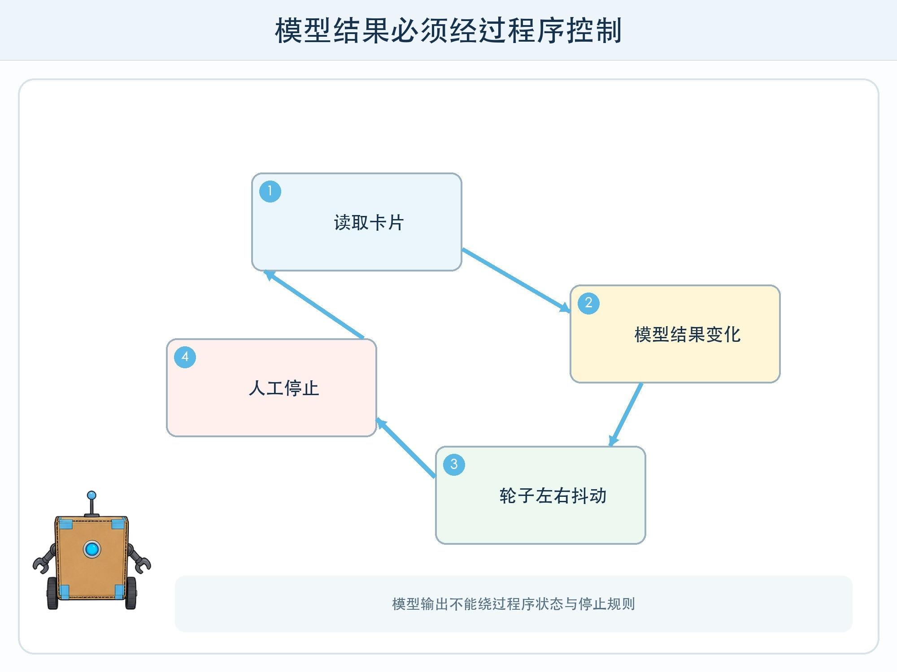
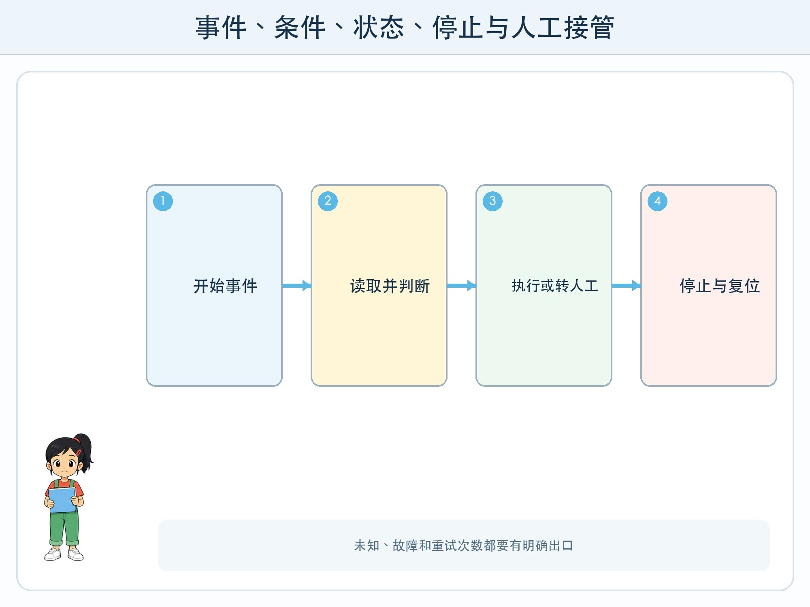

# 第 11 章 图形化智能程序

## 漫画开场

小问把分类模型接到方方的轮子上：识别为纸类就向左，塑料就向右。第一次运行，方方识别到一张模糊卡，结果在“纸类”和“塑料”之间快速变化，轮子也左右抖动。

朵朵按下停止键，却发现程序里根本没有处理停止事件。最后只能由老师切断电源。模型能给出分类，不等于完整程序已经安全。

## 工程挑战

本章要把模型结果放进一个完整程序，认识五种积木：

- 事件：什么时候开始。
- 条件：如果满足什么，就做什么。
- 循环：哪些步骤重复。
- 状态：系统现在处于等待、运行、暂停还是故障。
- 停止与人工接管：什么时候必须退出自动流程。

## 模型只是一个积木

图形化程序可能先读取卡片，再调用模型，得到类别和信心，然后用条件积木决定显示结果。界面还要告诉使用者系统正在工作、无法判断或发生错误。

如果程序只写“类别是纸就左转，否则右转”，所有未知情况都会被强迫送到右边。更完整的条件应包括：纸类、塑料类、低信心、无输入和传感器故障。低信心不等于错误，但表示系统缺少足够把握，适合转人工复核。

## 状态让程序不混乱

状态像程序桌面上的提示牌。等待状态不移动；运行状态处理一张卡；暂停状态保留现场但不继续；故障状态显示原因并等待检查。

没有状态管理时，使用者连续放入两张卡，程序可能同时处理；传感器断开后，旧结果可能被重复使用；停止后再次启动，也可能从错误位置继续。

状态变化可以画成图：等待收到“开始”进入运行；运行完成回到等待；任何状态收到“停止”进入安全暂停；检查通过后才允许重新开始。

## 循环必须有出口

循环适合重复读取卡片，但要写清结束条件。可以是处理一张后回到等待、达到限定次数停止，或收到停止按钮立即退出。

“一直重复直到成功”很危险，因为失败原因可能永远不会消失。网络断开、工具报错或输入不清时，程序应限制重试次数，显示错误并请人处理。

## 动手试一试：用纸积木搭程序

剪出事件、读取、模型、条件、动作、等待、故障、停止八类纸积木。无需电脑即可完成。

1. 搭出处理一张卡的正常路线。
2. 加入“没有卡片”和“模型不确定”路线。
3. 让同伴随时举起停止卡，检查是否能从每个状态到安全暂停。
4. 再加入“读取失败一次”和“连续失败三次”情境。
5. 给每条路线写可见提示，不能让使用者只看到方方不动。

如果使用图形化编程平台，只控制屏幕角色或低速纸面模拟，不让儿童独立连接真实电机、摄像头和网络账户。

## 人机界面也是系统一部分

显示“错误 52”对使用者帮助很小。更好的提示是“没有读到完整卡片，请摆正后重试；连续失败请按暂停并找老师”。提示要说明发生了什么、可以做什么、谁来帮助。

系统还应展示当前是自动判断还是人工选择，避免把人工结果误当成模型能力。日志记录时间、输入编号、模型结果、程序动作和人工修改，方便复盘。

## 小心这个坑

不要让模型输出直接控制可能伤人或损坏物品的动作。课堂原型使用屏幕动画、纸卡或很低风险的提示灯。真实设备需要成人进行电气、机械、网络和急停检查，并遵守学校规定。

## 工程师笔记

- 模型只是程序中的一个积木，完整系统还需要事件、条件、状态和界面。
- 未知与故障不能被塞进“否则”，循环必须有限制和出口。
- 停止、人工接管和清楚提示应在设计时加入，而不是出事后补上。

## 给大人的话

本章重在控制逻辑而非具体平台。可以用流程卡检查每一条路径，再迁移到 Scratch 类图形化环境。若使用硬件，只选安全低压设备并由成人负责连接、权限和急停。
