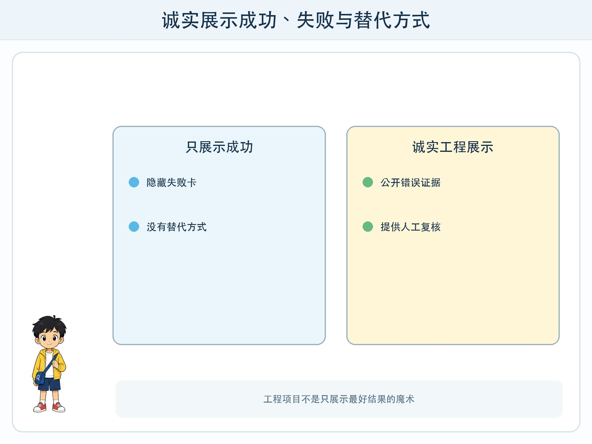
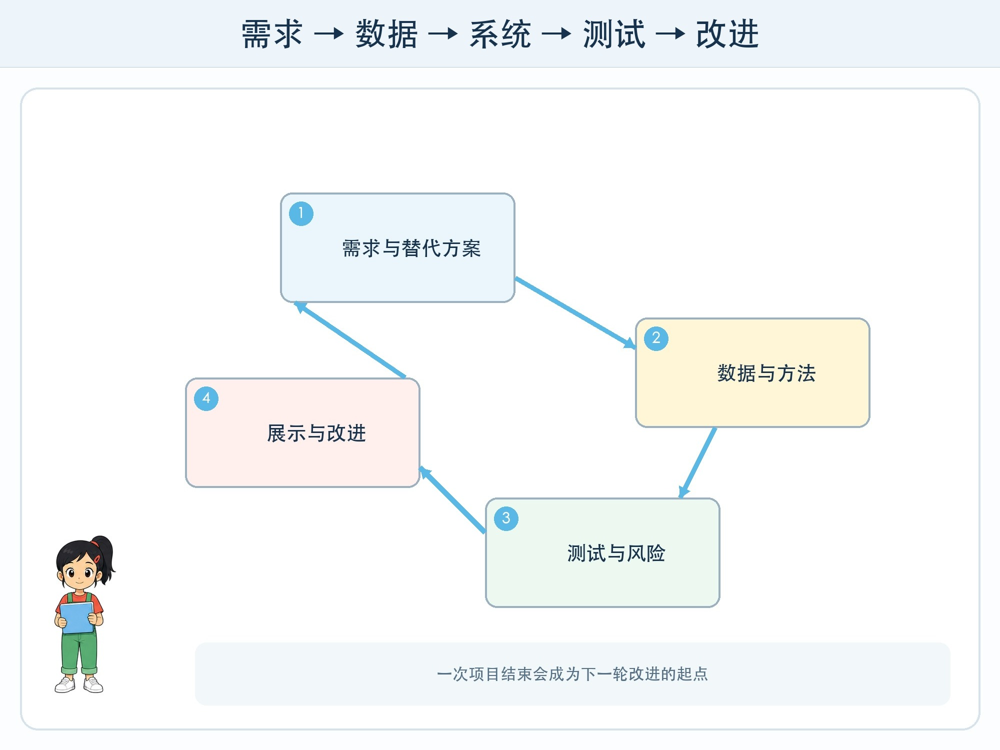

# 第 12 章 班级智能分类站

## 漫画开场

科技节前一天，三人把分类站装饰得很漂亮。小问准备只展示答对的卡，朵朵却把一张被遮挡的失败卡贴在展示板中央。方方旁边还多了三个区域：“自动结果”“请人复核”“暂不处理”。

“展示错误会不会显得不厉害？”小问问。朵朵回答：“工程项目不是魔术表演。别人需要知道它什么时候能用，什么时候不能用。”

## 工程挑战

最后一章要把全年知识合成一条项目链：需求、数据、清洗、标注、方法选择、程序、测试、公平、安全和展示。

项目可以是纯纸面原型，也可以在教师指导下使用图形化平台。完成标准不是“用了 AI”，而是每个决定都有理由，每个失败都有记录。

## 第一步：把问题缩小

不要写“做一个会分类所有东西的 AI”。可以写“把 30 张自绘物品卡分成纸类、塑料类和待复核，帮助四年级同学理解分类流程”。

再比较不用 AI 的方案：颜色贴纸、编号查表、人工选择菜单。若简单方案已经更准确、更便宜、更保护隐私，项目可以选择不用模型。工程目标是解决问题，不是强行使用热门技术。

## 第二步：准备可解释的数据

写数据卡：样本由谁绘制、允许哪些变化、标签定义是什么、哪些信息不收集。保留原始卡和清洗记录，训练卡与密封测试卡分开。

两名标注者独立标注一部分，记录争议并修改说明。不要为了数量复制同一张卡。让角度、颜色、遮挡等变化与真实使用范围相符。

## 第三步：画完整系统

系统图要包含输入、规则或模型、程序条件、输出、人工复核和停止。每条箭头都表示信息或动作流向，不能只画一个写着“AI”的大盒子。

在纸面原型中，一名同学扮演模型，根据训练卡规律给结果；另一名扮演控制程序，按条件卡决定自动分类还是转人工；第三名扮演测试员并记录。角色轮换后再做一次，可以发现说明是否只对作者自己有效。

## 第四步：先写测试计划

在看到结果前确定：测试卡数量、普通卡与难例比例、通过标准、关键错误和停止条件。

测试表至少包含：卡片编号、期望标签、实际结果、判断路径、错误类型、是否需要复核。除了总正确率，还要比较不同颜色、角度和遮挡条件。

若关键错误超过预定数量，不要临时降低标准。记录“本轮未通过”，找原因后重新设计。能够诚实停止，是工程能力的一部分。

## 第五步：准备风险与替代方案

分类站只使用自绘卡，不拍摄真实同学和校园物品；任何无法识别的形式都可以直接使用人工选择；屏幕或纸牌清楚显示当前状态；停止卡从任何步骤都有效。

风险表可以写：风险、可能影响、预防办法、发生后行动、负责人。例如“卡片看不清—分错类别—加入待复核—停止自动分类并请讲解员确认—项目组值班同学负责”。

## 动手试一试：七格项目板

把一张大纸分成七格：

1. 谁遇到什么问题。
2. 不用 AI 的方案。
3. 数据与标注规则。
4. 规则/模型/程序流程。
5. 普通测试与难例。
6. 隐私、公平、停止和替代方式。
7. 结果、限制与下一轮。

请另一组做评审，只允许提出三类问题：“证据在哪里”“谁可能无法使用”“失败后怎么办”。项目组必须修改至少一处，或用证据说明为什么保留。

## 怎样展示才诚实

展示一个成功例子和一个失败例子；公布测试数量而不是只报百分数；说明数据来自自绘卡；指出系统不能识别真实垃圾；把人工帮助和简单替代方案放在醒目位置。

不要演示真实摄像头收集同学图像，不让参观者输入姓名和联系方式。若使用在线工具，必须由学校和成人确认账户、权限与素材，并准备完全离线的展示方案。

## 压轴复盘

小问最终没有删掉失败卡。他在旁边写：“这张卡帮助我们发现遮挡测试不足。”参观者不但看到了方方分类，也看到了工程师怎样从错误中改进。

一座负责任的分类站，不是从不犯错的机器。它是一套知道目标、说明边界、主动测试、保护使用者并允许人接管的系统。

## 小心这个坑

项目展示结束后也要处理数据和设备：删除不再需要的临时文件，收回测试卡，关闭共享链接和设备权限。作品完成不等于责任结束。

## 工程师笔记

- 从小而明确的问题开始，先比较不用 AI 的方案。
- 数据、模型、程序、界面、测试和人工责任共同组成项目。
- 好展示同时公开成功、失败、范围、替代方式和下一步。

## 给大人的话

综合项目评价应重过程证据：问题定义、数据说明、测试记录、错误分析、安全设计和表达诚信。不要把画面华丽或是否调用真实 AI 作为主要分数。真实联网或硬件实现属于成人负责的可选扩展，纸面原型已能完整达成课程目标。
