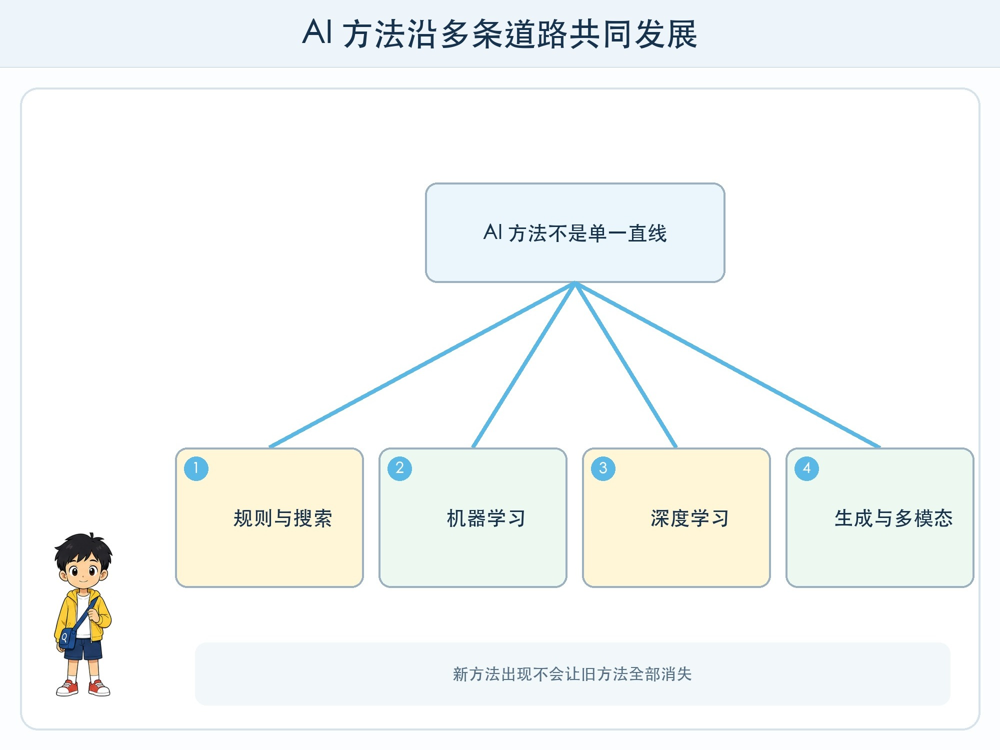
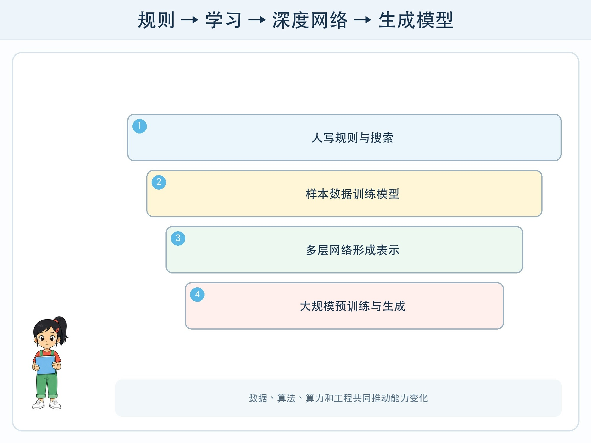

# 第 1 章 AI 的几次重要转弯

## 漫画开场

小问在展示板上画了一条直线：最左边是“只会按规则的老机器”，最右边是“什么都会的大模型”。朵朵看后把直线擦掉，改成许多交叉的道路。

“AI 不是一支队伍整齐向前走，”她说，“规则、搜索、机器学习和生成模型今天仍在一起工作。新方法出现，也不会让旧方法全部消失。”

## 训练营挑战

本章不要求背年份，而要理解四次重要的方法变化：人写大量规则、从数据学习、使用多层神经网络、通过大规模预训练生成内容。你还要能指出，每次转弯解决了什么问题，又带来了什么新限制。

## 从规则与搜索开始

早期许多 AI 系统由专家写知识和规则，再搜索可能步骤。例如棋类程序会评估局面并寻找有希望的走法。规则清楚时，这类方法仍然很有用。

困难在于，现实世界变化太多。要靠人把每种图片、声音和语言情况都写成规则，工作量巨大，也容易遗漏。工程师于是更广泛地使用机器学习：给系统样本和目标，让算法调整模型。

## 数据和算力推动学习方法

机器学习不是 2010 年以后才出现，但更多数字数据、更强计算设备和改进算法，让深度神经网络在图像、语音等任务上取得明显进展。它们能从大量输入中形成多层表示，不必由人手工列出所有特征。

“深度”指网络中有多层计算结构，不表示模型理解得一定更深。模型仍会依赖数据、目标和部署环境，也可能把无关规律学进去。

## Transformer 与生成模型

2017 年发表的 Transformer 架构用注意力机制处理序列中不同位置的关系，后来成为许多大语言模型和多模态模型的重要基础。模型在大规模数据上进行预训练，再通过提示、微调或连接资料完成不同任务。

生成式 AI 不只是从固定选项中分类，而是逐步产生文字、图片、声音等内容。它带来更自然的交互，也带来幻觉、版权、深度合成、成本和安全问题。

最新模型常能同时处理多种形式，也能调用工具或参与智能体流程。但“能展示”与“能可靠部署”之间还有评测、权限、日志和人工责任，这些会在六年级继续学习。

## 动手试一试：四种方法接力

准备任务“给校园活动卡分类并写一句介绍”。四人分别扮演：

1. 规则员：只能使用三条明确规则。
2. 样本员：参考八张带标签例子判断新卡。
3. 表示员：先把卡片转换成主题、时间、地点等数字或类别特征。
4. 生成员：根据分类结果和资料卡写介绍。

比较每人需要什么输入、能完成什么、最可能在哪里出错。最后画箭头组合他们，不要选“唯一最先进者”。

## 转弯不是终点

AI 发展常受到数据、算法、算力、工程工具和社会需求共同影响。一次突破可能在某项测评上很好，却不代表所有语言、地区、设备和任务都同样有效。

阅读“新模型超过人类”时，要追问超过的是哪个测试、测试范围是什么、人类基准怎样定义、真实使用是否有不同风险。历史让我们看到：热门说法会变化，问题定义和证据检查更长久。

## 小心这个坑

不要把 AI 历史写成少数“天才突然发明一切”。研究来自许多地区、学科、团队、公共资金、数据工作者和工程实践。介绍人物与机构时要核对原始资料，也要承认一条短时间线无法容纳全部贡献。

## 模型笔记

- 规则、搜索、机器学习和生成模型不是互相完全替代的四代机器。
- 数据、算法和算力共同推动深度学习与大模型发展。
- 新能力会带来新风险，展示效果必须经过真实任务评测。

## 给大人的话

建议用方法演变而非英雄名单组织历史。可展示 Transformer 原论文标题，但不要求孩子阅读公式。对“最新”内容标注审校日期，避免把具体产品排行榜写入稳定正文。
