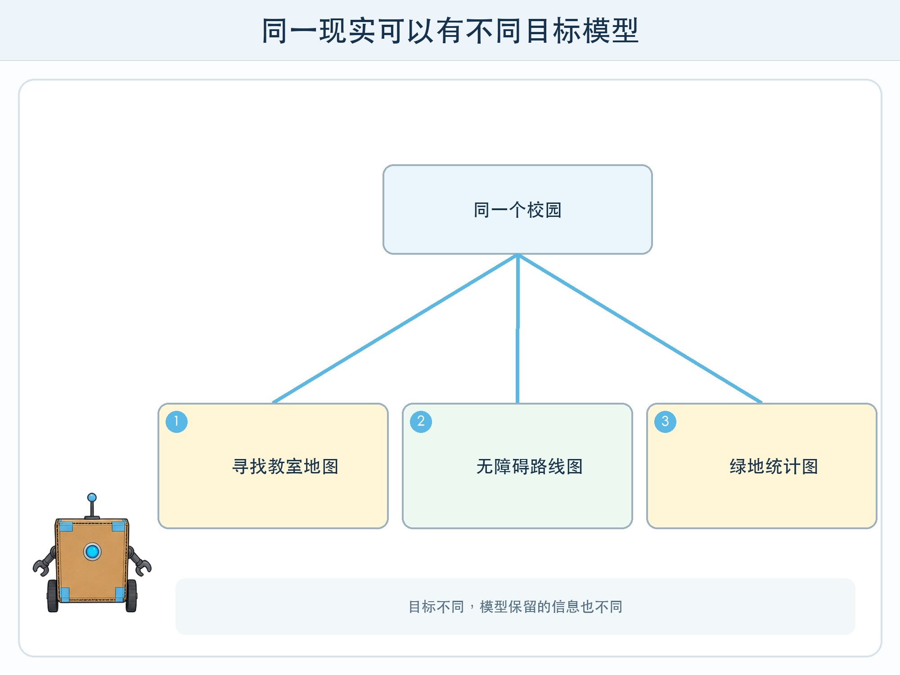
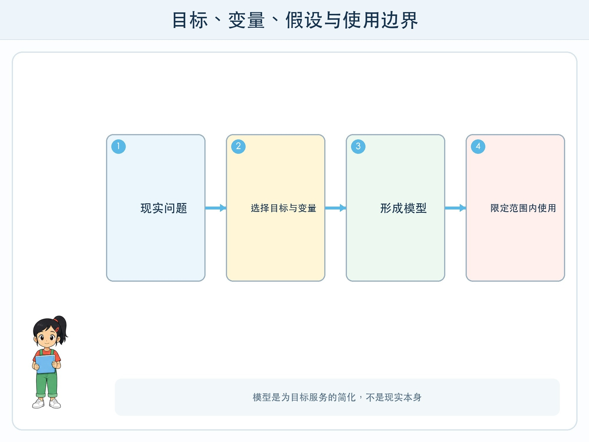

# 第 2 章 模型是现实的简化

## 漫画开场

朵朵要做一张校园地图。小问建议把每棵树、每块砖和每扇窗都画进去，结果纸上挤得看不清道路。方方只画教学楼和操场，又漏掉了无障碍坡道。

同一个校园，为“寻找教室”“规划轮椅路线”“统计绿地”制作的地图应该不同。地图不是校园本身，而是为了某个目标保留部分信息的模型。

## 训练营挑战

你要用“目标—变量—假设—边界”四个问题检查一个模型：它想完成什么，输入了哪些可变化因素，默认相信什么，在什么范围外不能使用。

## 模型为什么要简化

现实包含太多细节，计算系统不能把一切原样装进去。天气模型把大气状态表示成许多数值，图像分类模型把像素转换成内部特征，语言模型把文字切成 token 并计算后续可能性。

简化不是偷懒。若保留与目标无关的细节，系统更慢、更难解释，也可能收集不必要隐私。问题是要保留哪些、舍去哪些。这个选择来自设计者、数据与任务。

## 变量与目标

预测图书角排队，可以输入时间段、活动日、可借书数量等变量，目标是未来五分钟是否超过六人。若目标改成“每位同学是否喜欢阅读”，同一组变量就不够，而且这个目标本身也过度简化了人的兴趣。

模型训练需要可计算目标。分类目标可能是标签，生成目标可能与预测下一个 token 有关。选择目标会决定系统优化什么。只优化点击，推荐系统可能忽略内容质量；只优化总体正确率，可能忽略关键少数错误。

## 假设藏在哪里

模型与数据处理都包含假设：过去样本能代表未来；标签规则足够一致；测试环境与使用环境相近；所选变量包含有用信息。

假设不是一定错误，而是需要写出并验证的前提。若校园作息改变，过去排队规律可能失效；若新建了坡道，旧地图需要更新。模型上线后仍要监测环境变化。

## 边界比“聪明程度”更重要

一个只在自绘卡上训练的模型，边界就是类似画法与类别。它不能因为在测试卡上高分，就自动用于真实监控画面。模型卡或系统说明应记录用途、不适用场景、数据来源、指标和已知限制。

边界还包括谁会受结果影响。帮助整理虚构图书卡与决定真实学生机会，风险完全不同。高风险任务需要更严格证据、专业审查、人工决定，有时不应使用自动模型。

## 动手试一试：三张同地不同图

以虚构校园为对象，分别为“最快到医务室”“观察绿地”“找到安静阅读区”画三张简图。

1. 每张只允许选择五个字段或符号。
2. 写出为了目标保留什么、舍去什么。
3. 给每张图写一个假设和一个不能回答的问题。
4. 与同伴交换，看他是否会把一张图用于错误目标。
5. 增加“道路施工”新情况，判断哪张图需要更新。

这个活动帮助理解模型选择，不需要采集真实校园安全路线或个人行动数据。

## 模型不等于真相压缩包

模型参数保存的是训练过程中形成的计算关系，不是把每条原始资料完整放进可随时取出的抽屉。生成模型也可能把相似规律组合成未发生的内容。

因此需要事实时，应连接可核对资料或数据库；需要预测时，应报告不确定性与适用范围；需要行动时，应保留规则与人类审批。

## 小心这个坑

“模型显示”不是停止讨论的理由。要继续问数据是谁收集的、目标是谁定义的、错误由谁承担。用数字表示复杂现象时，不能忘记未被记录的部分和受影响者的声音。

## 模型笔记

- 模型为特定目标简化现实，保留与舍弃都是设计选择。
- 变量、目标和假设决定模型能学到什么，环境变化会让旧规律失效。
- 可靠说明必须写适用范围和不能回答的问题。

## 给大人的话

可把地图、地球仪、天气预报与 AI 模型对比，强调“模型”在科学中的广泛含义。避免把所有模型说成黑箱，也避免把简单可解释模型说成一定更公平；公平仍取决于任务、数据和使用方式。
