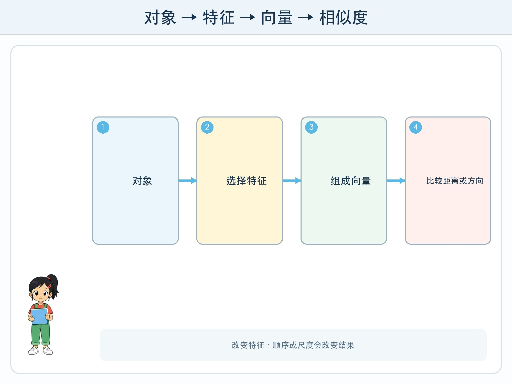

# 第 3 章 用数字表示信息

## 漫画开场

方方要把图书卡放到“相近的书靠在一起”的墙上。卡片上有主题、页数、图片比例和阅读难度。小问把书名按拼音排序，结果《海底探险》和《海洋动物图鉴》离得很远，《星球日记》和《星星手工》却靠在一起。

朵朵画出一张坐标图：横轴表示图片多少，纵轴表示知识性强弱。每本书变成一个点。相近不是看名字，而是看选定特征上的位置。

## 训练营挑战

你要理解**向量**：按固定顺序排列的一组数字，可以表示一个对象在多个特征上的位置。例如 `[图片比例, 篇幅, 科普程度]`。

向量不是对象本身。它只包含设计者或模型选择的表示。改变特征、顺序或尺度，相似关系也会改变。

## 从两个坐标到多维

平面坐标用两个数表示位置，例如 `(3, 5)`。若增加第三个特征，就像进入三维。真实模型常使用更多维度，人无法直接画出来，但仍可以把它理解为一串有固定含义或内部作用的数字。

假设三本虚构图书使用两个 0—5 分特征：图片多、科普强。A 是 `(5,4)`，B 是 `(4,4)`，C 是 `(1,2)`。A 与 B 在图上较近，按这两个特征看更相似。

## 距离表示哪种相似

最直观的方法是比较两点距离。距离小表示所选特征接近。但“近”只对当前表示成立。若加入“是否为故事书”，结果可能改变；若页数用 300、图片比例只用 0—1，页数差会支配距离，需要先调整尺度。

某些系统比较向量方向而不是绝对长度，常见方法叫余弦相似度。五年级不需要计算公式，只要想象两支从原点出发的箭头：方向越接近，某种模式越相似。

不同距离方法回答的“相似”也不同。工程师必须根据任务选择，并用真实例子检查，而不是看到小数点就相信结果。

## 特征向量与嵌入向量

人手工定义的 `[图片比例, 篇幅]` 是容易解释的特征向量。现代模型还会通过训练，把文字、图片或声音转换成高维**嵌入向量**。单个维度往往不能简单命名，但整体位置可用于搜索、聚类和匹配。

嵌入会在第 6 章详细学习。这里先记住：模型把内容变成数字表示，不等于理解了人类全部意义，也不保证相近内容事实一致。

## 动手试一试：人体坐标图

在地面贴两条互相垂直的纸带。横轴“图片少—图片多”，纵轴“故事性弱—故事性强”。准备 12 张虚构图书卡。

1. 小组先为每张卡打 0—5 分并记录理由。
2. 把卡放到对应坐标位置。
3. 找每张卡最近的两个邻居，判断推荐是否合理。
4. 把纵轴改成“科普性弱—强”，重新放置。
5. 比较哪些邻居改变，写出表示改变的原因。

活动评价虚构卡，不给真实同学的阅读能力、性格或兴趣打分。

## 数字也会带入判断

给“故事性”打 4 分包含人的判断，不是自然界自动提供的数字。不同标注者可能有分歧，需要定义和样例。模型形成的向量也受训练数据与目标影响。

如果向量用于推荐，缺少无障碍、语言或文化相关信息时，一些重要相似可能无法表现。表示设计既是技术问题，也是价值选择。

## 小心这个坑

不要把人压缩成“优秀度向量”或用未经同意的个人行为做兴趣坐标。向量很方便，但被省略的部分不会因为图画得漂亮而消失。结果影响人时，应允许纠正、解释和退出。

## 模型笔记

- 向量是按固定顺序排列的一组数字，用来表示所选特征或内部关系。
- 距离和方向可以比较相似，但答案取决于特征、尺度和比较方法。
- 数字表示是现实的简化，不是对象或人的完整意义。

## 给大人的话

本章可与数学坐标、测量和比例结合。先使用二维手工特征，再告诉孩子真实嵌入通常高维且难以逐维解释。避免把“向量数据库”讲成存放箭头的仓库，它存储和检索的是数值向量及相关内容标识。
