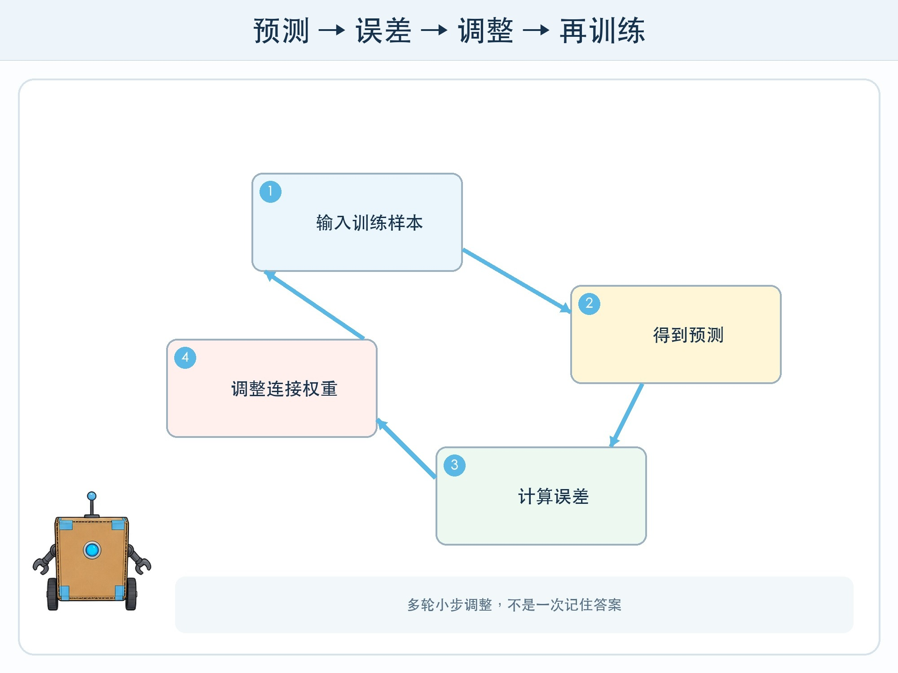
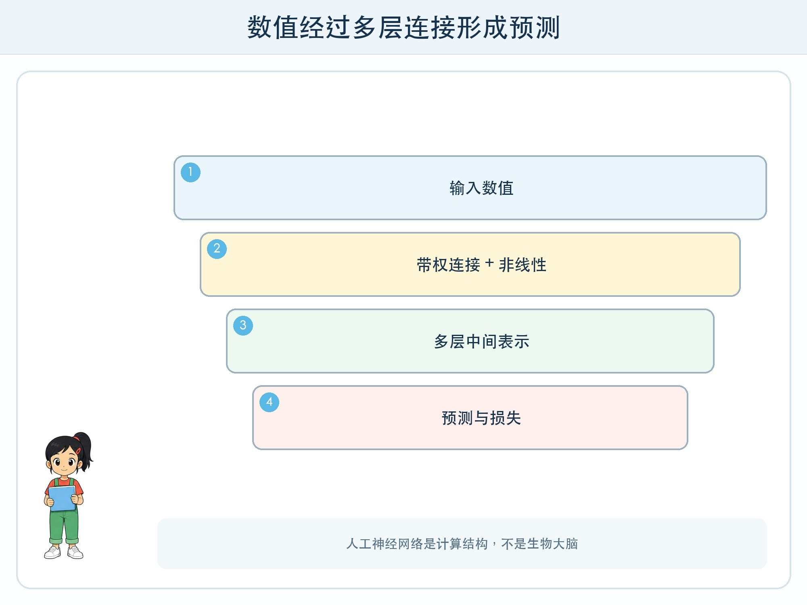

# 第 4 章 神经网络怎样调整

## 漫画开场

小问搭了一条“水果判断线”：颜色观察员把分数传给形状观察员，形状观察员再传给结果员。第一次，系统把绿色圆球当成苹果，也把绿色气球当成苹果。

朵朵没有直接加一条“气球规则”，而是让每位观察员根据错误调整自己传递信号的强弱。重复多轮后，材质与果梗线索的影响增大，只有颜色的影响减小。

## 训练营挑战

你要理解神经网络的五个基本环节：输入数值、多层连接、前向计算、损失或误差、反向调整。这里的“神经”来自历史类比，人工神经网络不是生物大脑，也没有人的感受。

## 一层计算做什么

一个计算单元会接收若干数字，为不同输入赋予不同权重，再经过非线性变换产生输出。权重表示某个输入在当前计算中的影响强弱，不等于人能直接读出的“知识重要程度”。

只有线性加减时，多层叠在一起仍难表示复杂弯曲边界。非线性让网络能够组合出更复杂关系。真实网络可能有很多层和大量参数，但基本过程仍是数字进入、逐层计算、得到输出。

## 从误差得到调整方向

训练时，模型先对一批样本预测，再用损失函数把预测与目标的差异变成数值。损失小通常表示在当前目标下更接近训练答案，但它不是伤心或后悔。

算法计算各参数怎样改变会让损失下降，再按一个小步更新。这类方法常称为梯度下降，误差信息向前面层传播并影响参数的过程叫反向传播。

若每步太大，可能越过较好位置甚至来回震荡；太小则训练很慢。更新一次不会学会任务，需要许多批数据和多轮训练。

## 训练不是背标准答案那么简单

模型若容量很大、训练太久或数据单一，可能把训练细节记得很好却不能泛化到新样本。正则化、数据增强、验证集和早停等方法用来减少过拟合风险，但没有一种方法保证所有新情况都正确。

训练数据标签错误时，网络也会被错误目标推动；目标只奖励总体正确率时，少数关键错误可能被忽略。优化做得很好，不表示优化目标本身选择正确。

## 动手试一试：连接权重传话

准备三种特征卡：颜色、形状、是否有果梗。三名同学分别持有权重筹码，第四名汇总分数判断“苹果/非苹果”。

1. 第一轮每种特征权重相同，测试六张训练卡。
2. 每答错一张，只允许把一个权重增加或减少一格。
3. 每调整一轮都重新测试全部训练卡。
4. 用四张密封新卡测试，不再调整。
5. 记录训练错误下降是否伴随新卡错误上升。

纸面活动只模拟“误差引导调整”的思路，并不等同于真实反向传播计算。

## 为什么很难逐条解释

复杂网络的能力分散在许多参数和中间表示中，很少存在“这一根连接就是苹果”。可视化某些激活或贡献能提供线索，但不能把漂亮热图当成完整因果解释。

因此高风险使用不能只说“模型内部很复杂”。需要配合数据说明、独立评测、输入限制、监控、人工复核和申诉机制。

## 小心这个坑

不要用“像大脑”推断模型会理解、期待或承担责任。也不要把训练说成系统自由成长：数据选择、目标函数、网络结构、计算资源和停止时机都来自人的设计与条件。

## 模型笔记

- 神经网络把数值经过多层带权连接和非线性变换得到输出。
- 训练用损失表示目标差异，再多轮小步调整参数。
- 损失下降不保证新数据可靠，更不保证目标公平或安全。

## 给大人的话

可用筹码活动建立直觉，不必提前讲偏导数。请明确纸面“一个人等于一个神经元”只是角色分工比喻，真实网络是矩阵计算。若孩子追问数学，可把梯度解释为局部最陡下降方向，留待后续课程推导。
