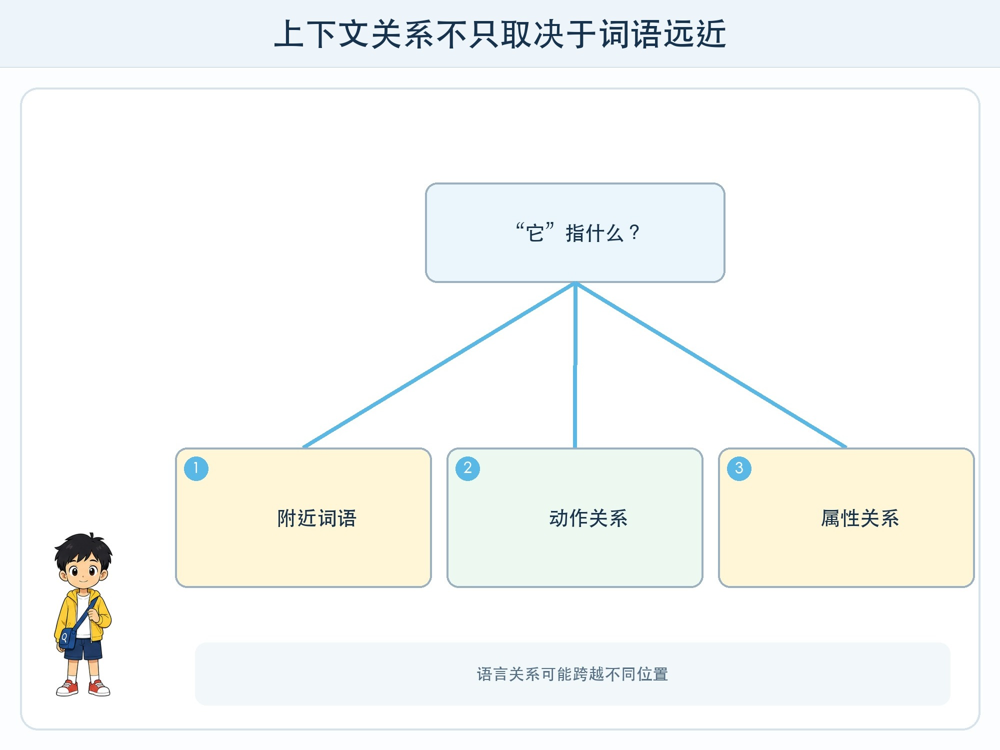
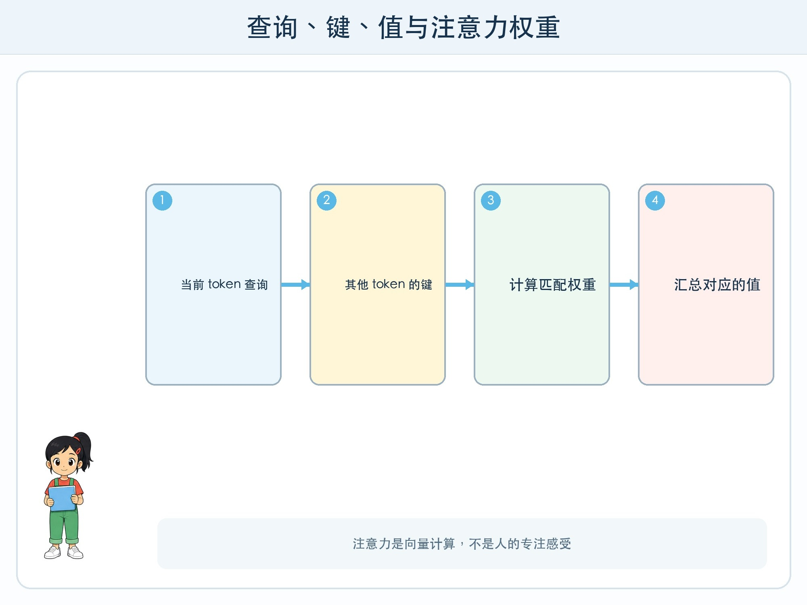

# 第 5 章 注意力在关注什么

## 漫画开场

方方读到一句话：“小问把奖状放进蓝色盒子，因为它更结实。”它问：“‘它’指奖状还是盒子？”

小问只看“它”前面的最近名词，回答奖状。朵朵却把“放进”“盒子”“结实”连成关系线：通常是盒子具有结实属性，句子里的远近不是唯一线索。

## 训练营挑战

你要理解 Transformer 中的自注意力直觉：每个 token 在形成新表示时，会根据当前任务与上下文，对其他 token 的信息分配不同权重。注意力不是人的专注感受，而是一组计算关系。

## 为什么要看不同位置

语言中的关系可能跨越很远。主语与动词要对应，代词要寻找指代对象，问题里的条件可能出现在开头，答案线索在结尾。

早期序列模型常按顺序传递状态。Transformer 的注意力机制让不同位置能更直接地计算关系，并适合在训练时并行处理许多位置。这是它能扩展到大规模训练的重要原因之一，不是唯一原因。

## 查询、键和值的纸面直觉

可以用图书馆比喻帮助理解。当前 token 形成一个“查询”，其他 token 提供可匹配的“键”和可汇总的“值”。查询与键越匹配，对应值在当前输出中的权重可能越高。

真实计算不是文字卡直接互相看，而是向量经过矩阵变换、相似度计算和归一化。多个注意力头可以在不同表示子空间中形成不同关系。这个比喻的边界是：头不一定对应人能命名的“语法头”或“事实头”。

## 顺序从哪里来

只比较 token 集合会丢失顺序。“猫追狗”和“狗追猫”词相同、意思不同。Transformer 因此需要位置信息，让表示包含 token 所在位置或相对距离。

现代模型使用不同的位置编码办法，但共同目标是让顺序进入计算。上下文越长，计算与记忆需求也会增加；能放入更长文本，不表示模型会同样准确使用每个位置的信息。

## 多层注意力形成复杂表示

一层注意力汇总上下文后，还会经过前馈网络、残差连接和归一化，再进入下一层。许多层共同形成复杂表示。最后语言模型把当前位置表示转换成下一个 token 的概率分布。

模型逐步生成时，每次新增 token 又进入上下文，继续计算后续可能性。流畅来自大规模训练形成的语言规律，不等于句中事实已经查证。

## 动手试一试：关系线实验

准备一句含 12—16 个词的短句和四种彩线：人物、动作、指代、时间。

1. 每人选择一个目标词，先只连最近词。
2. 再根据“完成当前解释需要什么信息”重新连接。
3. 给每条线分配 1—3 个筹码表示关系强弱，总筹码固定。
4. 把一个关键词换掉，观察哪些权重需要改变。
5. 比较不同同学的连接，不把任何一张图当作真实模型内部解释。

## 注意力图能解释一切吗

把注意力权重画成热图可以帮助研究，但模型输出经过多层、多个头和其他计算。某层某头的高权重不一定就是最终答案的完整原因。解释工具提供证据片段，仍需配合干预实验和任务评测。

## 小心这个坑

“注意力”这个名称容易让人以为模型正在有意识地关注。书中所有关系线都是计算示意。模型没有因为权重高就觉得某个词重要，也不会因上下文太长感到疲倦。

## 模型笔记

- 自注意力让每个 token 按计算权重汇总上下文中其他位置的信息。
- 查询、键和值是向量变换；多头不保证每个头都有可命名含义。
- Transformer 还需要位置信息和多层其他计算，注意力不是整套模型。

## 给大人的话

本章术语来自 2017 年 Transformer 论文。建议只用 Q/K/V 建立方向性直觉，不讲成数据库精确查询。若展示注意力图，应明确它不是完整因果解释，也不能证明模型“理解了”句子。
