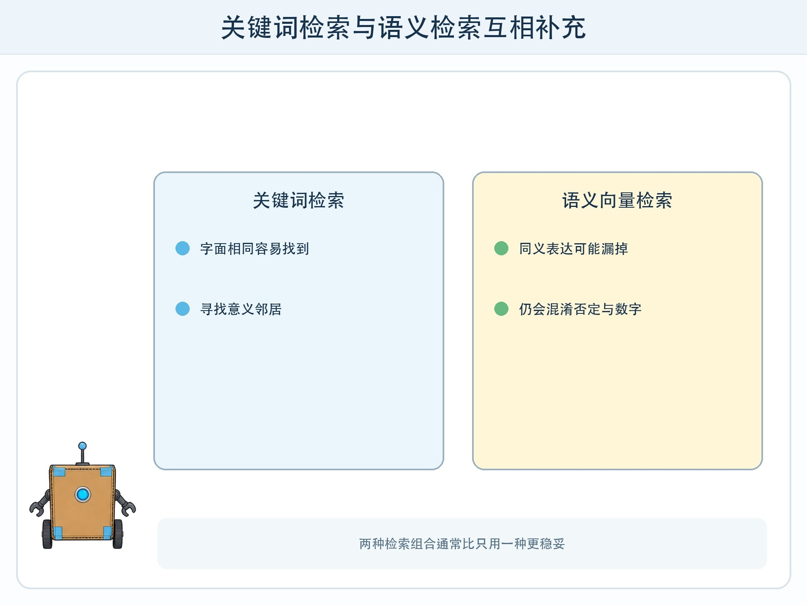
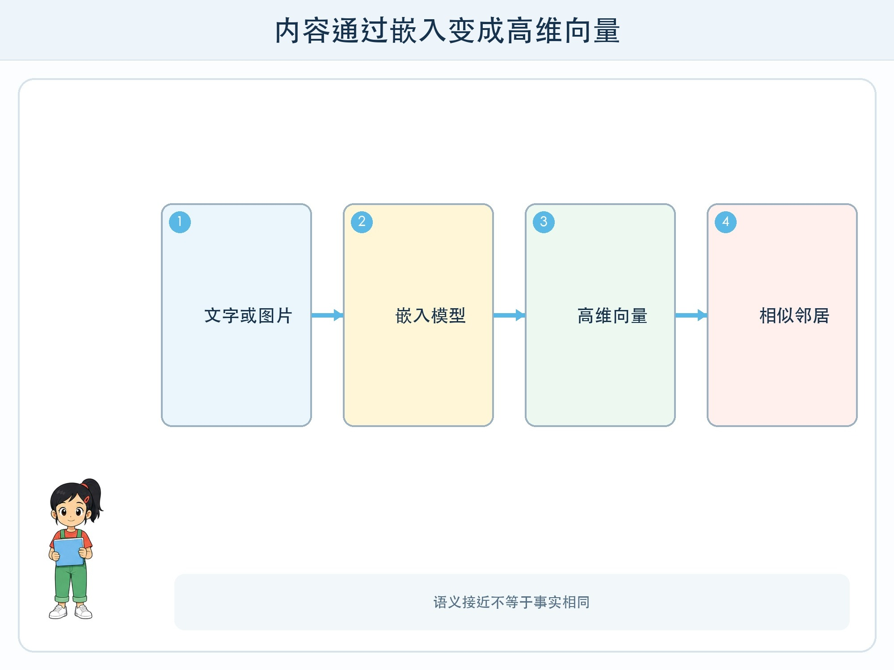

# 第 6 章 把意思放进坐标

## 漫画开场

小问在校园资料里搜索“雨天活动”，系统却只找到标题里刚好有这四个字的页面。朵朵输入“下雨时可以在哪里运动”，一篇标题为“室内体育安排”的资料也很相关，却没有共同关键词。

方方把句子转换成许多数字，再在坐标空间中寻找接近的资料。搜索开始能发现“字不同但意思相关”的内容。

## 训练营挑战

本章要认识**嵌入**：模型把文字、图片或其他对象转换成高维向量，使训练目标下相似的对象在向量空间中具有可比较关系。

你还要明白，语义接近不等于事实相同，向量数据库也不是模型记忆或真相仓库。

## 嵌入从哪里来

人手工定义的特征向量每一维容易命名。嵌入向量通常通过训练形成。模型在大量样本任务中调整参数，让相关文本、相配图片文字或相似内容的表示更接近。

训练目标不同，嵌入空间也不同。适合搜索句子意思的嵌入，不一定适合识别作者风格；适合通用网页的模型，不一定理解某所学校的缩写。必须在目标资料和问题上测试。

## 高维空间怎样想象

二维图只能画两个方向，真实嵌入可能有数百或更多维。我们把它投影成平面只是示意，点在图上靠近不代表真实高维距离完全一样。

比较向量时常用余弦相似度等方法。系统可以取最相近的前 K 项，再设置最低相似阈值。K 太小可能漏资料，太大可能把无关内容也送入后续模型。

向量通常和原文片段标识、标题、权限等元数据一起存储。检索得到向量对应的原文，人才可以核对证据。

## 语义相近仍可能相反

“图书馆周五开放”和“图书馆周五不开放”共享大量词语，向量可能很接近，事实却相反。数字、否定词、日期和专有名称也可能让通用相似度出错。

因此语义搜索适合寻找候选，不适合单独宣布答案。后续仍要读取原文、检查时间、来源与具体句子。关键词检索和语义检索组合，常比只用一种更稳妥。

## 动手试一试：句子邻居地图

准备 16 张虚构校园句子卡，包括同义、反义、同主题不同事实和完全无关内容。

1. 小组先按关键词重合摆放。
2. 再按整体意思重新摆放。
3. 为每张问题卡选三个最近邻，并说明理由。
4. 特别检查含“不”、日期和数字的卡。
5. 写出一条“相似但不能互相证明”的配对。

这个活动模拟嵌入检索的判断难点，不声称同学摆放结果等于真实模型向量。

## 嵌入也有隐私风险

向量看起来不像原文，却仍然由原始内容计算而来，可能包含敏感模式，也可能被错误关联。不能因为“已经变成数字”就随意保存个人资料。

建立向量库仍需控制来源、权限、保留时间和删除。删除原文时，还要处理对应向量与缓存，避免只删看得见的文件。

## 小心这个坑

不要把二维嵌入图中的簇给人贴性格或能力标签。降维图会丢失信息，聚类边界也由方法决定。涉及人时，简单“靠得近”可能造成严重误解。

## 模型笔记

- 嵌入把对象转换成高维向量，使特定训练目标下的相似关系可计算。
- 空间关系取决于模型、数据、任务和相似度方法，不是永远正确的意义地图。
- 语义相近不等于事实一致，检索结果必须回到原文核验。

## 给大人的话

可用同义句与否定句展示向量检索的价值和边界。若实际演示嵌入 API，只使用公开或虚构文本，并说明数据是否发送到云端。不要上传校内文件建立课堂向量库，除非学校已完成权限与数据治理。
