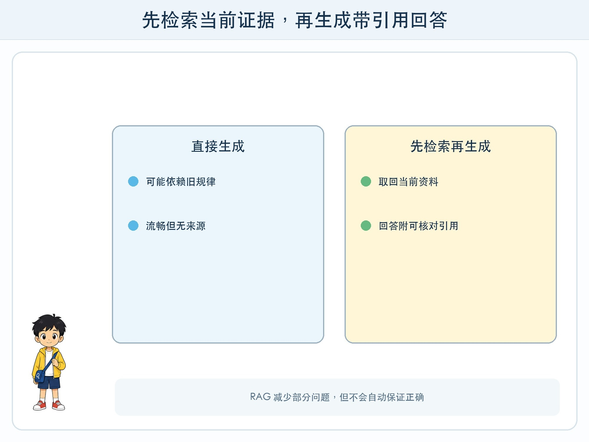
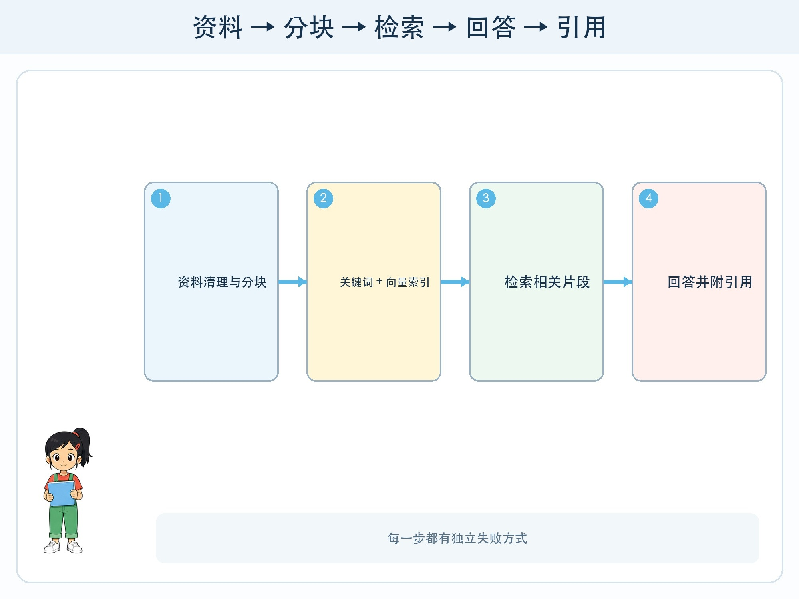

# 第 7 章 先查资料再回答

## 漫画开场

小问问方方：“今年科技节几点开始？”只使用语言模型时，方方流畅地给出一个时间，却与最新通知不符。朵朵没有继续改提示，而是把公开通知切成小卡，先检索相关卡，再连同问题一起交给回答员。

这次回答后面多了一条引用。小问打开原文，发现时间正确，还看到通知的发布日期。

## 训练营挑战

你要拆解**检索增强生成**（Retrieval-Augmented Generation，RAG）的完整链路：资料准备、分块、建立索引、检索、把证据放入上下文、生成回答与引用。

RAG 可以减少模型只靠预训练记忆回答的问题，但不会自动保证每个答案正确。

## 资料先怎样准备

系统先收集允许使用的资料，清理格式并保留标题、日期、来源和权限。长文通常切成若干片段，也叫分块。块太短会丢上下文，太长又可能混入许多无关内容。

每个片段可以建立关键词索引，也可以计算嵌入向量放入向量索引。原文仍需保存，因为最后要把真正文字交给模型并让人核对，不能只给一串向量。

## 问题来了以后

系统把问题转换成检索查询，找出若干候选片段。可以组合关键词与语义检索，再按日期、权限或资料类型过滤、重排。

然后系统构造上下文：明确告诉模型只能根据提供资料回答，资料不足就说不知道，并要求标出引用。模型根据问题和片段生成结果，应用再检查引用编号是否存在。

这里至少有两个模型角色：嵌入或重排模型帮助检索，生成模型组织回答。也可以有规则和普通搜索算法。RAG 是一条系统流程，不是一种神奇单模型。

## RAG 会在哪些地方失败

资料库没有最新通知，检索再好也找不到；分块把标题与正文切开，片段可能失去时间范围；问题表达与资料差异太大，检索可能漏掉；取回了正确片段，生成模型仍可能读错数字；引用存在，却不真正支持句子。

因此要分开测“找没找到”和“回答对不对”。检索测试看相关片段是否进入前 K 项；回答测试看事实是否被证据支持、引用是否对应、没有答案时是否会拒答。

## 动手试一试：人工 RAG 接力

准备八份虚构校园通知，每份写标题、日期和三段正文。三人分工：索引员、检索员、回答员。

1. 索引员把通知切成卡并保留来源编号。
2. 检索员只看问题和卡片关键词/摘要，选前三张。
3. 回答员只能根据取回卡作答，每句事实标卡号。
4. 加入一个资料库中没有答案的问题，检查能否说“未找到证据”。
5. 故意把日期与正文分开，观察错误并修改分块。

## 引用不是装饰

回答后列出三个链接，不代表每句话有证据。要打开引用，找到支持当前说法的具体段落。来源还要权威、适用且足够新。

系统可以要求回答逐句绑定片段编号，再用程序检查编号存在，但“引用支持语义”仍需要模型评测或人工核对。重要通知最终以学校原始发布为准。

## 小心这个坑

不要把未公开校内文件、学生资料或个人聊天记录放入练习资料库。RAG 会让内容更容易被搜索和组合，权限错误可能扩大泄露。课堂只使用教师准备的公开或虚构资料。

## 模型笔记

- RAG 在生成前检索外部资料，把候选证据放进当前上下文。
- 分块、索引、检索、生成和引用每一步都有独立失败方式。
- 有引用不等于被支持，资料不足时可靠系统应明确无答案。

## 给大人的话

人工接力能完整讲清 RAG，不必调用在线服务。若做真实演示，应使用公开资料并设置权限过滤。建议把“检索命中率”和“答案有据率”分开评价，避免用最终语气流畅掩盖检索失败。
