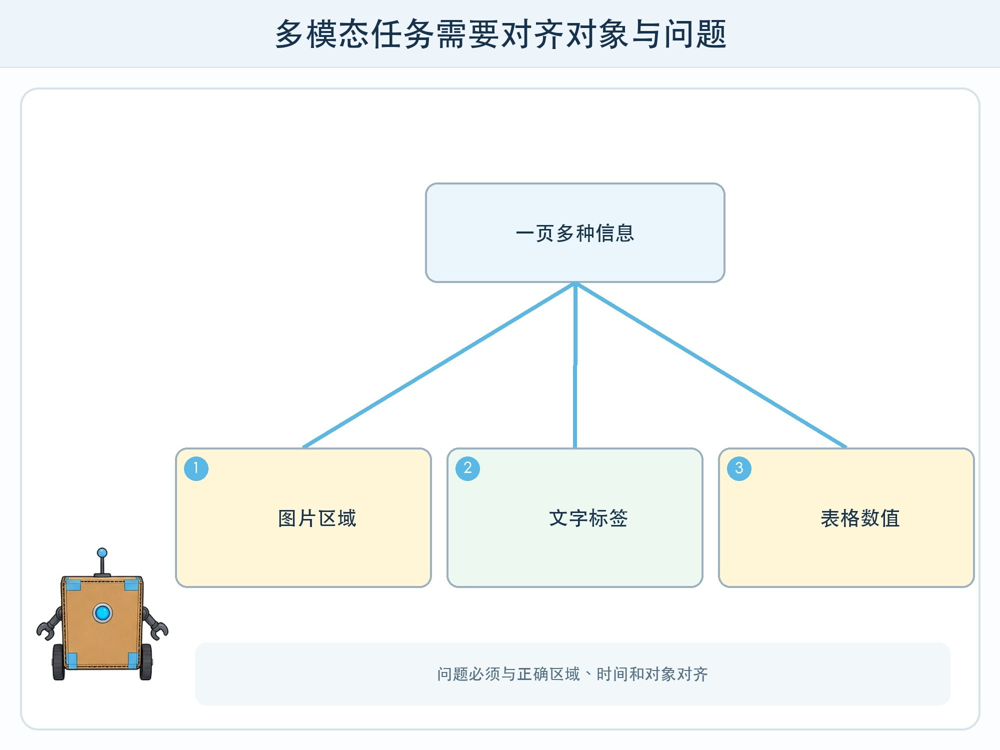
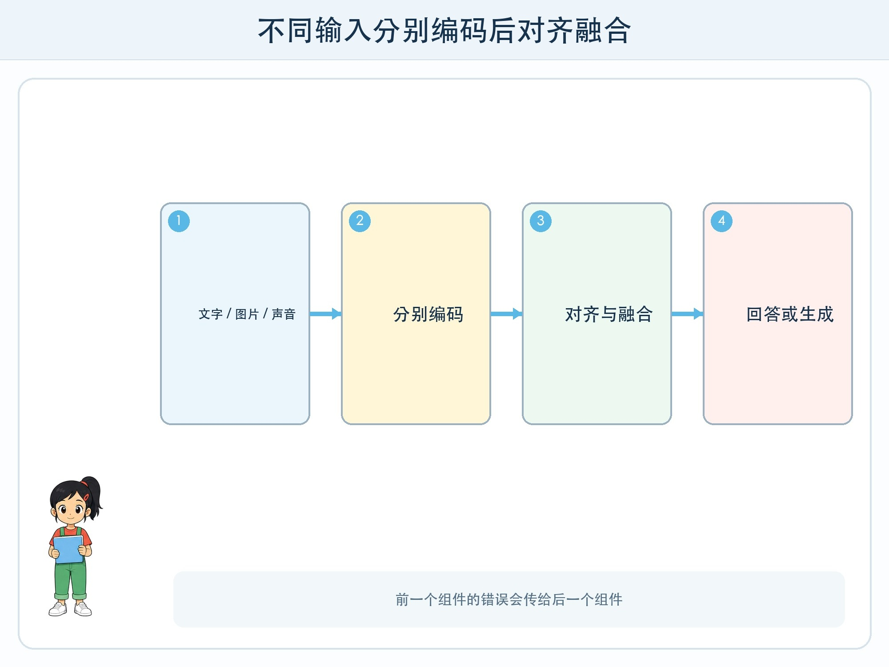

# 第 8 章 文字、图片和声音一起工作

## 漫画开场

小问拿着一张植物观察图问：“这片叶子怎么了？”图片里有两种植物，旁边标签写着不同日期，背景还有浇水记录表。模型只描述了最大的叶子，却忽略文字标签和表格。

朵朵把问题改成三步：先指出目标植物的位置，再读取标签日期，最后根据记录表整理可观察现象。她仍没有让模型直接给养护结论，而是请科学老师确认。

## 训练营挑战

本章要理解**多模态模型**：能够处理或生成文字、图片、声音、视频等多种数据形式的模型或系统。多模态不等于拥有人的全部感官，也不保证不同形式之间正确对齐。

## 不同输入先变成表示

文字会被切成 token，图片可分成小块并转换成视觉特征，声音会按时间变成信号片段。不同模型使用的编码方式不完全相同，但都需要把原始输入转换成可计算表示。

系统再通过共同训练、投影层或交叉注意力等方法，让问题文字能与图片区域、声音时间段建立关系。生成答案时，语言部分根据融合后的上下文逐步输出 token。

## 对齐为什么困难

“左边那个杯子”需要知道左边、杯子和当前画面对应；“他说完以后响起的声音”需要把文字指令与音频时间对齐；图表问题还要把轴名、数值和图形位置联系起来。

图片里有多个相似对象、分辨率低、文字很小或问题含糊时，模型可能对错目标。光学字符识别也可能读错字和数字。视频还增加帧顺序与动作持续时间。

所以高质量输入和清楚指向有帮助，但不能代替验证。让模型指出依据区域、转写文字或列出观察步骤，可以暴露部分错误。

## 多模态不是一个模型包办一切

有些系统由视觉模型、语音识别、语言模型和生成器组合；有些模型在统一架构中处理多种输入。用户看到一个聊天窗口，不代表后面只有一个模型。

每个组件都有独立边界。语音转写先错一个否定词，语言模型可能在错误文字上继续推理；图片裁剪漏掉图例，再强的回答模型也缺少证据。调试时要保存中间结果。

## 动手试一试：三模态接力

用纸笔模拟“图片 + 标签 + 口头说明”的任务，不录音、不上传照片。

1. 绘图员画一个含三个物体的场景并加简短标签。
2. 说明员背对图片读一条与其中一物有关的描述。
3. 整理员只看图与同伴写下的转述，回答目标问题。
4. 记录错误来自图没画清、声音转述错、目标没对齐还是回答推断过头。
5. 修改一个环节，再重做全部步骤。

## 生成图片也要核对

多模态模型能根据文字生成图片，也可能画错数量、空间关系、文字和文化细节。生成的“看起来像照片”不等于真实记录。

用于科普时，图像应与事实资料对照，并标明示意或生成性质。用于人物时必须考虑同意、肖像和误导。正式中文标签应后期确定性排版，不依赖图像模型生成。

## 小心这个坑

图片和声音可能包含人脸、姓名、位置、家庭环境与其他人谈话。不要因为模型“需要看”就上传。儿童活动使用自绘图和虚构标签；真实医疗、身份或安全判断不能只依赖通用多模态模型。

## 模型笔记

- 多模态系统把不同形式输入编码，再建立跨形式的对齐与融合。
- 一个界面背后可能有多个模型，前一步错误会传给后一步。
- 能描述图片不等于知道事实来源，生成图更不是真实事件证据。

## 给大人的话

本章重点是组件链和错误传播。若成人演示，可使用公开物品图而非学生照片，先查看图像转写或区域选择，再看最终回答。避免让孩子对人物情绪、健康或身份做自动推断。
