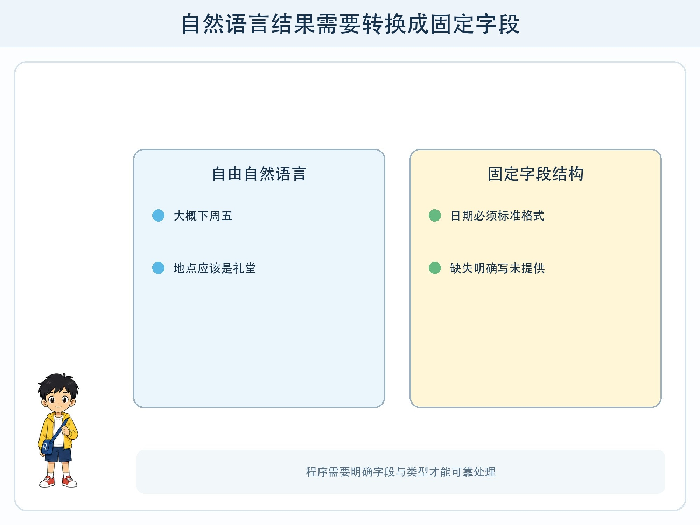
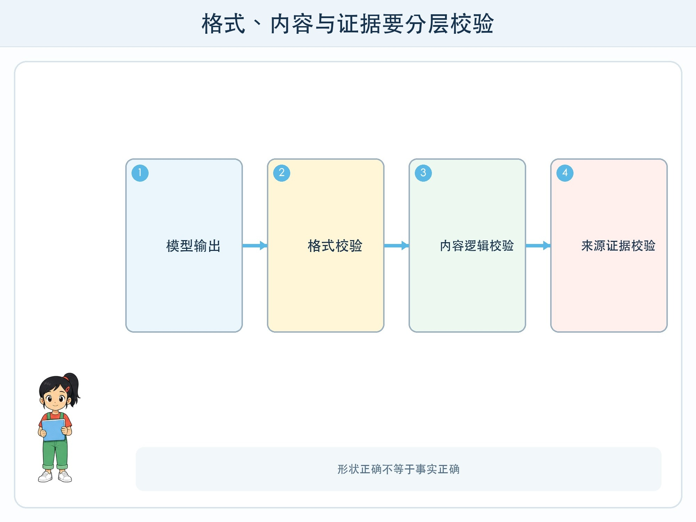

# 第 9 章 让输出可以被程序使用

## 漫画开场

方方要把科技节通知整理进日历。模型第一次回答：“活动大概在下周五下午，地点应该是礼堂。”人能看懂这句话，日历程序却不知道“大概”是什么时间，也找不到结束时刻。

朵朵设计了一张固定表：活动名、日期、开始、结束、地点、来源、是否确认。缺少的格子必须写 `null` 或“未提供”，不能猜。

## 训练营挑战

你要理解**结构化输出**：结果按照预先定义的字段、类型和层级组织，让程序能检查、保存或继续处理。常见形式包括表格、JSON 对象和固定选项。

结构清楚只保证形状更容易验证，不保证内容事实正确。

## 模式像一张空表

**模式**（schema）规定允许哪些字段和数据类型。例如日期必须是 `YYYY-MM-DD`，人数必须是整数，是否确认只能是“是/否”。必填字段缺失时，程序应拒绝继续。

JSON 可以表示键和值，例如活动名对应一段文字，时间对应标准字符串。五年级不必手写复杂括号，重点是同一字段永远使用同一名称和类型。

## 三层检查不能少

第一层是**格式校验**：括号、字段和类型是否符合模式。第二层是**内容校验**：日期是否存在、结束是否晚于开始、人数是否在合理范围。第三层是**证据校验**：这些值能否在原始通知中找到。

模型可能输出格式完美的错误日期。程序看到合法字符串不会自动知道它是编的。因此结构化输出要与 RAG 引用、规则检查和人工确认组合。

## 为什么缺失要明确

资料只写“下午举行”，模型若自动补成 14:00，会制造虚假精确。更好的输出是开始时间 `null`，并在“待确认事项”写“通知未提供具体时刻”。

未知值能让后续程序停止，而不是用猜测创建日历。系统可以提示用户补充资料，但不能把补充问题伪装成已知答案。

## 结构化提示怎样写

先给任务和资料，再提供字段说明、允许值和缺失处理，最后给一两个不含真实隐私的示例。示例帮助模型理解形式，但也可能让它机械复制内容，仍要测试不同情况。

更可靠的接口可能使用受约束解码或工具定义，限制输出结构。即便如此，字段语义与真实操作权限仍由应用负责。六年级会继续学习工具调用。

## 动手试一试：通知解析员

准备六张虚构通知，其中两张缺时间，一张地点有两个候选，一张日期格式不同。

1. 先设计七个字段和每个字段类型。
2. 同伴按自然语言自由整理第一轮。
3. 第二轮严格填表，缺失写“未提供”。
4. 由校验员检查格式、时间逻辑和原文证据。
5. 统计哪类错误靠结构解决，哪类仍需读原文。

不要使用真实学生日程、联系方式或内部活动安排。

## 程序继续行动前

把结果写入日历、发送消息或修改文件属于真实动作。即使结构校验通过，也应显示预览并由有权限的人确认。对儿童项目，默认只生成纸面预览，不自动连接真实账户。

系统要记录模型原始输出、校验错误、人工修改和最终提交者，以便出错后复盘。

## 小心这个坑

结构化输出不是“绝对可靠模式”。错误值、恶意内容和越权请求都可能装进合法字段。每个字段都要按用途限制长度、范围与权限，不能把模型输出直接当作可执行命令。

## 模型笔记

- 结构化输出按照字段和类型组织结果，让程序更容易验证。
- 格式正确、内容合理和证据支持是三种不同检查。
- 未提供的信息应明确为空，真实动作前还要预览和人工确认。

## 给大人的话

可用表格完成全部活动，再展示 JSON 只是同一结构的文本表示。不要让孩子连接个人日历或消息账户。编程扩展应先解析到受控数据结构，做白名单和范围校验，再只生成预览。
