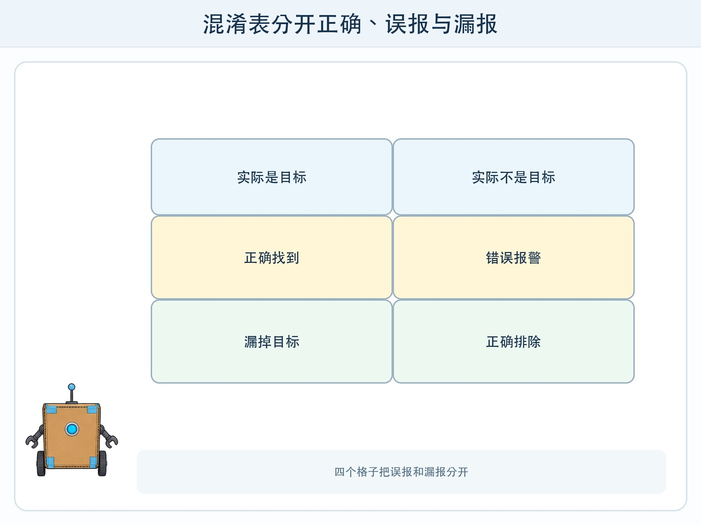
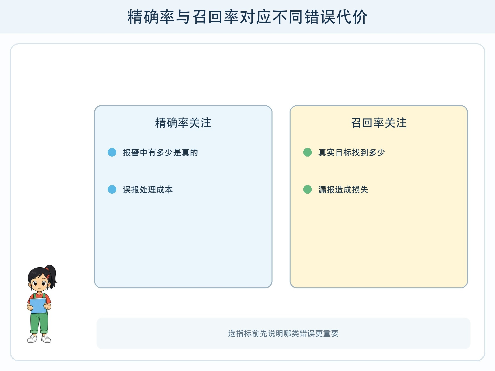

# 第 10 章 不只看正确率

## 漫画开场

方方负责从失物卡中找“疑似水瓶”。100 张卡里有 10 张水瓶，它找对 8 张，却把 12 张其他物品也报成水瓶。小问说：“答对了 86 张，正确率 86%，不错！”

朵朵指着桌上 20 张报警卡：“真正水瓶只有 8 张。负责寻找的人要翻很多错误提醒；还有 2 个水瓶完全没被找到。”

## 训练营挑战

你要读懂一个 2×2 混淆表，并分清真正例、假正例、真反例、假反例。再用直观比例理解精确率与召回率，选择指标前先说清哪类错误更重要。

## 四个格子

以“是否为水瓶”为目标：

- 真正例：实际是水瓶，系统也报水瓶。
- 假正例：实际不是，系统却报水瓶，也叫误报。
- 真反例：实际不是，系统也没有报警。
- 假反例：实际是，系统没找到，也叫漏报。

正确率把两个正确格相加再除以总数。若水瓶很少，系统全部回答“不是水瓶”也可能得到很高正确率，却一个水瓶都找不到。

## 精确率问什么

精确率关注“系统报出来的水瓶里，有多少真的是”。例子中报了 20 张，其中 8 张是真水瓶，精确率为 8/20，也就是 40%。精确率低，意味着人工要处理很多误报。

召回率关注“所有真实水瓶里，系统找到了多少”。10 个真实水瓶找到 8 个，召回率是 8/10，也就是 80%。召回率低，意味着漏掉较多目标。

两个指标不是越高越能同时轻松达到。降低报警门槛可能找回更多水瓶，也会增加误报；提高门槛可能减少误报，却漏掉更多。阈值要根据任务后果和人工处理能力选择。

## 指标必须连接现实代价

失物初筛中，误报意味着多看几张卡，漏报意味着失主找不到物品。若是安全或健康场景，错误代价可能完全不同，不能由儿童项目类推。

评测报告应先说明任务和风险，再选指标。还要按光线、角度、物品类型等相关条件分组，报告样本数量和不确定范围。测试样本太少时，一个百分数会剧烈变化。

## 动手试一试：混淆表裁判

准备 40 张图形卡，其中 10 张带星形。设计一条纸面判断方法，再由同伴保管答案。

1. 测试全部卡，把每张放入四格之一。
2. 数出四格数量并核对总数为 40。
3. 计算正确率、精确率和召回率。
4. 改变判断门槛，再测同一批卡。
5. 比较误报和漏报怎样变化，写出你更重视哪一个及原因。

不要用疾病、危险人物或真实同学作为分类主题。

## 生成任务怎样评测

开放回答没有唯一标签，不能只套用分类指标。可以建立评分表：事实有据、覆盖问题、引用正确、格式合规、语言适龄、无答案时拒答。部分项目由程序自动检查，语义和风险仍需人工评审。

自动评审模型也会有偏差，不能把“AI 给 AI 打分”当成最终证据。应抽样人工复核，并保存标准答案、评分规则和评审分歧。

## 小心这个坑

不要只公布最好指标，也不要测试很多版本后只选最高一次。评测方案、主要指标和通过标准应尽量在看到结果前确定。分数提高若来自测试泄漏或删掉难例，不是可靠进步。

## 模型笔记

- 混淆表把正确、误报和漏报分开，比单一正确率提供更多信息。
- 精确率看报警中有多少是真的，召回率看目标中找到了多少。
- 指标选择必须连接现实后果、样本范围和人工处理能力。

## 给大人的话

本章可与分数、百分数结合。重点是先用自然语言解释分母，再计算。不要把医疗筛查等高风险案例简化成课堂决策，可用失物卡或图形卡安全地展示指标权衡。
