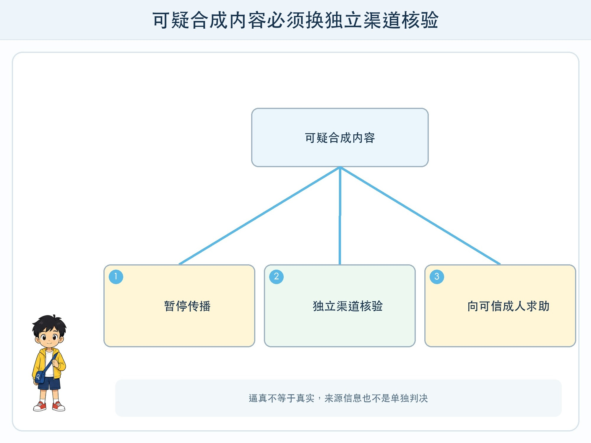
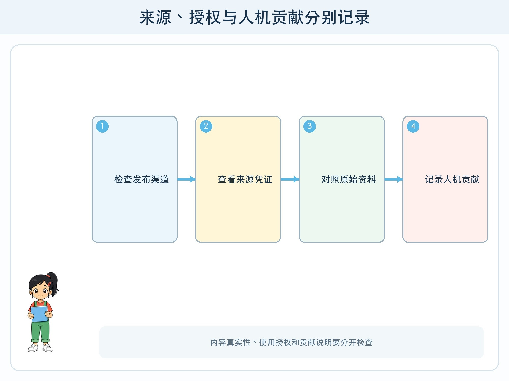

# 第 11 章 作品、来源与数字身份

## 漫画开场

小问收到一段“校长宣布明天放假”的语音，声音很像，背景却没有任何正式通知。他差点转发，朵朵让他先停下，用学校公开渠道确认。

另一边，方方生成了一张科技节海报。小问准备署上自己的名字，朵朵问：“哪些图由工具生成？参考了什么资料？有没有使用别人的角色或照片？”

## 训练营挑战

你要把三个问题分开：内容是真是假，素材是否有权使用，作品怎样诚实说明人和工具的贡献。还要认识**内容来源信息**：记录文件由谁、何时、用什么工具创建或修改的元数据与凭证。

## 合成内容为什么难判断

生成模型可以模仿某些声音、脸部或画面风格，编辑工具也能拼接真实素材。仅凭“看起来很真”或“声音很像”不够。

遇到涉及放假、转账、验证码、安全或名誉的内容，应停止传播，改用已知电话、官方网站、面对面询问等独立渠道。不要点击消息附带的陌生链接去“验证它自己”。

## 来源信息能做什么

一些标准尝试在文件中记录创作与编辑过程，例如设备或软件签署的内容凭证。它可以帮助查看来源链，但并非所有文件都有，元数据也可能在截图、转码或平台上传时丢失。

“没有凭证”不能自动证明是假，“有凭证”也不表示内容观点正确。来源信息是证据的一部分，还要看发布者身份、原始渠道和内容本身。

水印也有类似边界。可见水印可能被裁掉，隐藏标记也可能受压缩影响。可靠核验不应依赖单一标记。

## 使用生成工具仍要尊重作品

训练数据、输入素材和输出的权利问题会因地区、平台条款和用途变化。儿童应遵守老师要求：不用未授权角色冒充官方作品，不上传同学照片生成改编，不模仿真实同学或教师声音。

引用事实资料时列出原始来源；使用开放素材时查看许可；工具参与构思、改写或绘图时，按作业规则说明。诚实说明不会减少创造，反而让读者理解你的选择。

## 作品贡献记录

可以建立四列表：我独立完成、同伴帮助、AI 工具帮助、最终人工核验。每一项写具体动作，例如“我确定主题和事实”“工具生成三种标题草案”“我核对日期并重写第二段”。

不要只写“AI 辅助”四个字，也不要把未经检查的工具输出算成自己的事实判断。最终提交者要对展示内容负责。

## 动手试一试：来源侦查档案

由老师准备四份虚构材料：正式通知截图、来源不明转发、带创作记录的海报、被截图后丢失元数据的图片。

1. 分别记录内容主张、发布渠道、可见来源和缺失证据。
2. 为每份材料选择下一步核验渠道。
3. 不判断“像不像”，只写证据强弱。
4. 给一份生成海报填写贡献记录与素材许可表。
5. 讨论截图为何会让部分来源链断开。

材料不得使用真实诈骗账号、同学照片或可模仿的欺骗话术。

## 数字身份与同意

声音、人脸、签名和账号都与数字身份有关。即使出于玩笑，未经同意制作他人的合成形象也可能造成误解与伤害。删除文件也不能保证已经传播的副本消失。

发现自己或同学被冒用时，不独自与发布者争辩。保存必要证据，停止传播，告诉监护人、老师或平台，并按当地规则处理。

## 小心这个坑

不要把“检测 AI 生成”的单一工具结果当成最终判决。检测器会误报和漏报，不同内容与模型表现不同。判断作业诚信或人物身份需要过程证据和合适人员复核。

## 模型笔记

- 逼真不等于真实，重要消息要用独立、已知渠道核验。
- 内容凭证、元数据和水印能提供线索，但都有缺失与失效边界。
- 使用生成工具要尊重授权、同意和作业规则，并具体记录人机贡献。

## 给大人的话

安全教育重点是核验动作，不展示高仿欺骗技巧。涉及版权只讲基本原则并提示依据当地法律、学校规定和平台条款，不给儿童作法律结论。发现冒用时先保护儿童，再由成人处理报告与证据保存。
