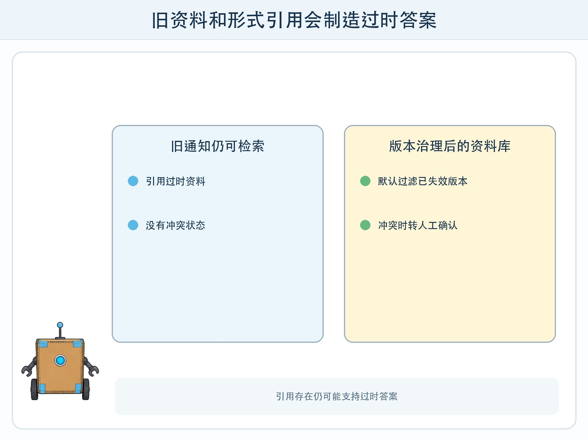
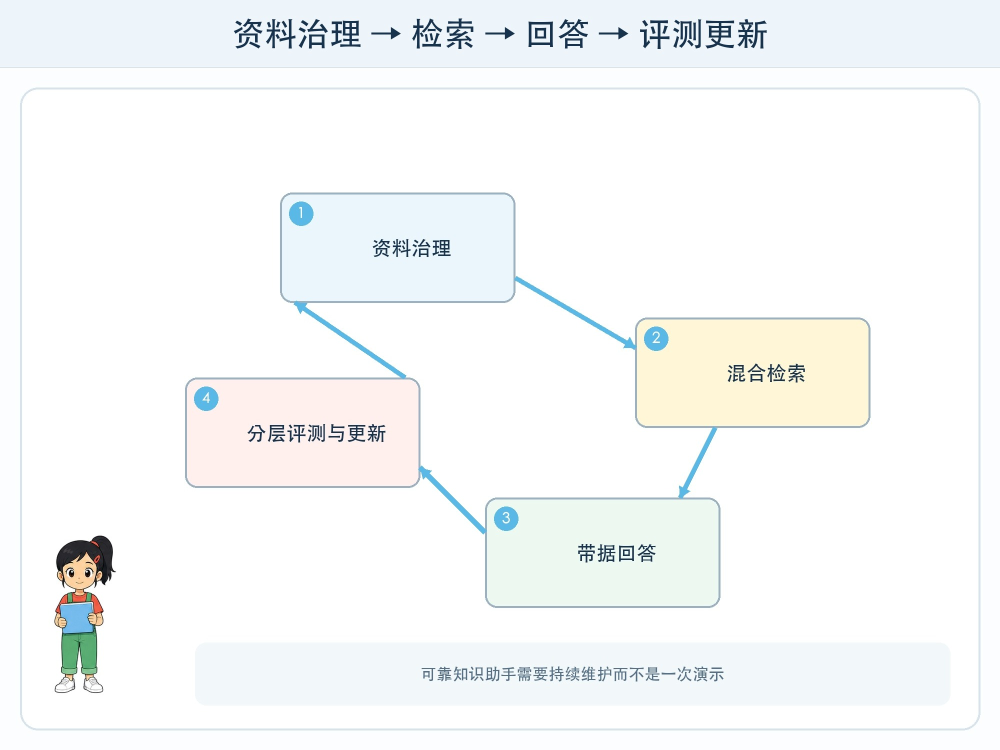

# 第 12 章 校园知识助手

## 漫画开场

科技节展示前，小问问助手：“明天社团在哪里集合？”系统找到三年前的旧通知，流畅地回答旧地点，还附上了看似正确的引用编号。

朵朵打开资料库，发现旧通知没有失效标记，检索也没有优先当前学期。方方没有“资料冲突”状态，只能选一段继续回答。

## 训练营挑战

最终项目要完成“资料—分块—索引—检索—回答—引用—评测”的闭环，并加入权限、无答案、资料冲突和人工更新流程。

项目使用教师准备的虚构校园资料。纸面角色扮演已能完成全部要求，不必连接真实学校系统。

## 第一步：定义助手边界

目标可以是回答 20 份虚构科技节资料中的时间、地点和活动规则。明确不回答个人成绩、联系方式、内部安全安排和资料库外的常识问题。

写出三类结果：有充分证据则回答并引用；资料缺失则说未找到；资料冲突或风险较高则列出冲突并请老师确认。拒答不是能力差，而是边界正确。

## 第二步：管理资料生命周期

每份资料带标题、发布日期、适用时间、来源编号、状态和权限。旧通知不一定删除，因为可能需要追溯，但应标“已过期”，默认检索过滤。

分块时让标题、日期和正文保持关联。建立关键词卡和语义摘要卡，保留返回原文的位置。资料更新后重新生成相关索引，并记录版本。

## 第三步：设计回答规则

回答员只能使用取回片段，每个具体时间、地点、数字和规则都标来源编号。若片段不支持，不得用“可能”“通常”补齐。

输出采用固定结构：简短答案、证据摘录、来源标题与日期、未确认事项。应用先检查引用存在、日期未过期、必要字段齐全，再显示预览。

## 第四步：分层评测

准备至少 24 道测试题：直接可查、同义表达、跨两个片段、资料缺失、旧新冲突、含错别字和不在范围。题目与开发示例分开。

评测表分四层：

| 层 | 主要问题 |
| --- | --- |
| 检索 | 正确片段是否进入候选？ |
| 回答 | 每条事实是否被片段支持？ |
| 引用 | 引用是否存在且真正对应？ |
| 行为 | 无答案、冲突和越界时是否停止？ |

不要把四层压成一个总分。检索失败与生成读错需要不同修复。

## 第五步：红色失败卡

展示板必须有至少三张红色失败卡：旧资料被取回、没有答案却猜测、引用不支持句子。每张写触发条件、影响、修复与重测结果。

还要写维护人：谁能增加资料，谁批准状态变化，多久复查一次，发现错误如何撤回。没有维护流程的知识助手会随时间变旧。

## 动手试一试：四人 RAG 系统

四人分别扮演资料管理员、检索器、回答模型和评测员。

1. 管理员准备带版本的资料卡。
2. 检索器按关键词和语义选前三片段。
3. 回答员按结构化表回答并引用。
4. 评测员对照标准答案，记录链路从哪一步出错。
5. 加入一份更新通知，检查旧答案是否会被纠正。
6. 交换角色，确认流程不依赖某个人的口头暗示。

## 项目答辩

答辩不问“你用了多大的模型”，而问：为什么需要助手而不是目录搜索？资料从哪里来？无答案怎样处理？关键错误是什么？谁能更新和停止？若系统关闭，用户还有什么替代方式？

能回答这些问题，说明你设计的是一套应用系统，而不是只展示一次聊天结果。

## 小心这个坑

不得把真实校内通知、学生资料、教师联系方式或账号对话放入公开项目。若未来由学校实施真实助手，需要数据分类、访问权限、安全测试、日志与责任审批，超出儿童纸面项目范围。

## 模型笔记

- 可靠知识助手从资料治理开始，不是从提示词开始。
- 检索、回答、引用和行为要分层评测，引用编号存在仍可能支持错误。
- 无答案、冲突、更新、撤回和人工负责人属于核心功能。

## 给大人的话

综合项目建议用虚构资料完成，评价需求、证据链、测试集和维护责任。技术扩展可在隔离环境实现，但不要为了演示把真实校内文件上传到个人向量库或第三方服务。
