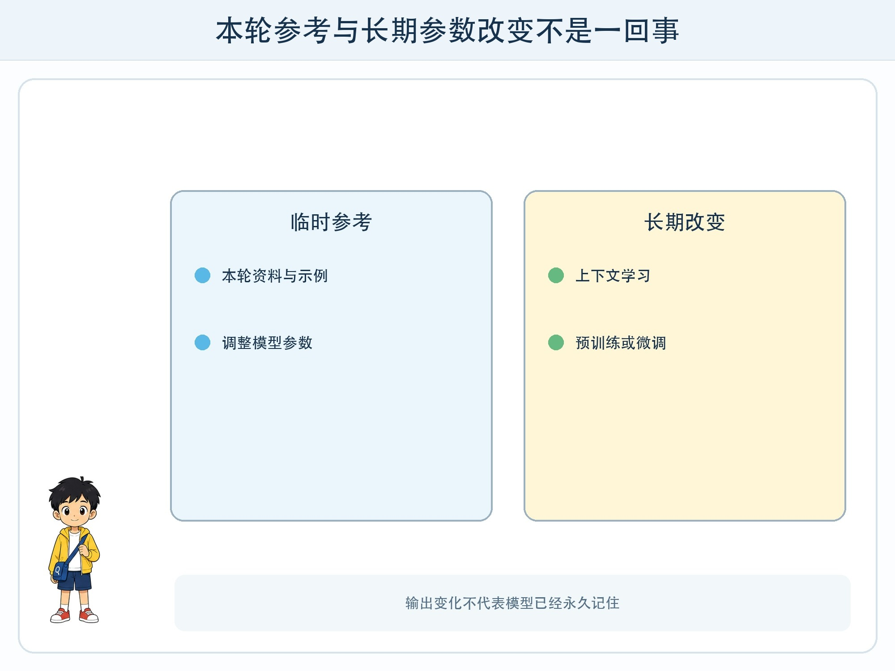
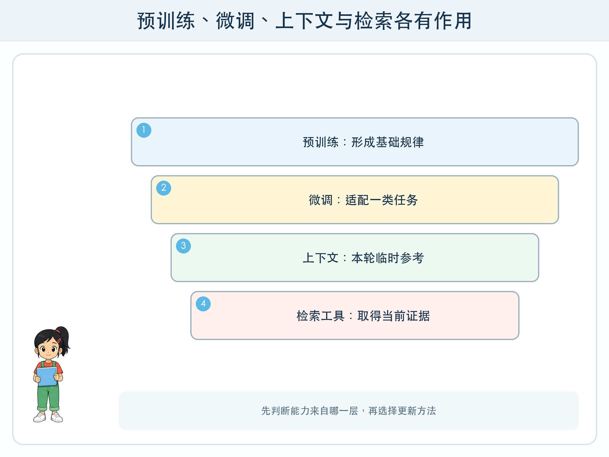

# 第 1 章 预训练、微调与上下文学习

## 漫画开场

科技节要增加一个“校园植物问答员”。小问把三条植物资料放进对话框，方方很快答对；换一个新对话，刚才的资料却不见了。朵朵说：“它是不是把知识学进模型了？”

三个人把“训练过”“本轮看过”和“查资料得到”混在一起，结果无法判断答案为什么改变。

## 系统任务

本章要建立一张“能力来源地图”，分清预训练、微调和上下文学习。它们都可能改变输出，却发生在不同时间，改变的部分也不同。

### 预训练：从大量样本中形成基础规律

预训练通常发生在模型发布前。训练程序让模型处理大量文字、图片或其他样本，反复预测并调整参数。参数可以理解为模型内部数量巨大的可调数值。完成后，模型获得语言形式、常见关系和任务模式等基础能力。

预训练成本高、周期长，不是每次提问都重新进行。模型见过许多样本，也不代表能准确背出每条来源，更不代表所有信息都正确、最新或适合儿童。

### 微调：让已有模型更适合一类任务

微调从一个已有模型出发，用更有针对性的样本继续训练。例如，让模型学习怎样按固定格式抽取活动时间，或怎样保持某种回答风格。它会改变部分参数，因此效果能跨多个会话保留。

微调样本如果带偏见、错误或隐私信息，问题也可能进入模型行为。微调之后仍需独立测试，不能只检查训练样本。

### 上下文学习：在当前任务里临时参考

把任务说明、几个示例和资料放进当前请求，模型可以据此调整回答，这常被称为上下文学习。它通常不改模型参数，只影响这一次会话可见范围内的计算。

新对话未携带旧内容时，模型不应被假定“已经记住”。应用若要持续使用资料，需要明确保存位置、权限、过期规则和删除方式。

## 动手试一试：三种能力卡

准备三张卡：蓝色“模型发布前学习大量样本”，绿色“针对任务继续训练”，黄色“本轮临时提供说明和示例”。再准备六个场景：改变回答格式、加入今天的校历、学习一种新分类任务、开始新对话、删除临时资料、修正长期行为。

1. 先把每个场景放到最可能的卡下。
2. 写出判断证据，而不是只写名称。
3. 对“今天的校历”讨论为什么检索资料通常比重新训练更合适。
4. 对“修正长期行为”讨论为什么单个提示可能不够。

## 压力测试

向系统提供一个故意错误的示例，再换到新会话测试。记录错误是否只影响当前上下文，还是持续出现。不要在真实在线服务中上传个人资料，课堂使用虚构文本或离线卡片。

停止条件是：无法确认资料是否会被保存，或任务要求写入真实姓名、账号和位置时，立即停止输入并请教师确认。

## 设计师笔记

- 预训练与微调会调整参数，上下文学习主要改变当前请求可见的信息。
- 输出变化不等于模型“永久学会”，要追问变化发生在哪一层。
- 最新事实通常应由受控资料或工具提供，并保留来源与时间。

## 给大人的话

本章不要求孩子训练大模型。重点是用“何时发生、是否改参数、能否跨会话保留、谁能删除”四个问题建立边界。产品的具体实现可能不同，教师应避免承诺某个聊天工具一定会或一定不会保存内容。
