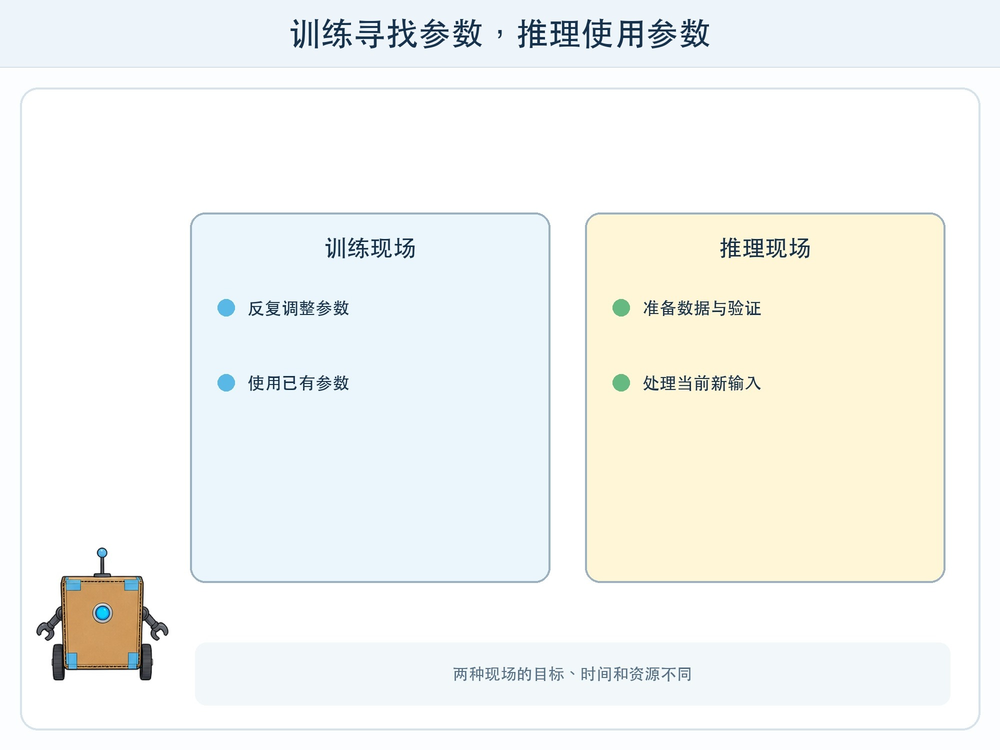
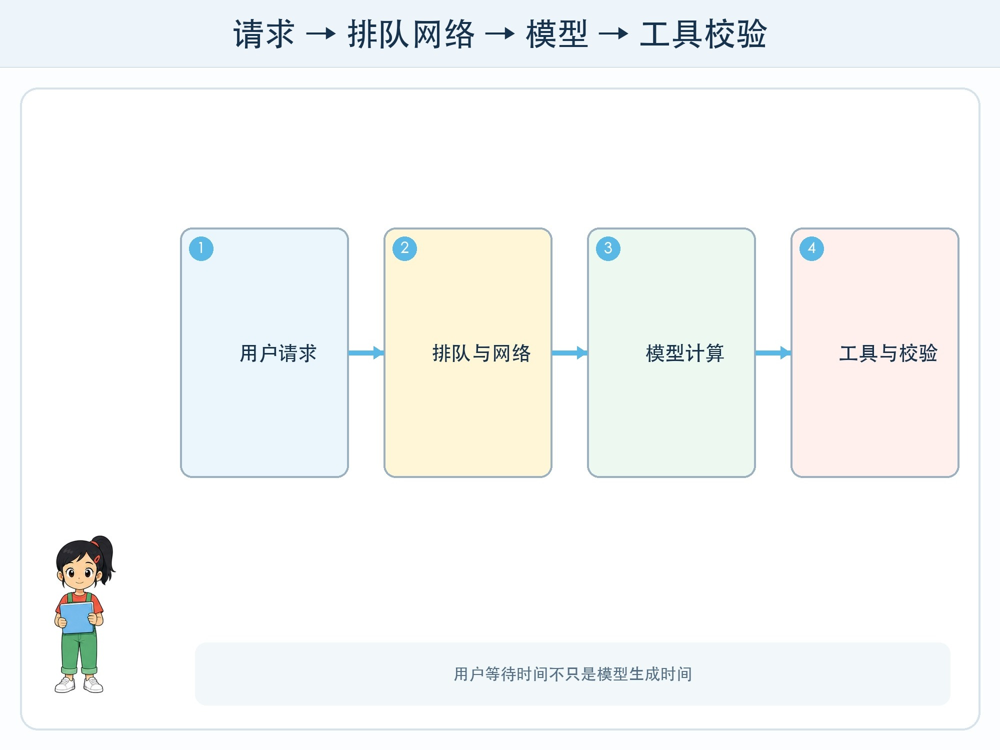

# 第 2 章 训练和推理的两种现场

## 漫画开场

朵朵看到生成答案只用了几秒，就说：“训练一个模型应该也差不多快吧？”小问拿出实验记录：训练组准备样本、连续计算、检查误差；使用组只把一个请求送进已经训练好的模型。

方方提醒：“两边都在算，但目标、时间和资源完全不同。”

## 系统任务

系统设计师要分清训练和推理。训练寻找合适参数，推理使用已有参数处理新输入。混淆两者，会误判成本、速度、能耗和隐私风险。

### 训练现场

训练从数据、目标和初始模型开始。模型产生预测，程序计算预测与目标的差距，再反向调整参数。这个循环可能执行很多轮，还要保留验证数据，防止模型只记住训练样本。

训练计划要写清数据许可、清理方式、算力预算、停止条件和版本。损失下降不等于真实任务一定变好，所以每个版本都要在未参与训练的测试集上检查。

### 推理现场

推理接收用户输入，经过分词或编码，使用固定参数计算，再把结果交给应用。一次推理通常比完整训练短，但用户多、输入长、模型大时，延迟和费用仍会累积。

推理系统还包含排队、缓存、网络、工具调用和内容校验。用户感受到的等待时间，不只是模型计算时间。

### 四项共同预算

第一是延迟：多久出现首个结果，多久完成全部结果。第二是吞吐量：同一时间能处理多少请求。第三是资源：内存、算力、电量和网络。第四是质量：为了更快或更省，结果下降多少。

## 动手试一试：纸面算力调度

全班分成训练队和推理队。训练队拿 20 张分类卡，通过多轮修正规则提高准确率；推理队使用已经冻结的规则处理 12 张新卡。

1. 分别记录准备、计算、检查和等待时间。
2. 推理队不得临时偷看标准答案改规则。
3. 训练队每改一次规则就标版本号。
4. 加入同时到达的五个请求，观察排队对总延迟的影响。
5. 用“时间—资源—质量”三栏解释最终选择。

## 压力测试

把推理任务放到“电量只剩 10%”“网络中断”“十个人同时提问”“答案必须两秒内出现”四种条件下。每组选择缩短输入、换小模型、转云端、转设备端、排队或暂时关闭中的一种方案，并写出失去什么。

如果质量要求涉及健康、财务、安全或学生评价，不能为了速度自动降低人工复核。系统达到资源上限时应排队、降级到普通搜索或明确不可用，而不是悄悄返回未经检查的答案。

## 设计师笔记

- 训练是寻找参数，推理是使用参数处理新输入。
- 延迟包括网络、排队、工具和校验，不只有模型生成。
- 优化必须同时报告速度、资源和质量，不能只展示更快。

## 给大人的话

活动可用纸卡完成，无需租用算力。若展示真实模型，只记录公开可见的响应时间与设备状态，不让孩子接触付费密钥。把“更大模型一定更好”改成“是否满足本任务约束”的工程讨论。
