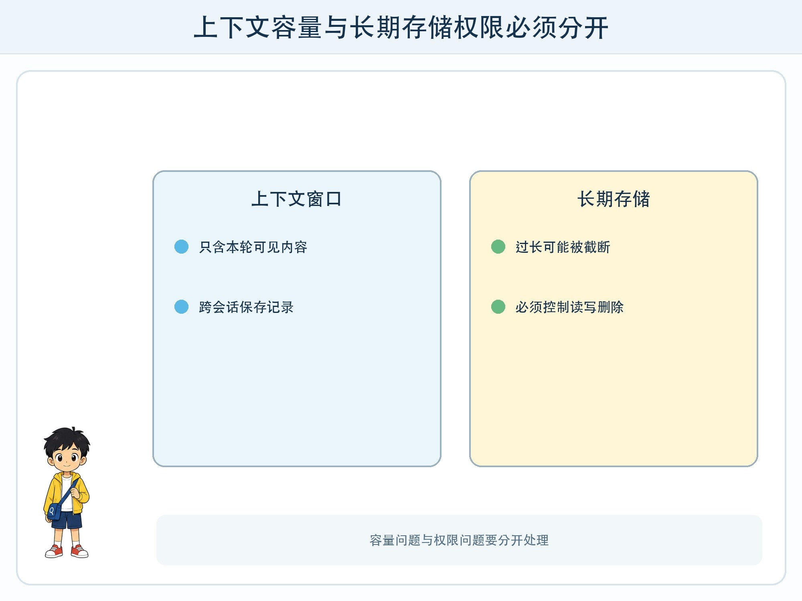
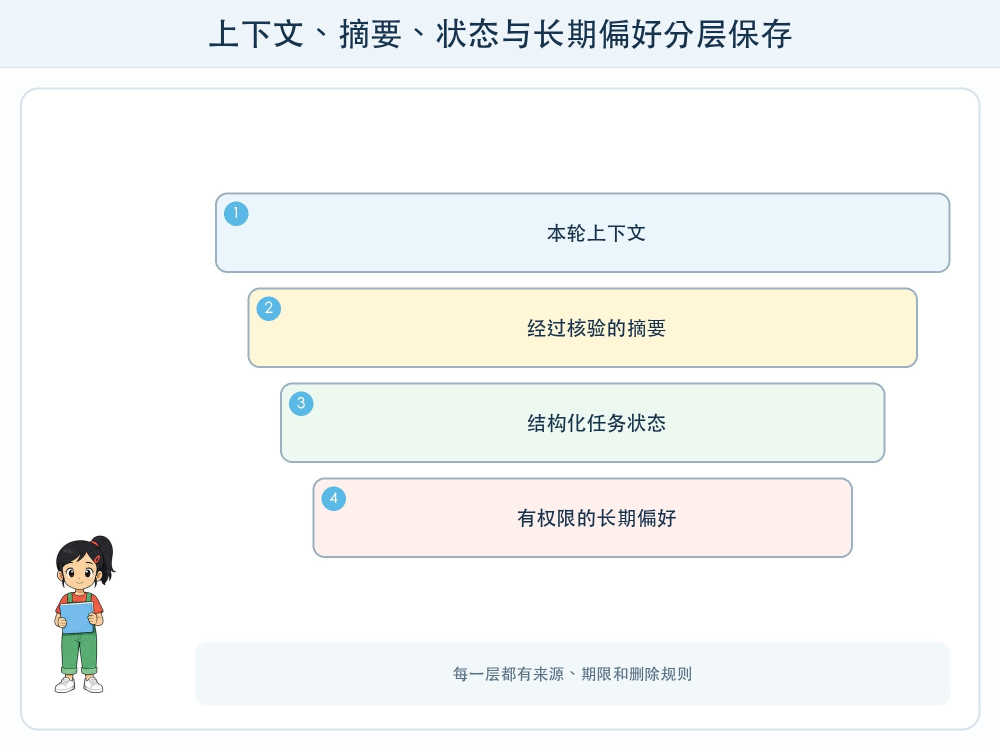

# 第 3 章 上下文窗口不是永久记忆

## 漫画开场

小问连续讨论了十几轮科技节安排，助手突然把“周三布展”说成“周四布展”。朵朵以为系统故意忘记，方方却发现最早的通知已经不在本轮可处理的内容里。

更麻烦的是，另一个测试账号竟看到了不属于它的偏好卡。大家意识到：记忆不仅是容量问题，也是权限问题。

## 系统任务

模型一次能处理的信息范围叫上下文窗口。应用为了跨会话连续工作，还可能使用摘要、数据库、用户档案或检索系统。它们不是同一种“记忆”，必须分别设计。

### 上下文：这一次能看见什么

当前指令、对话、工具结果和取回资料会占用上下文空间。内容过长时，应用可能截断旧消息或压缩成摘要。窗口变大可以容纳更多内容，却不会自动判断哪些事实重要，也不会保证早期信息始终被正确使用。

因此关键约束应放在清晰位置，并在执行前重新确认。长任务要分阶段保存经过核验的中间结果，而不是依赖模型回忆全部对话。

### 摘要：缩短但会丢信息

摘要能节省空间，却是一种有损压缩。把“周三前不能公开”缩成“周三公开”，一个词就改变了规则。重要日期、数字、否定词和审批状态应使用固定字段保存，并与原文链接在一起。

### 长期存储：先问谁能写、读和删

数据库可以保存偏好、任务状态和授权信息。每条记录要有用户范围、来源、创建时间、失效时间和删除入口。模型提出“值得记住”不等于系统可以保存；应由明确规则或用户确认决定。

## 动手试一试：四层记忆盒

画四个盒子：本轮上下文、核验摘要、任务状态、长期偏好。把“今天的临时分组”“已审批的地点”“做到第 3 步”“喜欢图表回答”“同学电话号码”放入盒子或“不得保存”区。

1. 为每条信息写读取者。
2. 写保存多久和谁能删除。
3. 写来源原文在哪里。
4. 删除一条记录后，检查摘要和缓存是否仍残留。
5. 交换账号，验证看不到对方内容。

## 压力测试

准备一段很长的虚构对话，把关键否定条件放在开头，再逐步加入无关内容。观察系统何时遗漏条件。接着让摘要员压缩对话，另一组对照原文寻找日期、数字、对象和否定词错误。

停止条件是：系统无法说明信息存在哪里、谁能读取、怎样删除，或出现跨用户内容时，立即停止继续写入并报告教师。不能用“模型可能记住了”代替数据泄露排查。

## 设计师笔记

- 上下文窗口是一次处理范围，不等于永久、准确或私密的记忆。
- 摘要会丢细节，关键状态应用结构化字段和原文共同保存。
- 长期存储必须有权限、期限、来源、删除和跨账号隔离测试。

## 给大人的话

不要让孩子用真实账号测试跨会话记忆。课堂可使用编号角色与虚构偏好。若产品提供“记忆”开关，应一起查看管理和删除入口，并说明关闭某项功能不必然等于所有历史数据立即从所有系统中消失。
