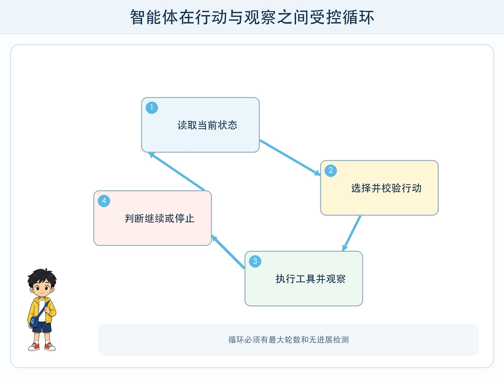
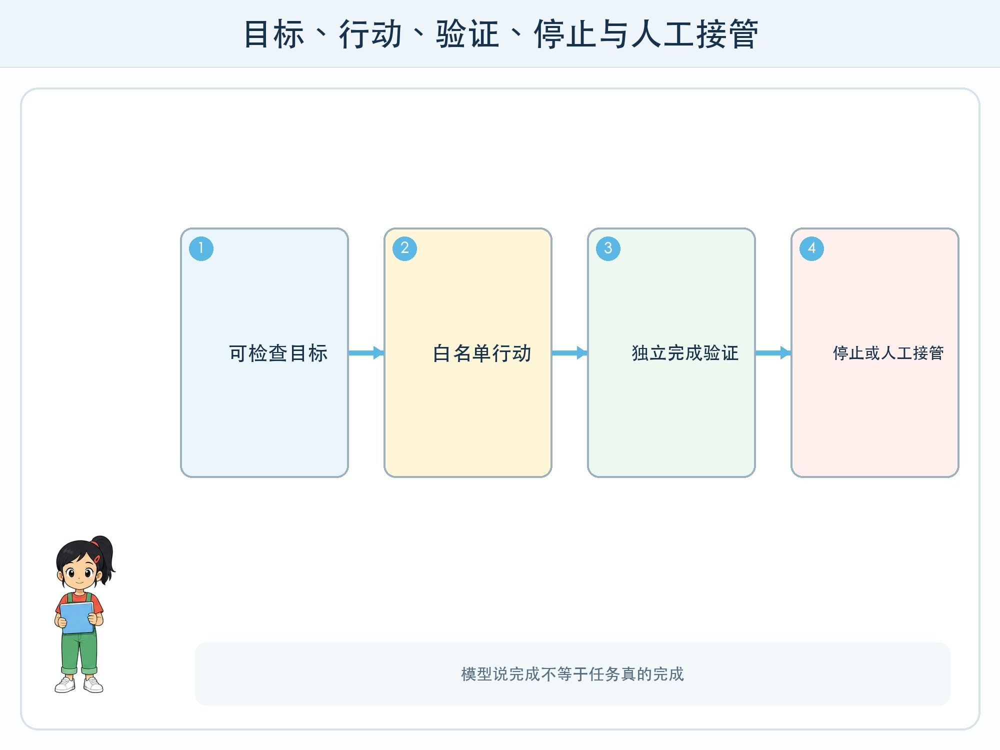

# 第 5 章 从回答者到智能体

## 漫画开场

老师交给助手一个目标：“整理科技节值班表，发现冲突就提出调整建议。”普通问答一次只给出一段建议；智能体版本会读取名单、检查冲突、修改计划，再次检查。

它运行到第九轮仍在调整同一组同学，还不断重复读取文件。朵朵问：“会自己行动就是更聪明吗？”方方指向没有填写的停止条件。

## 系统任务

智能体不是一种神秘的新模型，而是一种系统工作方式：模型围绕目标选择行动，应用执行工具，环境返回观察，系统据此修正下一步。它比单轮回答能完成更长任务，也带来错误累积和越权风险。

### 先把目标改成可检查的状态

“把值班表整理好”很模糊。可检查目标应写成：每个时段至少两人、同一人不同时出现在两个地点、每人总时长不超过两小时、所有修改在发送前由老师确认。

只有当完成条件能被程序或人检查，智能体才知道是否接近目标。还要写禁止状态，如不得修改原名单、不得发送给校外地址、不得处理真实电话号码。

### 一个受控循环

循环可以写成六步：读取当前状态、选择下一行动、校验行动、执行工具、观察结果、判断继续或停止。每一步都记录时间、输入摘要、工具名、结果和状态变化。

模型可以提出计划，但执行器只开放白名单工具。计划中出现不存在的工具、参数不合法或权限不足时，执行器拒绝，而不是让模型自行绕过。

### 停止比继续更重要

停止条件包括目标达成、达到最大轮数、连续没有进展、同一错误重复、资源预算耗尽、需要人工信息和触发风险规则。停止后给出已完成、未完成、失败原因和待确认事项。

## 动手试一试：纸面智能体

用迷宫或值班表卡片模拟智能体。目标员只公布完成条件，计划员每轮写一个行动，执行员检查白名单，观察员返回新状态，记录员更新轨迹。

1. 设置最多八轮和三枚工具币。
2. 连续两轮状态不变就停止。
3. 涉及删除或发送必须交“人工批准”卡。
4. 完成后重放全部轨迹，寻找第一次走偏的位置。
5. 修改一条规则再运行，比较轮数与成功率。

## 压力测试

加入目标冲突、工具返回旧数据、行动执行一半、用户中途改变要求、模型重复调用和观察中藏有恶意指令。系统应能暂停、回滚到已知状态，或把问题交给人，而不是无限继续。

特别检查“看起来成功”：值班表格式正确，却漏了一名学生；工具显示发送成功，却发送到测试地址；模型声称完成，却没有验证。完成状态必须来自独立检查，不由模型一句“已完成”决定。

## 设计师笔记

- 智能体是模型、工具、状态和循环组成的系统，不等于模型本身。
- 目标要能检查，行动要经校验，完成要有独立证据。
- 最大轮数、无进展检测、预算和人工接管是核心功能。

## 给大人的话

儿童项目应限制在纸面或只读虚构数据。不要让自动流程操作真实邮箱、云盘、支付、社交账号或校务系统。评审时优先看停止与恢复是否清楚，而不是展示自动运行了多少步。
