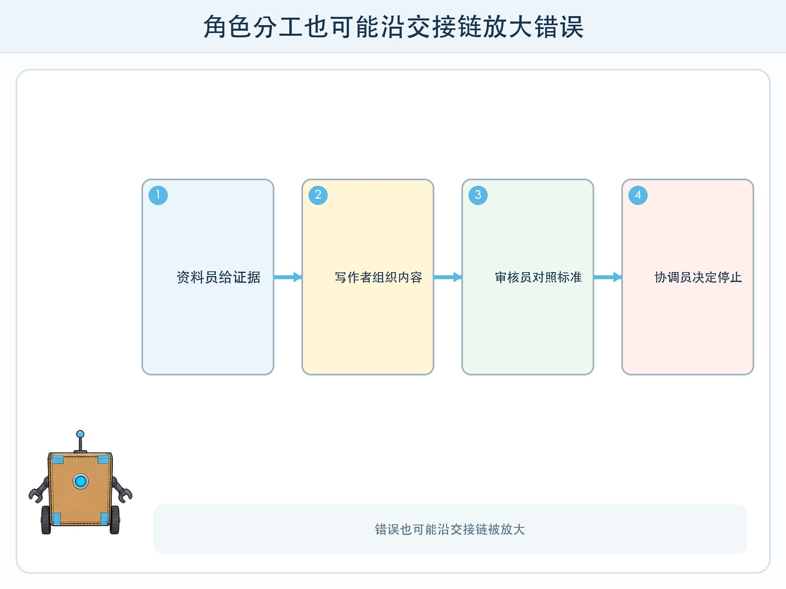
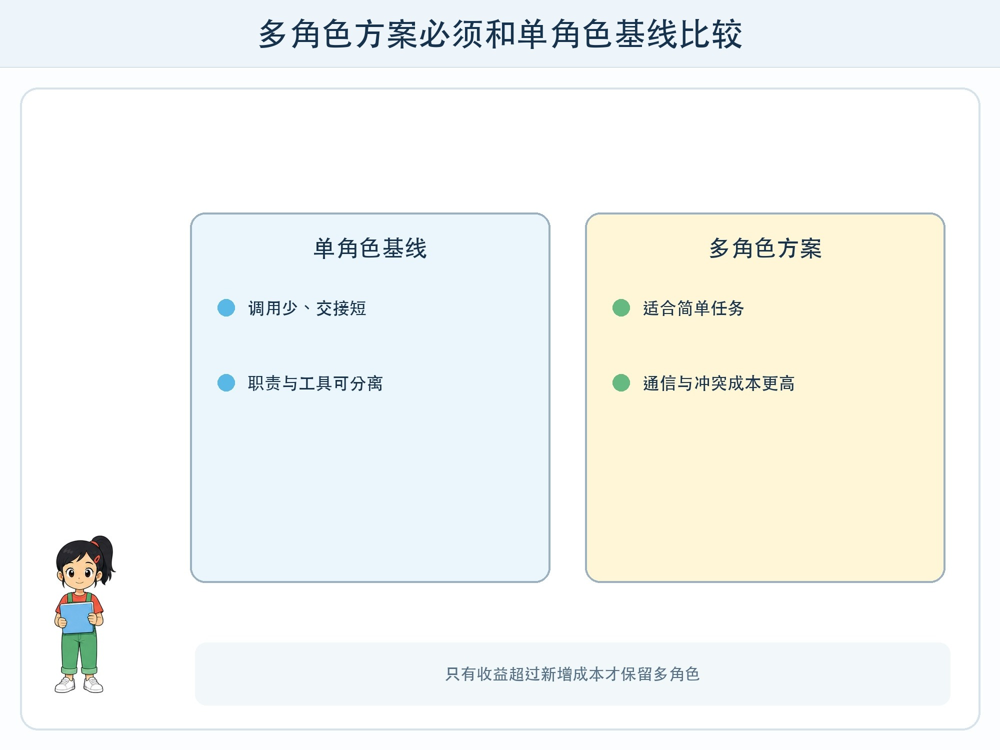

# 第 6 章 多智能体一定更好吗

## 漫画开场

小问设计了三个角色：资料员、写作者和审核员。第一次协作很顺利；第二次，资料员把未经核验的日期交给写作者，审核员只检查语句通顺，三个角色一起把错误放大。

朵朵说：“角色更多不等于观点更独立。它们可能使用同一个模型、同一批资料和同一种错误假设。”

## 系统任务

多智能体系统让多个角色交换任务和结果。分工可能降低单个上下文的复杂度，也可能增加通信、冲突、轮数、成本和新的失败点。设计前先证明一个智能体为什么不够。

### 有意义的分工

角色应拥有不同职责、输入或工具，而不只是不同名字。资料员能访问资料索引，只输出证据卡；规划员把目标拆成步骤；执行员调用白名单工具；审核员对照验收标准，不接受没有证据的结论。

每次交接使用固定字段：任务编号、输入来源、已完成内容、未确认事项、证据和下一位负责人。自然语言聊天很灵活，却容易遗漏状态。

### 冲突怎样解决

两个角色意见不同，不应靠“多数投票”自动决定。若它们依赖同一错误来源，多数也会错。系统可以回到原始证据、运行确定性检查、请求第三方数据，或交给有权限的人。

审核角色若和写作角色使用同一提示、同一上下文，独立性有限。更可靠的做法是给审核员明确标准和隐藏测试，不让它只评价自己的解释。

### 比较单角色基线

先让一个受控流程完成任务，记录成功率、错误、时间和调用次数；再加入多角色。只有当质量收益足以覆盖额外成本，分工才有理由保留。

## 动手试一试：编辑部实验

用同一组虚构活动资料完成一页介绍。A 组由一人按清单完成，B 组由资料员、写作者、事实审核员协作。

1. 两组使用相同时间和资料。
2. 记录错误数、漏项、交接次数和总耗时。
3. B 组不得口头补充，必须用交接卡。
4. 加入一条互相冲突的通知，观察如何升级处理。
5. 比较结果，决定哪些角色值得保留或合并。

## 压力测试

故意让一个角色迟迟不交付、重复转交、丢失任务编号、相信错误来源或把自己的工作退回给上一个角色。系统应有总协调状态、最大往返次数和明确责任人。

再测试“互相表扬但没有证据”：每个角色都说上一步很好，最终内容却缺少来源。验收程序只检查结构化证据和任务标准，不把角色的自我评价当事实。

## 设计师笔记

- 多角色的价值来自不同职责、信息或工具，不来自角色名字。
- 固定交接字段、冲突升级与总停止条件能减少失控。
- 必须与单角色基线比较，更多调用和更长对话本身不是进步。

## 给大人的话

课堂角色扮演比接入真实多智能体框架更适合本年龄段。评分时要求展示对照数据和失败案例，避免把复杂流程误当成技术先进。若没有明显收益，合并角色是成熟的系统决策。
