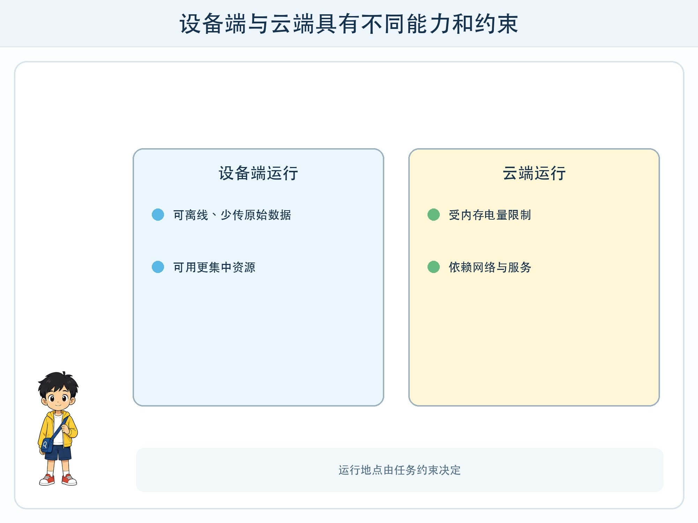
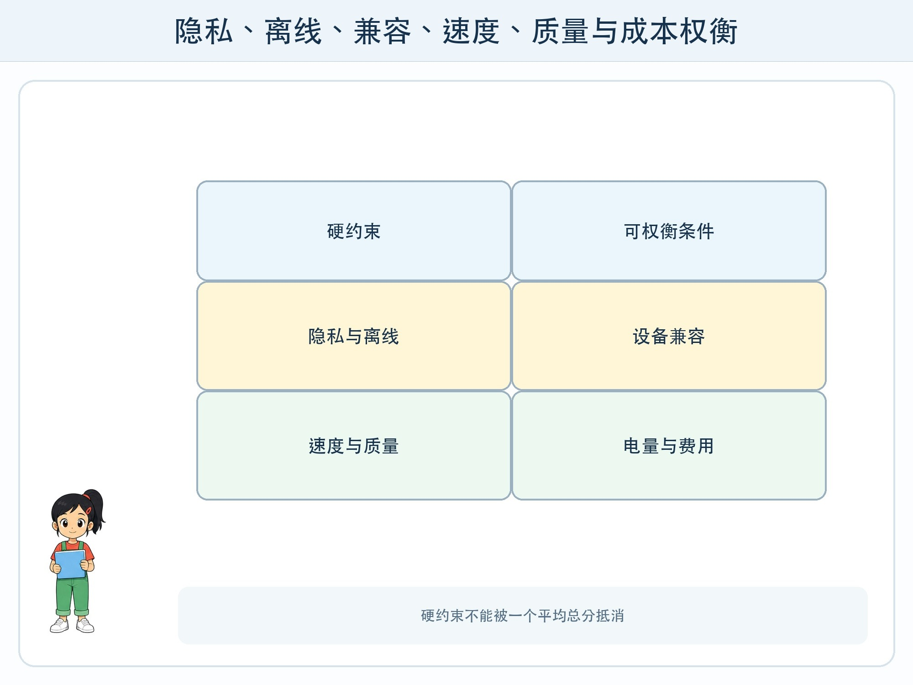

# 第 7 章 云端还是设备端

## 漫画开场

校园导览应用在操场网络较弱时无法识别标牌。小问建议把全部能力放到手机里；方方发现旧设备内存不足，运行后发热明显。朵朵又担心把每张照片传到云端会暴露无关人物。

他们发现，选择运行地点不是“先进与落后”的比赛，而是约束之间的权衡。

## 系统任务

端侧 AI 在手机、平板、电脑或其他本地设备上运行模型；云端 AI 把请求送到远程服务器。真实应用还可以混合两者：先在本地完成简单、敏感或离线任务，需要更强能力时再征得同意转到云端。

### 端侧的优势与限制

本地运行可减少原始数据离开设备的机会，断网时仍可能工作，也省去一次网络往返。但设备有内存、电量、散热和模型大小限制，不同机型的速度与可用能力可能不同。

“在设备上”不自动等于绝对安全。本地应用仍可能过度收集、留下日志、被其他组件读取，或在备份时上传。权限和数据生命周期仍要设计。

### 云端的优势与限制

云端通常更容易使用较大模型、集中更新和弹性资源，却依赖网络，并涉及传输、服务端保存、地区、费用和服务可用性。请求发送前应最小化数据，能裁剪图片就不传整张，能传统计量就不传原始记录。

### 一张决策表

对每项功能比较：最低设备、离线要求、允许延迟、数据敏感度、模型质量、更新频率、电量和成本。不要只用一个总分掩盖硬约束。例如“照片不得离开设备”是门槛，不应被“云端效果高一点”抵消。

## 动手试一试：部署评审会

选择三个虚构功能：离线识别校园标牌、生成活动长文、把语音转成短指令。每组获得不同设备卡、网络卡和隐私卡。

1. 标出必须条件与可协商条件。
2. 为端侧、云端和混合方案填决策表。
3. 写出不可用时的普通功能替代方案。
4. 说明何时向用户请求联网与上传同意。
5. 交换设备卡，检查方案是否仍成立。

## 压力测试

测试无网络、低电量、低存储、旧设备、服务端故障、费用达到上限和模型版本更新。混合方案还要测试本地与云端结果不一致时怎样展示。

当设备不满足要求时，应用应明确显示原因，提供文本搜索、手动输入或稍后处理，而不是无限等待。涉及敏感照片或录音时，默认不应为了提升效果自动转云端。

## 设计师笔记

- 端侧与云端各有能力和风险，选择由任务约束决定。
- 本地运行仍需权限、日志和删除设计；云端请求应数据最小化。
- 设备兼容、离线降级、版本变化和用户知情都要进入测试表。

## 给大人的话

本章不要求学生安装大型模型。可用纸面决策表或设备已有的离线功能观察。不要用真实人像、声纹或位置数据做对比测试。产品支持范围变化较快，课堂应以当日官方设备说明为准，而不是把具体型号写成永久结论。
