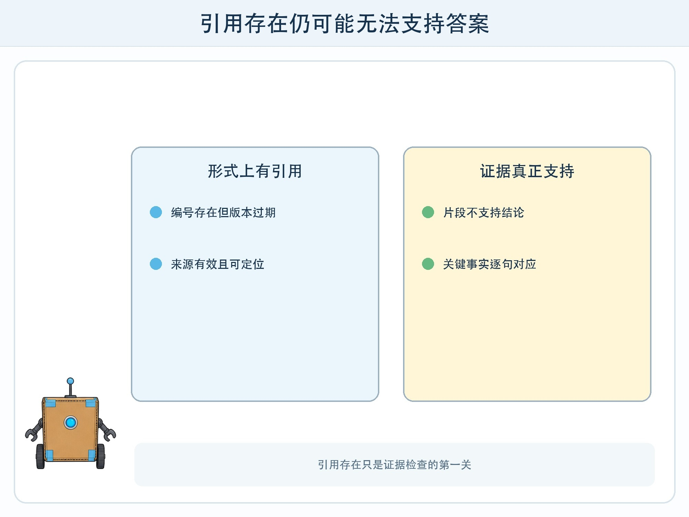
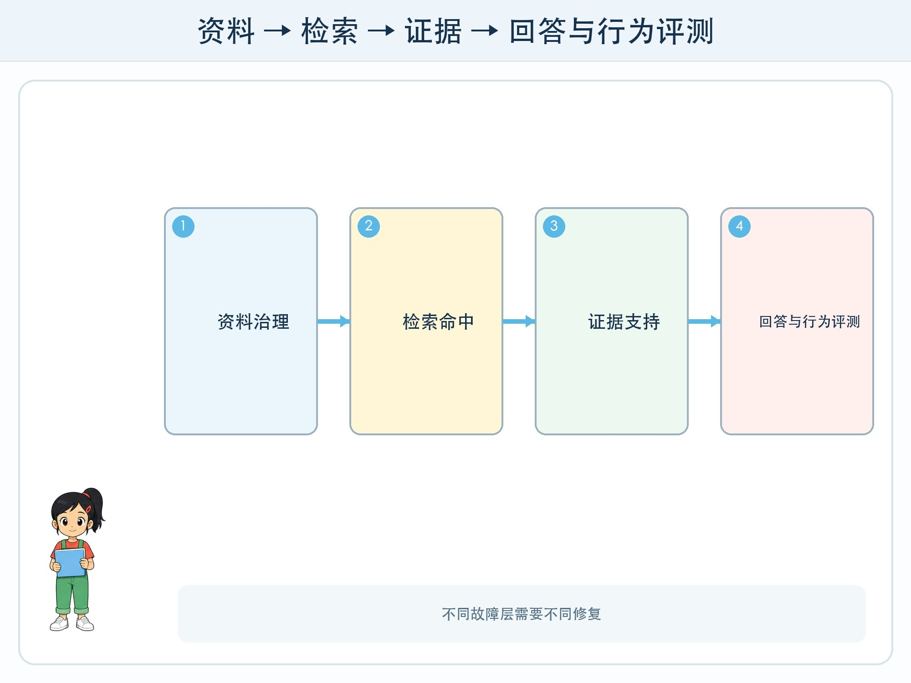

# 第 8 章 把知识助手做可靠

## 漫画开场

五年级的校园知识助手已经能附引用。六年级复测时，小问发现引用编号真实存在，却支持的是另一场活动；朵朵提问“哪些项目不能带电池”，系统只找到了“可以带电池”的句子，漏掉关键否定。

方方说：“有检索、有引用，不代表证据真的支持答案。”

## 系统任务

检索增强生成系统通常先从资料库取回片段，再让模型依据片段回答。可靠性来自资料治理、检索评测、证据核验、拒答规则和持续监控，而不是在提示词里写一句“必须正确”。

### 资料先可治理

每份资料需要来源、版本、发布时间、生效时间、失效状态、权限和负责人。分块不能把标题、否定条件、表头和正文拆散。索引更新后保留版本记录，并测试旧内容是否仍会意外进入结果。

### 把链路拆开评测

检索层检查正确片段是否进入候选，并记录排名；证据层检查片段是否直接支持具体句子；回答层检查是否完整、清楚且没有越过证据；行为层检查资料缺失、冲突和越权时是否拒答或转人工。

一个总分无法告诉设计师修哪里。检索没找到与模型读错片段，是两种故障。

### 引用要到句子

答案中的日期、数字、地点、允许和禁止等关键陈述，应能指向具体片段。引用存在只是第一关，还要检查来源可信、版本有效、内容真正支持。多来源冲突时，不要自行挑一个顺眼答案，应展示冲突与时间并请求确认。

## 动手试一试：证据审计

教师准备 20 份带版本的虚构科技节资料和 24 道问题。学生分成资料管理员、检索员、回答员和审计员。

1. 给每个答案中的事实编号。
2. 审计员逐条标“直接支持、部分支持、不支持、来源冲突”。
3. 分别统计检索命中和证据支持，不能合并成一个分数。
4. 加入一份新通知，重建索引后复测旧问题。
5. 把失败题加入固定回归测试集。

## 压力测试

覆盖错别字、同义表达、否定问题、跨表格两行、旧新冲突、没有答案、超出权限、资料里藏指令和引用编号伪造。对每类至少准备两个例子，开发时看过的示例与最终测试分开。

系统在无支持证据、来源冲突、权限不足或索引过期时应停止生成确定结论。允许输出“未找到”“资料冲突”和“请负责人确认”，并提供普通目录搜索作为替代。

## 设计师笔记

- RAG 的起点是资料治理，终点是持续评测与更新。
- 检索命中、证据支持、回答质量和系统行为要分层测量。
- 引用编号真实仍可能对应错版本、错片段或不支持的结论。

## 给大人的话

项目继续使用虚构资料，不上传真实校内文件。教师评价应重视失败分类、回归测试和维护责任。若使用在线模型，只提交已经脱敏的短片段，并遵守学校和服务平台的数据规则。
