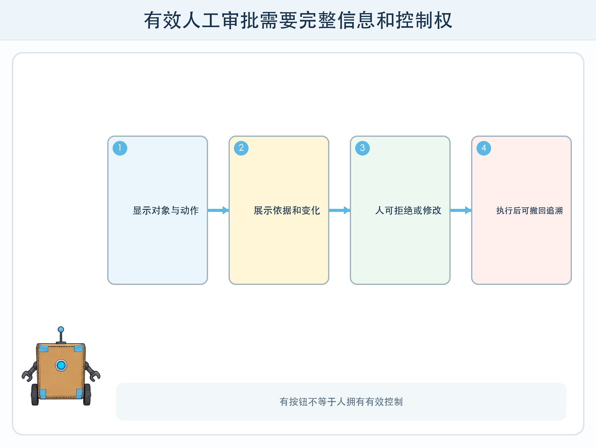
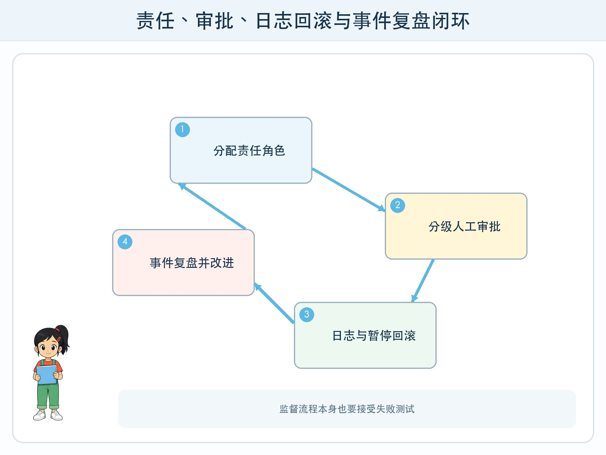

# 第 10 章 谁为结果负责

## 漫画开场

智能体把活动提醒草稿生成得很完整。小问以为老师点击“批准”就代表有人监督，朵朵却发现批准页只显示最后一段文字，看不到收件人、资料版本和模型改过什么。

方方说：“按钮旁边有人，不等于人有足够信息和真正的控制权。”

## 系统任务

人工监督不是在流程图末尾画一个“小人”。负责人要能理解当前状态、看见关键证据、拒绝或修改行动、暂停系统并追溯发生了什么。

### 责任链而不是一句“人负责”

为每个环节写角色：资料负责人批准来源和版本；产品负责人定义用途与边界；操作人员处理异常；审核人员检查高影响结果；维护人员修复并复测。一个人可以承担多个角色，但职责不能空白。

用户也不应承担所有责任。系统设计者不能用一行“结果仅供参考”掩盖误导界面、缺失证据或不可撤回操作。

### 有效审批的四个条件

审批人看得到对象、动作、依据和影响；有足够时间判断；可以拒绝、修改和要求更多信息；批准后仍能撤回或纠正。连续弹出大量确认会让人形成机械点击，重要操作应集中展示差异与风险。

### 日志、回滚和事件复盘

日志记录版本、时间、角色、工具、关键状态与结果，避免保存不必要的完整私人内容。回滚让系统恢复到已知状态。发生事件后，复盘关注条件、流程和防线为何失效，不把责任简单推给最后点击的人。

还要测试监督者不在线、看不懂证据或连续处理大量提醒的情况。系统不能默认“超时等于批准”，而应保持暂停、转交备用负责人或降级为只读。监督流程本身也有失败模式。

## 动手试一试：审批页改造

教师给出一张只有“确定/取消”的坏审批页。学生把它改成可判断的版本。

1. 显示要发送给谁、会做什么。
2. 显示资料来源、版本和变更对比。
3. 标出风险、未确认事项和预计影响。
4. 提供修改、拒绝、保存草稿和紧急停止。
5. 让未参加设计的同学试用，观察他是否真能发现故意错误。

## 压力测试

测试审批人匆忙、页面缺字段、模型把高风险动作写成普通文案、日志中断、执行一半失败和操作后才发现错误。系统应支持分级审批、默认只读、原子操作或补偿步骤。

当没有合适负责人、证据不足、无法回滚或影响范围不明时，操作保持暂停。高影响决策不因“模型信心高”而跳过人工程序。

## 设计师笔记

- 人工监督要求信息、时间、权力和退出手段，不只是确认按钮。
- 角色责任、最小必要日志、回滚和复盘共同形成责任链。
- 无法判断或无法恢复时，暂停是正确系统行为。

## 给大人的话

可用日常审批例子讨论，不让孩子承担真实安全责任。成人应对项目数据、账号、发布和外部工具保持最终控制。评价孩子时看其是否识别责任空白，而不是要求他们为技术故障背责。
