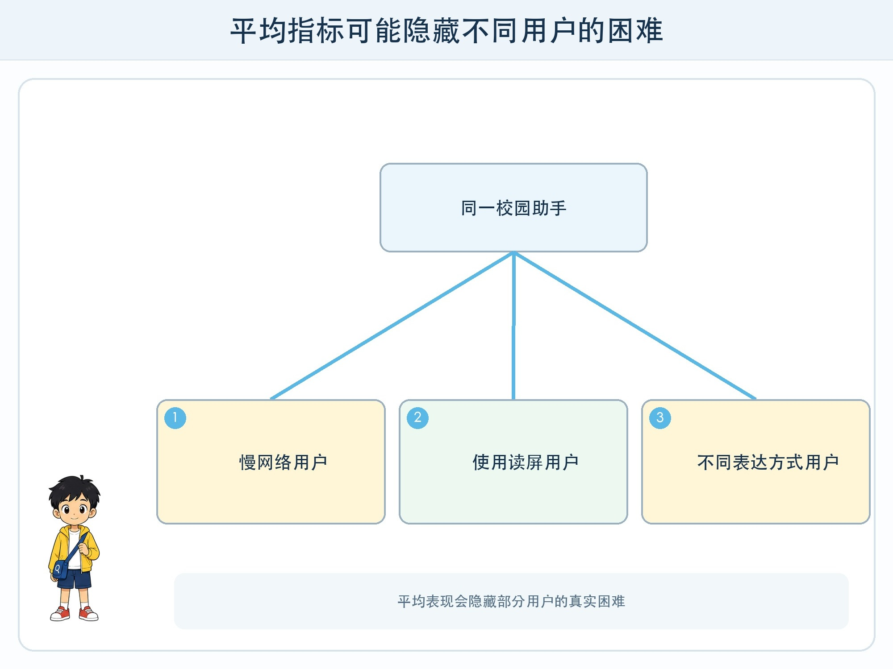
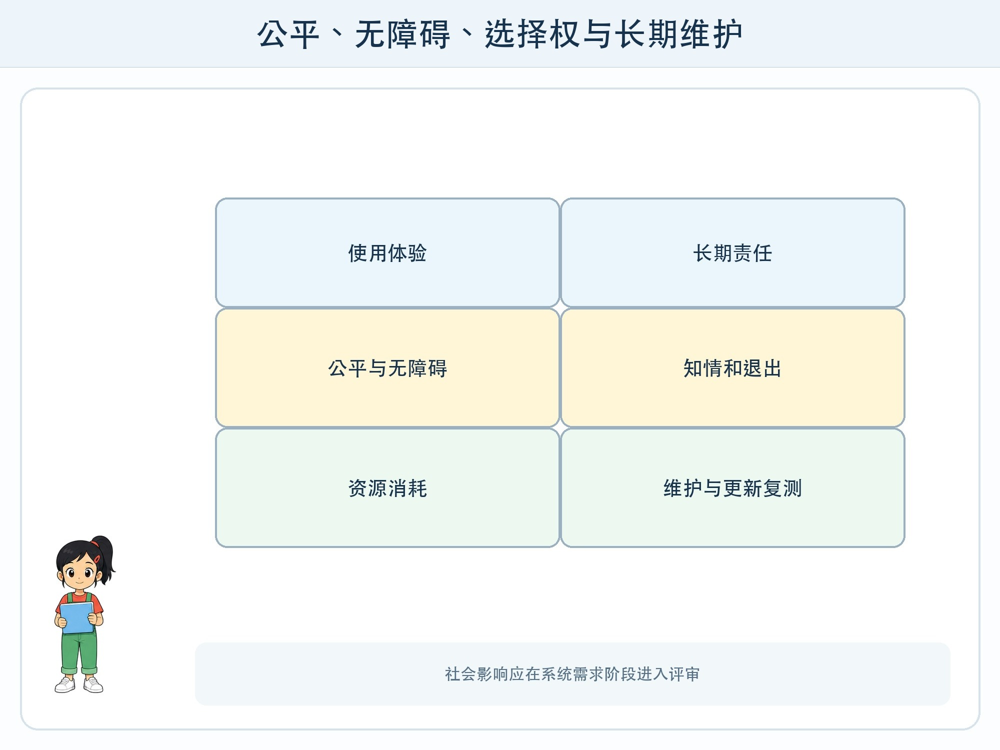

# 第 11 章 AI 与社会的长期选择

## 漫画开场

校园问路助手平均回答很快，但一位使用读屏软件的同学听不懂图中的文字；低年级同学不理解“置信度”；家里网络不稳定的同学总被转到失败页面。

小问发现，平均分很高仍可能把一部分人留在系统之外。系统需求必须包含“谁可能用不了”。

## 系统任务

AI 系统会影响信息获取、学习机会、劳动分工、创作署名和资源消耗。社会影响不是发布后的附加讨论，而应在需求、数据、界面、评测和退出方案里体现。

### 公平要看具体群体与错误

不能只问“系统公平吗”，要问：对哪些人、在哪个任务、哪类错误、造成什么后果。语音系统对方言识别更差，可能让部分用户反复失败；推荐系统只看点击，可能让较少曝光的内容越来越难被看见。

评测要按与任务相关的条件分组，同时保护个人隐私。发现差异后，检查数据覆盖、界面、阈值和替代通道，而不是给群体贴“难识别”的标签。

### 无障碍与选择权

图片提供准确文字说明，声音信息同时提供字幕，颜色不是唯一提示，操作支持键盘或辅助技术。用户应知道何时在与 AI 互动，能够更正、退出并使用普通流程。

### 资源与长期维护

训练和运行模型需要计算设备、电力、网络与维护。系统设计应选择满足任务的适当规模，减少无意义重复调用，记录资源预算。更新模型后重新评测，因为能力和错误模式可能变化。

## 动手试一试：利益相关者地图

围绕虚构校园助手画四圈：直接用户、受结果影响的人、维护者、学校与社区。每个角色写收益、可能损失、需要的信息和申诉方式。

1. 至少加入一位不直接操作系统却受影响的人。
2. 用不同网络、设备、语言表达和辅助需求走查任务。
3. 为失败用户设计非 AI 替代路径。
4. 写出内容与资料更新负责人。
5. 记录一个仍有争议、不能只靠技术解决的问题。

## 压力测试

检查系统在旧设备、慢网络、读屏、放大字体、只听声音、不同表达方式和用户拒绝提供额外数据时是否仍可完成核心任务。再检查“自动化偏见”：用户是否因为界面看起来权威就不敢纠正。

若某一群体错误明显更高、没有替代通道或影响无法解释，应限制使用范围并继续改进。试点成功不代表可以立刻用于成绩、纪律或机会分配等高影响场景。

## 设计师笔记

- 平均指标会隐藏群体差异，公平要结合任务、错误与后果讨论。
- 无障碍、知情、更正、退出和普通替代流程属于核心需求。
- 资源消耗、维护责任和模型更新后的复测也是社会责任。

## 给大人的话

讨论社会影响时避免让孩子代表某个群体下结论。可邀请有相关经验的人参与，或采用权威无障碍指南。涉及学生评价和真实群体数据的研究需要学校与专业人员负责，不作为儿童独立实验。
