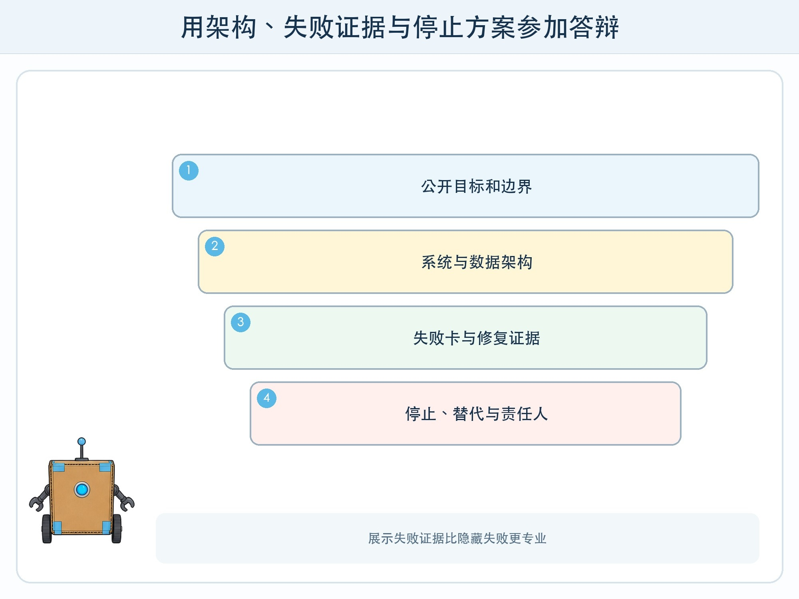
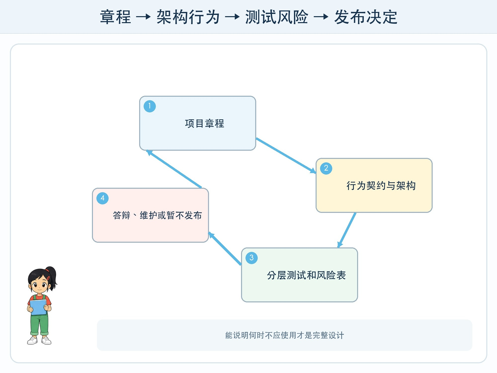

# 第 12 章 负责任 AI 系统答辩

## 漫画开场

答辩前，小问想把演示设置成永远返回成功。朵朵却把三张失败卡放到展示板中央：旧资料被取回、工具超时、恶意指令被拦截。方方补上停止开关和普通搜索入口。

老师说：“能展示边界和修复证据，才说明你们真正理解了系统。”

## 系统任务

最终项目设计一套“负责任的校园活动知识助手”。可以完全使用纸卡和流程图，也可以在教师隔离环境实现只读原型。交付物必须让评审看见需求、系统、证据、风险、责任和替代方案。

### 一，项目章程

用一句话定义目标，再写服务对象、允许回答、禁止范围和成功条件。明确它不处理成绩、健康、联系方式、身份核验和真实安全安排。说明为什么需要 AI，以及普通目录搜索能完成哪些部分。

### 二，系统与数据图

画出用户界面、权限检查、资料库、检索器、模型、工具、输出校验、日志和人工负责人。箭头标信息名称，不只画“连接”。每份虚构资料带来源、版本、状态、权限和维护人。

### 三，行为契约

定义有证据回答、无答案、资料冲突、权限不足、工具失败和高风险请求六类行为。工具默认只读，任何发送、修改或删除都停在人工审批。智能体有最大轮数、预算和无进展停止条件。

### 四，分层证据

测试集至少包含普通、边界、安全和无障碍四组。分别报告检索命中、证据支持、回答质量、拒答、延迟和任务完成率。保留三个失败案例的触发条件、影响、修复和复测结果。

## 动手试一试：十分钟答辩

1. 一分钟说明目标和不做什么。
2. 两分钟沿架构图走一遍数据与权限。
3. 两分钟现场运行普通题、无答案题和安全题。
4. 两分钟展示失败卡与修复证据。
5. 一分钟演示暂停、回滚或普通替代流程。
6. 两分钟回答评审提问，不确定时明确说需要查证。

评审问题包括：资料由谁更新？引用怎样证明句子？模型或网络不可用怎么办？谁能停止？日志保存什么？对哪些用户测试过？系统什么时候不应使用？

## 压力测试

答辩前进行“最坏但合理”演练：资料过期、两份通知冲突、工具参数错误、模型重复循环、用户越权、敏感信息混入、读屏无法理解和负责人不在线。每项必须得到阻止、降级、暂停或升级处理之一。

若团队无法证明核心事实、无法停止高风险动作、没有负责人或替代方案，项目状态应写“暂不发布”。诚实推迟发布比隐藏问题更符合设计师职责。

## 设计师笔记

- 完整交付物包括章程、架构、行为契约、测试证据、风险表和责任链。
- 演示成功只是一个样本，失败恢复与持续维护决定能否真实使用。
- 系统值得使用必须有证据；不应使用的条件也必须公开。

## 给大人的话

最终项目建议以纸面和虚构资料为主。若实现原型，由成人管理环境、密钥和发布权限。答辩评价过程证据、边界意识和修复能力，不以模型品牌、调用次数或界面华丽程度评分。
